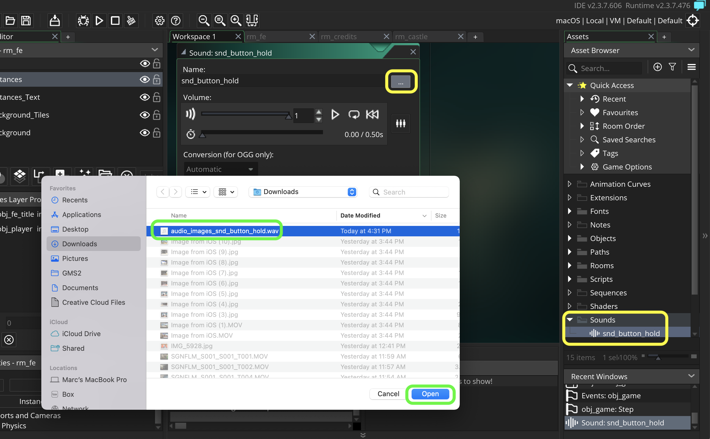
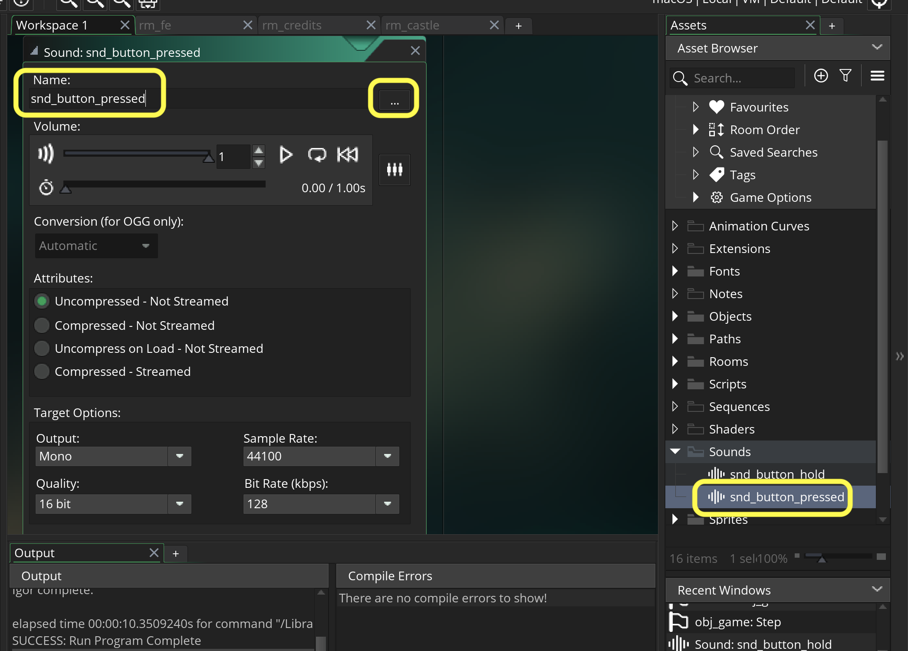
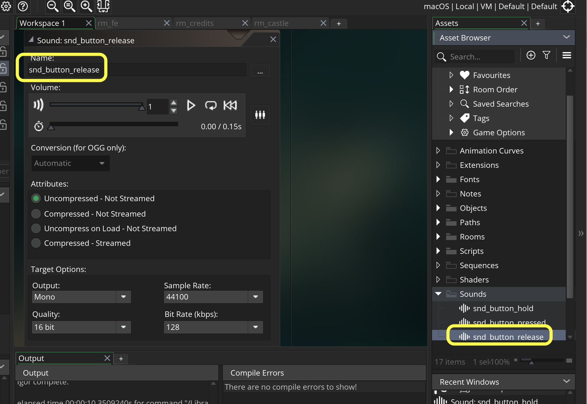
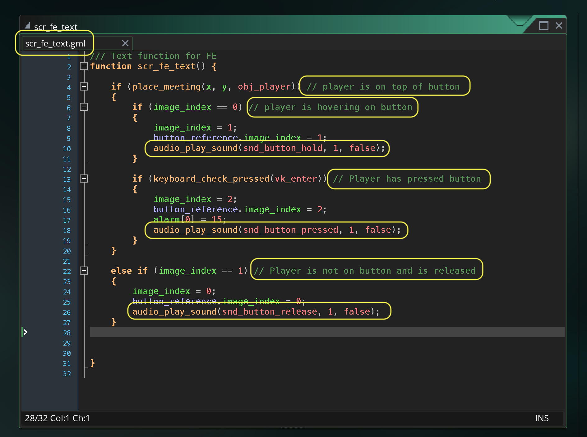
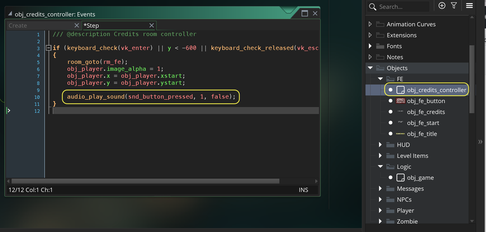
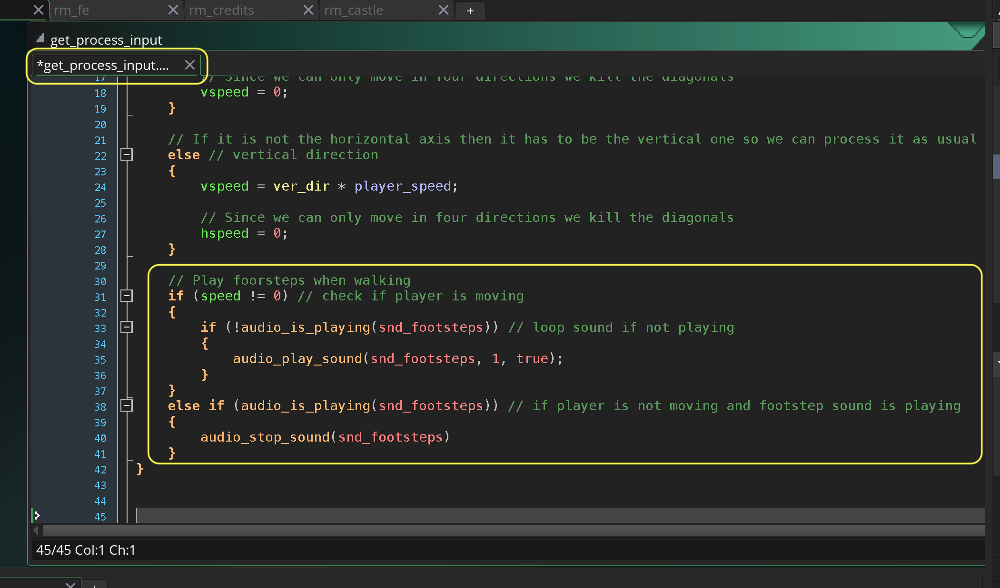
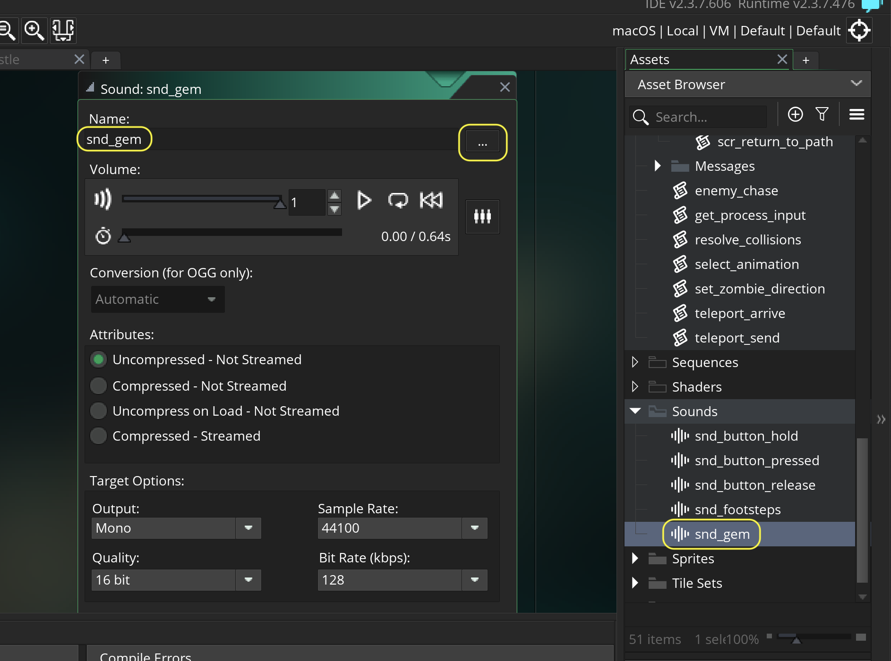
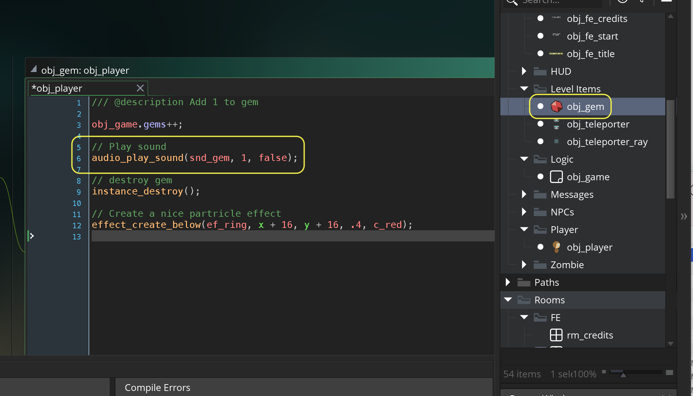

### Audio SFX

[previous](../front-end/README.md#user-content-front-end) • [home](../README.md#user-content-gms2-ue4-space-rocks) 

Now I am generally happy with what we have done to date so lets add audio.  Even though there is a lot more we can do, we will wrap up this tutorial by adding sound to the game. If the core mechanic does not include audio, we typically wait until we are happy with what we have before we add audio. 

 

---

##### `Step 1.`\|`SPCRK`|:small_blue_diamond:

Download [snd_button_hold.wav](images/snd_button_hold.wav) and save it to your computer. Right click on **Sounds** and select **Create | Sound**.  Press the three dots and select the above file. Call it `snd_button_hold`.

##### `Step 2.`\|`FHIU`|:small_blue_diamond: :small_blue_diamond: 

Repeat and add another sound for [snd_button_pressed.wav](images/snd_button_pressed.wav).

##### `Step 3.`\|`SPCRK`|:small_blue_diamond: :small_blue_diamond: :small_blue_diamond:

Repeat and add another sound for [snd_button_release.wav](images/snd_button_release.wav)

##### `Step 4.`\|`SPCRK`|:small_blue_diamond: :small_blue_diamond: :small_blue_diamond: :small_blue_diamond:

Now lets call the sound effects, put them as a second priority and set them to non-looping.  Open `scr_fe_text` and add a sound for each image change state of the buttons in the FE.

##### `Step 5.`\|`SPCRK`| :small_orange_diamond:

Now *press* the <kbd>Play</kbd> button in the top menu bar to launch the game. Walk around and press the buttons in the FE screen and listen to the three audio states. You might have to turn the audio on in this and following videos to hear them.

https://user-images.githubusercontent.com/5504953/154821724-68ed41be-7c6a-48e3-85f9-75fbac96f7ae.mp4

##### `Step 6.`\|`SPCRK`| :small_orange_diamond: :small_blue_diamond:

Lets add a sound when leaving the credits screen.  Open `obj_credits_conroller` and add another pressing sound.

##### `Step 7.`\|`SPCRK`| :small_orange_diamond: :small_blue_diamond: :small_blue_diamond:

Now *press* the <kbd>Play</kbd> button in the top menu bar to launch the game. Now press the <kbd>Escape</kbd> key in the credits menu and you should hear the sound.

https://user-images.githubusercontent.com/5504953/154842929-75c5f8ba-508b-443f-95a1-767dff8f4adc.mp4

##### `Step 8.`\|`SPCRK`| :small_orange_diamond: :small_blue_diamond: :small_blue_diamond: :small_blue_diamond:

Download [snd_footsteps.wav](images/snd_footsteps.wav). Lets make a footstep sound in the game. Create a new sound and press the three dots icon to load the above sound file and call it `snd_footsteps`. 

##### `Step 9.`\|`SPCRK`| :small_orange_diamond: :small_blue_diamond: :small_blue_diamond: :small_blue_diamond: :small_blue_diamond:

Open `get_process_input` and add a footstep sound to the game.  Make sure you don't launch the sound multiple times by checking to see if it is already playing and stop playing footsteps when the player stops.

##### `Step 10.`\|`SPCRK`| :large_blue_diamond:

Now *press* the <kbd>Play</kbd> button in the top menu bar to launch the game. Make sure that footsteps work in the game.

https://user-images.githubusercontent.com/5504953/154843571-9c226a18-8100-4b29-9eee-e1c361ac17e8.mp4

##### `Step 11.`\|`SPCRK`| :large_blue_diamond: :small_blue_diamond: 

Now lets have a sound for picking up the gem, download [snd_gem.wav](images/snd_gem.wav). Create a new **Sound** file and load the above file and call it `snd_gem`.

Then open the **obj_gem: Collision | obj_player** event and add to the collision event script and play the gem sound.

##### `Step 12.`\|`SPCRK`| :large_blue_diamond: :small_blue_diamond: :small_blue_diamond: 

Now *press* the <kbd>Play</kbd> button in the top menu bar to launch the game. Now run into the gem and hear the cool sound!

##### `Step 13.`\|`SPCRK`| :large_blue_diamond: :small_blue_diamond: :small_blue_diamond:  :small_blue_diamond: 

Now lets have a final sound effect for walking through the teleporter and download [snd_transporter.wav](images/snd_transporter.wav). Create a new **Sound** file and load file **snd_transporter**.wav and call it `snd_transporter`.

Now lets open up **obj_player | Collision obj_transporter** event and play the transporter sound.  Also, lets stop the footstep sound from playing:

##### `Step 14.`\|`SPCRK`| :large_blue_diamond: :small_blue_diamond: :small_blue_diamond: :small_blue_diamond:  :small_blue_diamond: 

	Run the game by pressing the  Play Button. Make sure the gem and teleporter sound play.  Next up lets add music to the game.

##### `Step 15.`\|`SPCRK`| :large_blue_diamond: :small_orange_diamond: 

Lets import the two final sounds in the game one called snd_music and the other called snd_enemy_chase.

##### `Step 16.`\|`SPCRK`| :large_blue_diamond: :small_orange_diamond:   :small_blue_diamond: 

Open obj_fe_start and check to see if music is playing.  If not play the music.  This looping will carry over room changes so we can just let it go.
		obj_fe_start: Create

##### `Step 17.`\|`SPCRK`| :large_blue_diamond: :small_orange_diamond: :small_blue_diamond: :small_blue_diamond:

Open the zombie step event and when in chase turn off music and start chase sound.  When returning turn off chase sound and play music again.  

obj_zombie: Step Event

##### `Step 18.`\|`SPCRK`| :large_blue_diamond: :small_orange_diamond: :small_blue_diamond: :small_blue_diamond: :small_blue_diamond:

Run the game by pressing the  Play Button. Make sure the chase sound and music works.  That is it for this tutorial, thanks for getting this far!

___

| [previous](../front-end/README.md#user-content-front-end)| [home](../README.md#user-content-gms2-ue4-space-rocks) | 
|---|---|
