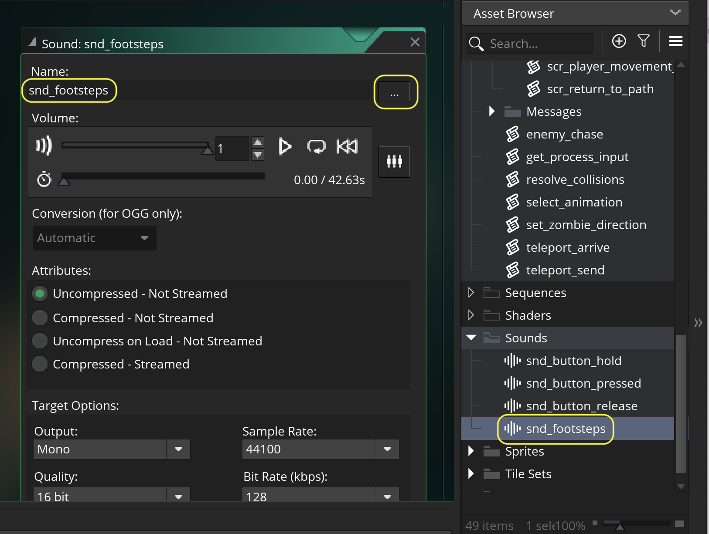
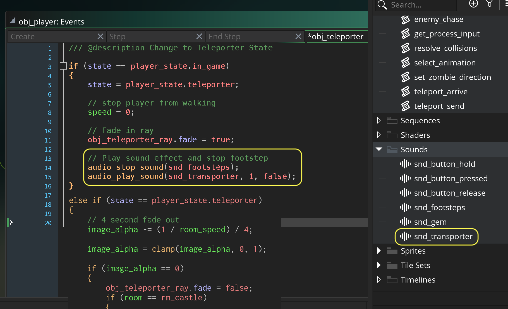

### Audio SFX

[previous](../front-end/README.md#user-content-front-end) • [home](..//README.md#user-content-gms2-action-adventure-game) 

Now I am generally happy with what we have done to date so lets add audio.  Even though there is a lot more we can do, we will wrap up this tutorial by adding sound to the game. If the core mechanic does not include audio, we typically wait until we are happy with what we have before we add audio. 

 

---

##### `Step 1.`\|`TDAAG`|:small_blue_diamond:

Open up **P4v**.  Select the top folder of the **GameMaker** project. Press the <kbd>Checkout</kbd> button.  Checkout out all files in P4V so that they are all writable (otherwise they will be read only and none of the changes will be saved). Select a **New** changelist and add a message describing the unit of work you will be performing. Press the <kbd>OK</kbd> button.

Open up the project you are working on in **GameMaker**. 

##### `Step 2.`\|`TDAAG`|:small_blue_diamond: :small_blue_diamond: 

Download [snd_button_hold.wav](images/snd_button_hold.wav) and save it to your computer. Right click on **Sounds** and select **Create | Sound**.  Press the three dots and select the above file. Call it `snd_button_hold`.

##### `Step 3.`\|`TDAAG`|:small_blue_diamond: :small_blue_diamond: :small_blue_diamond:

Repeat and add another sound for [snd_button_pressed.wav](images/snd_button_pressed.wav).

##### `Step 4.`\|`TDAAG`|:small_blue_diamond: :small_blue_diamond: :small_blue_diamond: :small_blue_diamond:

Repeat and add another sound for [snd_button_release.wav](images/snd_button_release.wav)

##### `Step 5.`\|`TDAAG`| :small_orange_diamond:

Now lets call the sound effects, put them as a second priority and set them to non-looping.  Open `scr_fe_text` and add a sound for each image change state of the buttons in the FE.

##### `Step 6.`\|`TDAAG`| :small_orange_diamond: :small_blue_diamond:

Now *press* the <kbd>Play</kbd> button in the top menu bar to launch the game. Walk around and press the buttons in the FE screen and listen to the three audio states. You might have to turn the audio on in this and following videos to hear them.

https://user-images.githubusercontent.com/5504953/154821724-68ed41be-7c6a-48e3-85f9-75fbac96f7ae.mp4

##### `Step 7.`\|`TDAAG`| :small_orange_diamond: :small_blue_diamond: :small_blue_diamond:

Lets add a sound when leaving the credits screen.  Open **obj_credits_conroller | Step** event and add another pressing sound.

##### `Step 8.`\|`TDAAG`| :small_orange_diamond: :small_blue_diamond: :small_blue_diamond: :small_blue_diamond:

Now *press* the <kbd>Play</kbd> button in the top menu bar to launch the game. Now press the <kbd>Escape</kbd> key in the credits menu and you should hear the sound.

https://user-images.githubusercontent.com/5504953/154842929-75c5f8ba-508b-443f-95a1-767dff8f4adc.mp4

##### `Step 9.`\|`TDAAG`| :small_orange_diamond: :small_blue_diamond: :small_blue_diamond: :small_blue_diamond: :small_blue_diamond:

Download [snd_footsteps.wav](images/snd_footsteps.wav). Lets make a footstep sound in the game. Create a new sound and press the three dots icon to load the above sound file and call it `snd_footsteps`. 

##### `Step 10.`\|`TDAAG`| :large_blue_diamond:

Open `get_process_input` and add a footstep sound to the game.  Make sure you don't launch the sound multiple times by checking to see if it is already playing and stop playing footsteps when the player stops.

##### `Step 11.`\|`TDAAG`| :large_blue_diamond: :small_blue_diamond: 

Now *press* the <kbd>Play</kbd> button in the top menu bar to launch the game. Make sure that footsteps work in the game.

https://user-images.githubusercontent.com/5504953/154843571-9c226a18-8100-4b29-9eee-e1c361ac17e8.mp4

##### `Step 12.`\|`TDAAG`| :large_blue_diamond: :small_blue_diamond: :small_blue_diamond: 

Now lets have a sound for picking up the gem, download [snd_gem.wav](images/snd_gem.wav). Create a new **Sound** file and load the above file and call it `snd_gem`.

##### `Step 13.`\|`TDAAG`| :large_blue_diamond: :small_blue_diamond: :small_blue_diamond:  :small_blue_diamond: 

Then open the **obj_gem: Collision | obj_player** event and add to the collision event script and play the gem sound.

##### `Step 14.`\|`TDAAG`| :large_blue_diamond: :small_blue_diamond: :small_blue_diamond: :small_blue_diamond:  :small_blue_diamond: 

Now *press* the <kbd>Play</kbd> button in the top menu bar to launch the game. Now run into the gem and hear the cool sound!

https://user-images.githubusercontent.com/5504953/154844035-fdfd4aa8-fa6f-418a-bf4f-6e53479f6732.mp4

##### `Step 15.`\|`TDAAG`| :large_blue_diamond: :small_orange_diamond: 

Now lets have a final sound effect for walking through the teleporter and download [snd_transporter.wav](images/snd_transporter.wav). Create a new **Sound** file and load file **snd_transporter**.wav and call it `snd_transporter`.

Now lets open up **obj_player | Collision obj_teleporter** event and play the transporter sound.  Also, lets stop the footstep sound from playing:

##### `Step 16.`\|`TDAAG`| :large_blue_diamond: :small_orange_diamond:   :small_blue_diamond: 

Now *press* the <kbd>Play</kbd> button in the top menu bar to launch the game. Go into the teleporter and see if a sound plays.

https://user-images.githubusercontent.com/5504953/154844346-95c342f0-ae0c-4c74-b8ca-11fbeaf5d677.mp4

##### `Step 17.`\|`TDAAG`| :large_blue_diamond: :small_orange_diamond: :small_blue_diamond: :small_blue_diamond:

Lets import the two final sounds in the game one called [snd_music.mp3](images/snd_music.mp3) and the other called [snd_enemy_chase.mp3](images/snd_enemy_chase.mp3). Create and name the two **Sound** files.

##### `Step 18.`\|`TDAAG`| :large_blue_diamond: :small_orange_diamond: :small_blue_diamond: :small_blue_diamond: :small_blue_diamond:

Open **obj_fe_start | Create** event and check to see if music is playing.  If not play the music.  This looping will carry over room changes so we can just let it go.

##### `Step 19.`\|`TDAAG`| :large_blue_diamond: :small_orange_diamond: :small_blue_diamond: :small_blue_diamond: :small_blue_diamond: :small_blue_diamond:

Open the **enemy_chase** script.  Turn off the music and start enemy chase sound.  When returning to path turn off the chase sound and play the regular music again.  

##### `Step 20.`\|`TDAAG`| :large_blue_diamond: :large_blue_diamond:

Now *press* the <kbd>Play</kbd> button in the top menu bar to launch the game. Make sure the chase sound and music works.  That is it for this tutorial, thanks for getting this far!

https://user-images.githubusercontent.com/5504953/154845088-ed5631c6-0c39-4e95-9aa6-096005ff5065.mp4

##### `Step 21.`\|`TDAAG`| :large_blue_diamond: :large_blue_diamond: :small_blue_diamond:

Select the **File | Save Project**, then press **File | Quit** (PC) **Game Maker | Quit** on Mac to make sure everything in the game is saved.

##### `Step 22.`\|`TDAAG`| :large_blue_diamond: :large_blue_diamond: :small_blue_diamond: :small_blue_diamond:

Open up **P4V**.  Select the top folder and press the **Add** button.  We want to add all the new files we created during this last session.  Add these files to the last change list you used at the begining of the session. Make sure the message accurately represents what you have done. Press the <kbd>OK</kbd> button.

##### `Step 23.`\|`TDAAG`| :large_blue_diamond: :large_blue_diamond: :small_blue_diamond: :small_blue_diamond: :small_blue_diamond:

Now you can submit the changelist by pressing both <kbd>Submit</kbd> buttons.

| `action.adventure.game`\|`THE END`| 
| :--- |
| **That's All Folks!** Thanks for sticking around. That is it for this tutorial but there is so much more that you can do with this game.  First you can add damage done by the zombie.  Have fun! |

<!--  -->

| [previous](../front-end/README.md#user-content-front-end)| [home](..//README.md#user-content-gms2-action-adventure-game) | 
|---|---|
