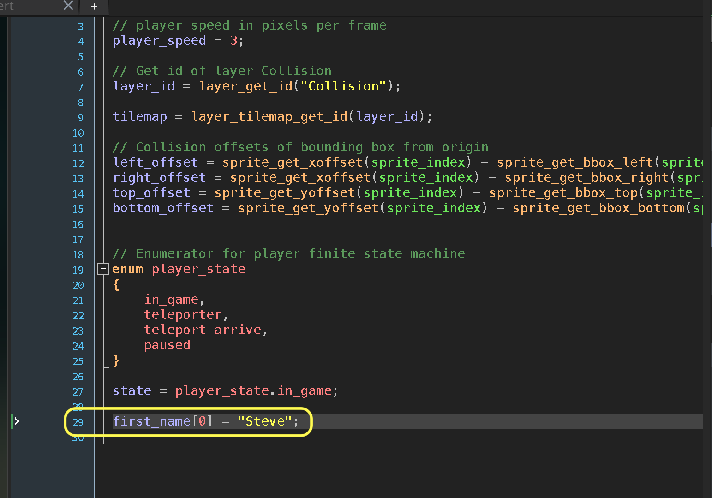
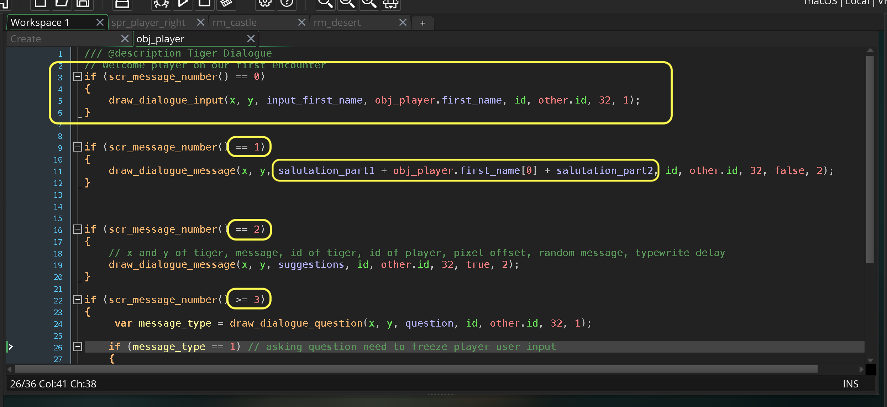
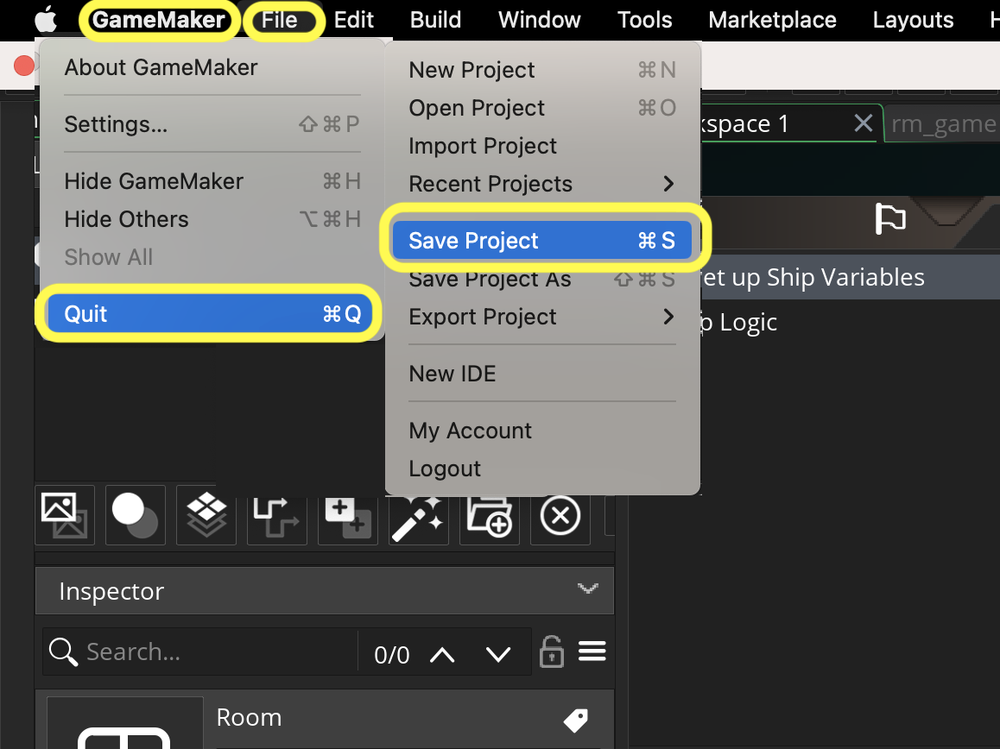
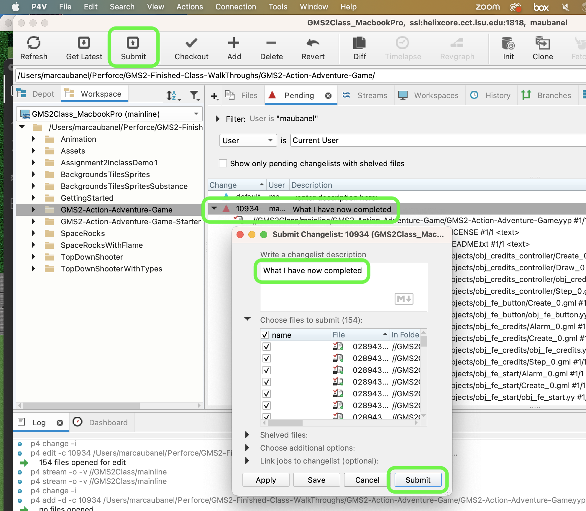

### Message Dialogue Box II

[previous](../) • [home](..//README.md#user-content-gms2-action-adventure-game) • [next](../)

Finish up using message boxes in gamemaker.

 

---

##### `Step 1.`\|`TDAAG`|:small_blue_diamond:

Lets store the name in the player as it is this player's name.  It needs to be an array so we will add an array string in slot 0 called `first_name`.

##### `Step 2.`\|`TDAAG`|:small_blue_diamond: :small_blue_diamond: 

Update the order so that the question is first.  Add our final message type `draw_dialogue_input(x, y, question, variable, id, player_id, space_above, typewriter_delay)`. The addition is a `variable` parameter which is the **array** (it has to be an array).  The rest should be the same with the question as a string or an array of multiple strings. For the salutation we need to concatonate the `salutation_part_1` with the newly entered player name and `salutation_part_2`.

##### `Step 3.`\|`TDAAG`|:small_blue_diamond: :small_blue_diamond: :small_blue_diamond:

Now *press* the <kbd>Play</kbd> button in the top menu bar to launch the game. This is all we have to demonstrate for message boxes. Have fun with them!

https://user-images.githubusercontent.com/5504953/152991038-805fc776-65fa-48ce-851a-c8cef8303593.mp4

##### `Step 4.`\|`TDAAG`|:small_blue_diamond: :small_blue_diamond: :small_blue_diamond: :small_blue_diamond:

Select the **File | Save Project**, then press **File | Quit** (PC) **Game Maker | Quit** on Mac to make sure everything in the game is saved.

##### `Step 5.`\|`TDAAG`| :small_orange_diamond:

Open up **P4V**.  Select the top folder and press the **Add** button.  We want to add all the new files we created during this last session.  Add these files to the last change list you used at the begining of the session. Make sure the message accurately represents what you have done. Press the <kbd>OK</kbd> button.

##### `Step 6.`\|`TDAAG`| :small_orange_diamond: :small_blue_diamond:

Now you can submit the changelist by pressing both <kbd>Submit</kbd> buttons.

<!--  -->

| [previous](../)| [home](..//README.md#user-content-gms2-action-adventure-game) | [next](../)|
|---|---|---|
