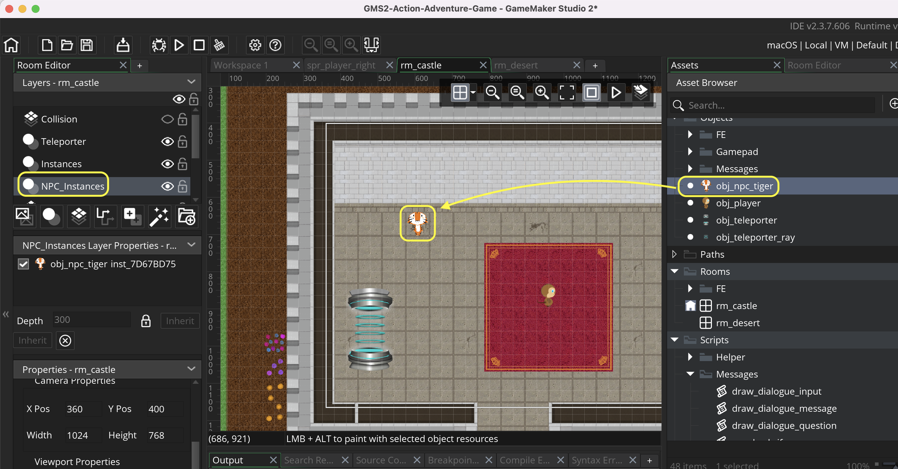
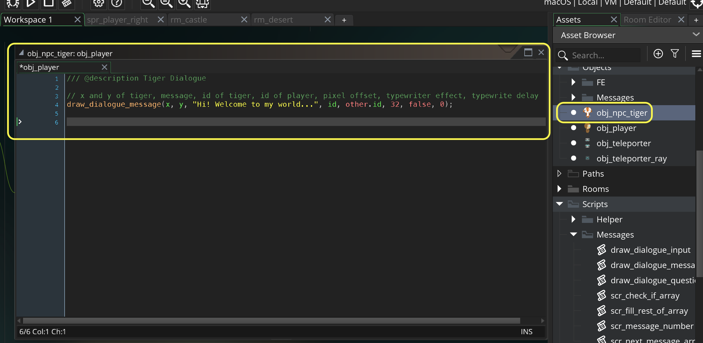

### Basic Message Dialogue Box

[previous](../refactor-player/README.md#user-content-refactoring-player-step-events) • [home](../README.md#user-content-gms2-ue4-space-rocks) • [next](../)

I have provided some code to make dialogue boxes easier to implement.  Lets just display some text in a pop up box.

 

---

##### `Step 1.`\|`SPCRK`|:small_blue_diamond:

Lets import a sprite to act as an NPC.  This character will not animate, we will just talk to it.  Right click on the **Sprites** title in the **Resources** menu and select **Create | Sprite**.  Call it `spr_npc_tiger`.  Download the artwork [spr_npc_tiger.png](images/spr_npc_tiger.png). Press the <kbd>Import</kbd> button and selet the downloaded **pr_npc_tiger.png sprite**.

##### `Step 2.`\|`FHIU`|:small_blue_diamond: :small_blue_diamond: 

Now lets create an object from this sprite. Right click on the **Objects** title in the **Resources** menu and select **Create | Object**. Bind the `spr_npc_tiger` to this object and call it `obj_npc_tiger`.

##### `Step 3.`\|`SPCRK`|:small_blue_diamond: :small_blue_diamond: :small_blue_diamond:

Open **rm_castle** and add a new **Instance Layer** underneath the **Instance** with the player.  Call it `NPC_Instances`.  Drag a copy of the tiger to the top of the castle.

##### `Step 4.`\|`SPCRK`|:small_blue_diamond: :small_blue_diamond: :small_blue_diamond: :small_blue_diamond:

There are 7 scripts in the **Scripts | Messages** folder.  You will be using 4 of them and the messaging system uses the other three.  The 4 we care about are:

* `draw_dialogue_message(x, y, text, id, player_id, space_above, is_random, typewriter_delay)` is used to display a simple message box.  It draws a message box above the character that is speaking and accepts either a simple string or an array of multiple strings.  If there is more than one string then they are all played before the menu closes. 
* `draw_dialogue_question(x, y, text, id, player_id, space_above, typewriter_delay)` has a text array with three components.  This function asks a yes/no question with two answers basing on how the player answers in the game. The first array is a question, the second array string is an answer to the affirmative (player presses yes) and the final third string array is for the negative when the player presses no.
* `draw_dialogue_input(x, y, question, variable, id, player_id, space_above, typewriter_delay)` asks a quetion and allows the user to input an answer in a text box with the keyboard.  This requires a question in an array or string and an answer to be a single string array.</li>
* `scr_message_number()` returns a number of which message is being displayed.  This allows you to put logic in the character with the text box to make decisions on what should be displayed depending how many times the player has chatted with the character.

Lets start with drawing a simple message.  Add a new create event to `obj_npc_tiger`.  We will do the most simple type of message by just displaying a string.  We will add a basic salutation that the NPC initially asks you.

We will trigger the box when the player collides with the collision volume of the tiger npg.  Open up **obj_tiger_npc** and add a **Collision | obj_player**. We pass the position of the npc to the messaging system, the text message as a string, the id of the instance of the npc and the id of the instance of the player that has triggered the event. We put a margin of 32 pixels above the NPC to separate its head from the message box.  We set is_random to false as since there is only one message there is no need to randomize the one we play.  We set the typewrite effect to false for now.

##### `Step 5.`\|`SPCRK`| :small_orange_diamond:

##### `Step 6.`\|`SPCRK`| :small_orange_diamond: :small_blue_diamond:

##### `Step 7.`\|`SPCRK`| :small_orange_diamond: :small_blue_diamond: :small_blue_diamond:

##### `Step 8.`\|`SPCRK`| :small_orange_diamond: :small_blue_diamond: :small_blue_diamond: :small_blue_diamond:

##### `Step 9.`\|`SPCRK`| :small_orange_diamond: :small_blue_diamond: :small_blue_diamond: :small_blue_diamond: :small_blue_diamond:

##### `Step 10.`\|`SPCRK`| :large_blue_diamond:

##### `Step 11.`\|`SPCRK`| :large_blue_diamond: :small_blue_diamond: 

##### `Step 12.`\|`SPCRK`| :large_blue_diamond: :small_blue_diamond: :small_blue_diamond: 

##### `Step 13.`\|`SPCRK`| :large_blue_diamond: :small_blue_diamond: :small_blue_diamond:  :small_blue_diamond: 

##### `Step 14.`\|`SPCRK`| :large_blue_diamond: :small_blue_diamond: :small_blue_diamond: :small_blue_diamond:  :small_blue_diamond: 

##### `Step 15.`\|`SPCRK`| :large_blue_diamond: :small_orange_diamond: 

##### `Step 16.`\|`SPCRK`| :large_blue_diamond: :small_orange_diamond:   :small_blue_diamond: 

##### `Step 17.`\|`SPCRK`| :large_blue_diamond: :small_orange_diamond: :small_blue_diamond: :small_blue_diamond:

##### `Step 18.`\|`SPCRK`| :large_blue_diamond: :small_orange_diamond: :small_blue_diamond: :small_blue_diamond: :small_blue_diamond:

##### `Step 19.`\|`SPCRK`| :large_blue_diamond: :small_orange_diamond: :small_blue_diamond: :small_blue_diamond: :small_blue_diamond: :small_blue_diamond:

##### `Step 20.`\|`SPCRK`| :large_blue_diamond: :large_blue_diamond:

##### `Step 21.`\|`SPCRK`| :large_blue_diamond: :large_blue_diamond: :small_blue_diamond:

___

| [previous](../refactor-player/README.md#user-content-refactoring-player-step-events)| [home](../README.md#user-content-gms2-ue4-space-rocks) | [next](../)|
|---|---|---|
