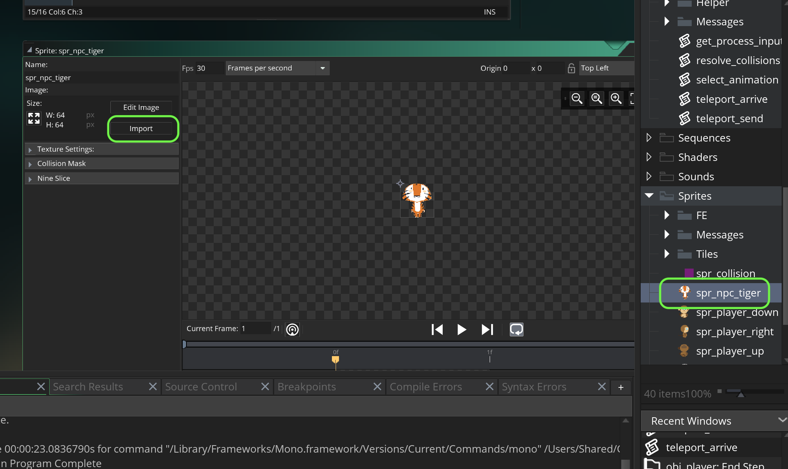

### Basic Message Dialogue Box

[previous](../refactor-player/README.md#user-content-refactoring-player-step-events) • [home](../README.md#user-content-gms2-ue4-space-rocks) • [next](../)

I have provided some code to make dialogue boxes easier to implement.  Lets just display some text in a pop up box.

 

---

##### `Step 1.`\|`SPCRK`|:small_blue_diamond:

Lets import a sprite to act as an NPC.  This character will not animate, we will just talk to it.  Right click on the **Sprites** title in the **Resources** menu and select **Create | Sprite**.  Call it `spr_npc_tiger`.  Download the artwork [spr_npc_tiger.png](images/spr_npc_tiger.png). Press the <kbd>Import</kbd> button and selet the downloaded **pr_npc_tiger.png sprite**.

##### `Step 2.`\|`FHIU`|:small_blue_diamond: :small_blue_diamond: 

Now lets create an object from this sprite. Right click on the **Objects** title in the **Resources** menu and select **Create | Object**. Bind the `spr_npc_tiger` to this object and call it `obj_npc_tiger`.

##### `Step 3.`\|`SPCRK`|:small_blue_diamond: :small_blue_diamond: :small_blue_diamond:

##### `Step 4.`\|`SPCRK`|:small_blue_diamond: :small_blue_diamond: :small_blue_diamond: :small_blue_diamond:

##### `Step 5.`\|`SPCRK`| :small_orange_diamond:

##### `Step 6.`\|`SPCRK`| :small_orange_diamond: :small_blue_diamond:

##### `Step 7.`\|`SPCRK`| :small_orange_diamond: :small_blue_diamond: :small_blue_diamond:

##### `Step 8.`\|`SPCRK`| :small_orange_diamond: :small_blue_diamond: :small_blue_diamond: :small_blue_diamond:

##### `Step 9.`\|`SPCRK`| :small_orange_diamond: :small_blue_diamond: :small_blue_diamond: :small_blue_diamond: :small_blue_diamond:

##### `Step 10.`\|`SPCRK`| :large_blue_diamond:

##### `Step 11.`\|`SPCRK`| :large_blue_diamond: :small_blue_diamond: 

##### `Step 12.`\|`SPCRK`| :large_blue_diamond: :small_blue_diamond: :small_blue_diamond: 

##### `Step 13.`\|`SPCRK`| :large_blue_diamond: :small_blue_diamond: :small_blue_diamond:  :small_blue_diamond: 

##### `Step 14.`\|`SPCRK`| :large_blue_diamond: :small_blue_diamond: :small_blue_diamond: :small_blue_diamond:  :small_blue_diamond: 

##### `Step 15.`\|`SPCRK`| :large_blue_diamond: :small_orange_diamond: 

##### `Step 16.`\|`SPCRK`| :large_blue_diamond: :small_orange_diamond:   :small_blue_diamond: 

##### `Step 17.`\|`SPCRK`| :large_blue_diamond: :small_orange_diamond: :small_blue_diamond: :small_blue_diamond:

##### `Step 18.`\|`SPCRK`| :large_blue_diamond: :small_orange_diamond: :small_blue_diamond: :small_blue_diamond: :small_blue_diamond:

##### `Step 19.`\|`SPCRK`| :large_blue_diamond: :small_orange_diamond: :small_blue_diamond: :small_blue_diamond: :small_blue_diamond: :small_blue_diamond:

##### `Step 20.`\|`SPCRK`| :large_blue_diamond: :large_blue_diamond:

##### `Step 21.`\|`SPCRK`| :large_blue_diamond: :large_blue_diamond: :small_blue_diamond:

___

| [previous](../refactor-player/README.md#user-content-refactoring-player-step-events)| [home](../README.md#user-content-gms2-ue4-space-rocks) | [next](../)|
|---|---|---|
