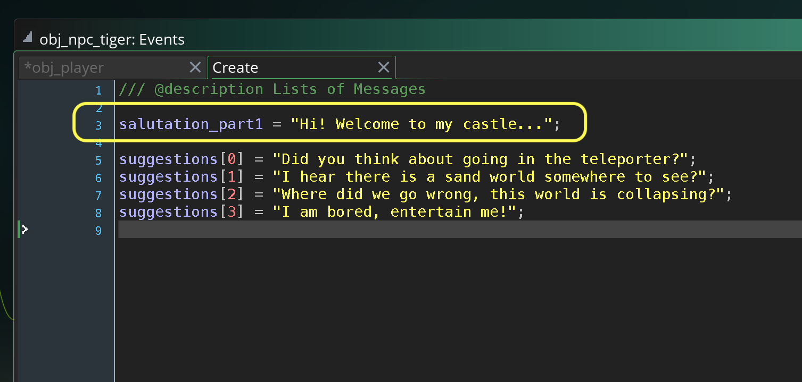

### Message Dialogue Box

[previous](../refactor-player/README.md#user-content-refactoring-player-step-events) • [home](..//README.md#user-content-gms2-action-adventure-game) • [next](../basic-message-ii/README.md#user-content-message-dialogue-box-ii)

I have provided some code to make dialogue boxes easier to implement.  Lets just display some text in a pop up box. It includes a message box that can display a message, a yes/no question and allows the user to input text and save it to a variable.  I have included all the needed files you need in this project.

 

---

##### `Step 1.`\|`TDAAG`|:small_blue_diamond:

Open up **P4v**.  Select the top folder of the **GameMaker** project. Press the <kbd>Checkout</kbd> button.  Checkout out all files in P4V so that they are all writable (otherwise they will be read only and none of the changes will be saved). Select a **New** changelist and add a message describing the unit of work you will be performing. Press the <kbd>OK</kbd> button.

Open up the project you are working on in **GameMaker**. 

##### `Step 2.`\|`TDAAG`|:small_blue_diamond: :small_blue_diamond: 

Lets import a sprite to act as an NPC.  This character will not animate, we will just talk to it.  Right click on the **Sprites** title in the **Resources** menu and select **Create | Sprite**.  Call it `spr_npc_tiger`.  Download the artwork [spr_npc_tiger.png](images/spr_npc_tiger.png). Press the <kbd>Import</kbd> button and selet the downloaded **pr_npc_tiger.png sprite**.

##### `Step 3.`\|`TDAAG`|:small_blue_diamond: :small_blue_diamond: :small_blue_diamond:

Now lets create an object from this sprite. Right click on the **Objects** title in the **Resources** menu and select **Create | Object**. Bind the `spr_npc_tiger` to this object and call it `obj_npc_tiger`.

##### `Step 4.`\|`TDAAG`|:small_blue_diamond: :small_blue_diamond: :small_blue_diamond: :small_blue_diamond:

Open **rm_castle** and add a new **Instance Layer** underneath the **Instance** with the player.  Call it `NPC_Instances`.  Drag a copy of the tiger to the top of the castle.

##### `Step 5.`\|`TDAAG`| :small_orange_diamond:

There are 7 scripts in the **Scripts | Messages** folder.  You will be using 4 of them and the messaging system uses the other three.  The 4 we care about are:

* `draw_dialogue_message(x, y, text, id, player_id, space_above, is_random, typewriter_delay)` is used to display a simple message box.  It draws a message box above the character that is speaking and accepts either a simple string or an array of multiple strings.  If there is more than one string then they are all played before the menu closes. 
* `draw_dialogue_question(x, y, text, id, player_id, space_above, typewriter_delay)` has a text array with three components.  This function asks a yes/no question with two answers basing on how the player answers in the game. The first array is a question, the second array string is an answer to the affirmative (player presses yes) and the final third string array is for the negative when the player presses no.
* `draw_dialogue_input(x, y, question, variable, id, player_id, space_above, typewriter_delay)` asks a quetion and allows the user to input an answer in a text box with the keyboard.  This requires a question in an array or string and an answer to be a single string array.</li>
* `scr_message_number()` returns a number of which message is being displayed.  This allows you to put logic in the character with the text box to make decisions on what should be displayed depending how many times the player has chatted with the character.

Lets start with drawing a simple message.  Add a new create event to `obj_npc_tiger`.  We will do the most simple type of message by just displaying a string.  We will add a basic salutation that the NPC initially asks you.

We will trigger the box when the player collides with the collision volume of the tiger npg.  Open up **obj_tiger_npc** and add a **Collision | obj_player**. We pass the position of the npc to the messaging system, the text message as a string, the id of the instance of the npc and the id of the instance of the player that has triggered the event. We put a margin of 32 pixels above the NPC to separate its head from the message box.  We set is_random to false as since there is only one message there is no need to randomize the one we play.  We set the typewrite effect to false for now.

##### `Step 6.`\|`TDAAG`| :small_orange_diamond: :small_blue_diamond:

Now *press* the <kbd>Play</kbd> button in the top menu bar to launch the game. Run into the NPC and see the dialogue message pops up.  There are two ways to close the message box.  Either hit the <kbd>Enter</kbd> button or walk outside of the collision volume and in both cases the message box dissapears.  There is a 3 second cool down period to where another message box will not appear.

https://user-images.githubusercontent.com/5504953/152686410-dce8f458-928b-416b-9749-ecbbe72703f3.mp4

##### `Step 7.`\|`TDAAG`| :small_orange_diamond: :small_blue_diamond: :small_blue_diamond:

Lets add the typewriter effect to game.  Go back to the collision event in the npc and change the typewiter_delay to 2 frames between letters.

##### `Step 8.`\|`TDAAG`| :small_orange_diamond: :small_blue_diamond: :small_blue_diamond: :small_blue_diamond:

Now *press* the <kbd>Play</kbd> button in the top menu bar to launch the game. Run into the NPC and see the dialogue message pops up.  Now the text appears slowly. You can't skip the message box until the typewriter completes.  Pressing **Enter** button fast forwards and finishes the typing skipping the effect. The next **Enter** will close the message box. 

https://user-images.githubusercontent.com/5504953/152686664-215682b8-d70d-46f3-9972-6e5c4a7f2258.mp4

##### `Step 9.`\|`TDAAG`| :small_orange_diamond: :small_blue_diamond: :small_blue_diamond: :small_blue_diamond: :small_blue_diamond:

Please note that it is up to you to determine if your text fits within the one box.  If your message takes more room it will run out the bottom of the box.  You have the ability to split this longer message into multiple messages in an array.  

An array is a simple list.  An array allows one variable name to hold multiple instances of the same data type.  We identify an array entry from the list with square brackets and the list number inside for example `sample_array[3]` would be the fourth item in an array called `sample_array`.  Why fourth?  We always start the array with [0] so the first time in the array would be `sample_array[0]`. 

Open up **obj_npc_tiger** and press the <kbd>Add Event</kbd> and select a **Create** event. Lets add an array to the npc's create event of various messages that would take more than one message box to display all of them.  They are also separate thoughts.

##### `Step 10.`\|`TDAAG`| :large_blue_diamond:

Open the **obj_npc_tiger | Collision**  event and alter which message to pass.  We want to pass the entire array so we use the array name without the brackets so it sends the entire list to the function. Lets randomize the order.

##### `Step 11.`\|`TDAAG`| :large_blue_diamond: :small_blue_diamond: 

Now you will see that it displays all the messages in random order before the message disappears.  Notice that the icon is an arrow when there is a message that is coming up.

https://user-images.githubusercontent.com/5504953/152687270-868137f7-623d-4378-83e1-a682aca6e028.mp4

##### `Step 12.`\|`TDAAG`| :large_blue_diamond: :small_blue_diamond: :small_blue_diamond: 

We have included a script that will return which message number is going displayed to allow the user to display a new message.  The script `scr_message_number()` returns which message number is being displayed.  Open the **obj_player | Create** event and add a message. 

##### `Step 13.`\|`TDAAG`| :large_blue_diamond: :small_blue_diamond: :small_blue_diamond:  :small_blue_diamond: 

Then open up the **obj_player | Collision**  event and string the last two messages together using `scr_message_number()`.

##### `Step 14.`\|`TDAAG`| :large_blue_diamond: :small_blue_diamond: :small_blue_diamond: :small_blue_diamond:  :small_blue_diamond: 

Now *press* the <kbd>Play</kbd> button in the top menu bar to launch the game.

https://user-images.githubusercontent.com/5504953/152710591-c3889d20-b70f-4883-a895-86337d10593e.mp4

##### `Step 15.`\|`TDAAG`| :large_blue_diamond: :small_orange_diamond: 

Now we will be asking a yes/no question.  This means we need to pass the message function an array of strings with the question in slot [0], the positive answer if the player selects yes in slot [1] and the no answer if the player selects no in slot [2].  

Open the **obj_npc_tiger | Create** event and add a question array with a question, a positive answer, and a negative answer.

##### `Step 16.`\|`TDAAG`| :large_blue_diamond: :small_orange_diamond:   :small_blue_diamond: 

Change the condition on the multiple question from `>=` to `==`.

Add the method `draw_dialogue_question(x, y, text, id, player_id, space_above, typewriter_delay)()` that is the same as the above parameter minus the randomize, as this will only take one question. The text argument HAS to be an array and has to contain 3 strings.  Open up `obj_npc_tiger | Collision` and add a third question message.

Now *pr

##### `Step 17.`\|`TDAAG`| :large_blue_diamond: :small_orange_diamond: :small_blue_diamond: :small_blue_diamond:
ess* the <kbd>Play</kbd> button in the top menu bar to launch the game.

The third message is a question that you can answer with Y or N by selecting the button with the arrow keys and pressing enter. There is a problem though you still move the player.

https://user-images.githubusercontent.com/5504953/152984957-deda275d-0e6a-49da-aaba-e8887d182d90.mp4

##### `Step 18.`\|`TDAAG`| :large_blue_diamond: :small_orange_diamond: :small_blue_diamond: :small_blue_diamond: :small_blue_diamond:

We want to freeze/pause the player (don't accept input) while the player answers the question so we need to add another state. Open the **obj_player | Create** event and add a `paused` state to `player_state`. We do not need any logic for this state, as the player will be doing nothing.

##### `Step 19.`\|`TDAAG`| :large_blue_diamond: :small_orange_diamond: :small_blue_diamond: :small_blue_diamond: :small_blue_diamond: :small_blue_diamond:

Now the player will just keep animating in the diretion they are going if we change states.  When we are in `player_state.paused` then we need to stop the player by setting `speed` to `0` and then select the idle animation by calling the animation selection function.  We do not need to resolve collisions as nothing is moving in this level (that will collide with the player) and the player is not moving. Open up `obj_player | Step` event and add the appropriate logic.

##### `Step 20.`\|`TDAAG`| :large_blue_diamond: :large_blue_diamond:

Now the three message functions return a real number with the state type the message box is in.  State 0 is a regular message, State 1 is a yes no question and State 2 is user inputing text.  Our question goes from State 1 when asking the yes no question to State 0 with the answer.  We just need to freeze the player in State 1.  Open the collision event for the NPC and add:

##### `Step 21.`\|`TDAAG`| :large_blue_diamond: :large_blue_diamond: :small_blue_diamond:

Now *press* the <kbd>Play</kbd> button in the top menu bar to launch the game. Now you can select **Y** and **N** without moving the player.  Control resumes after the yes or no question.

https://user-images.githubusercontent.com/5504953/152987615-5f9618bb-aab2-4209-9a47-2497701b0e2f.mp4

<!--  -->

| [previous](../refactor-player/README.md#user-content-refactoring-player-step-events)| [home](..//README.md#user-content-gms2-action-adventure-game) | [next](../basic-message-ii/README.md#user-content-message-dialogue-box-ii)|
|---|---|---|
