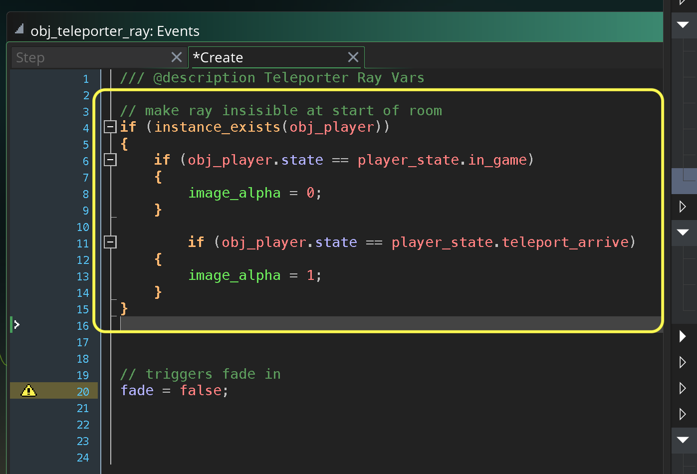
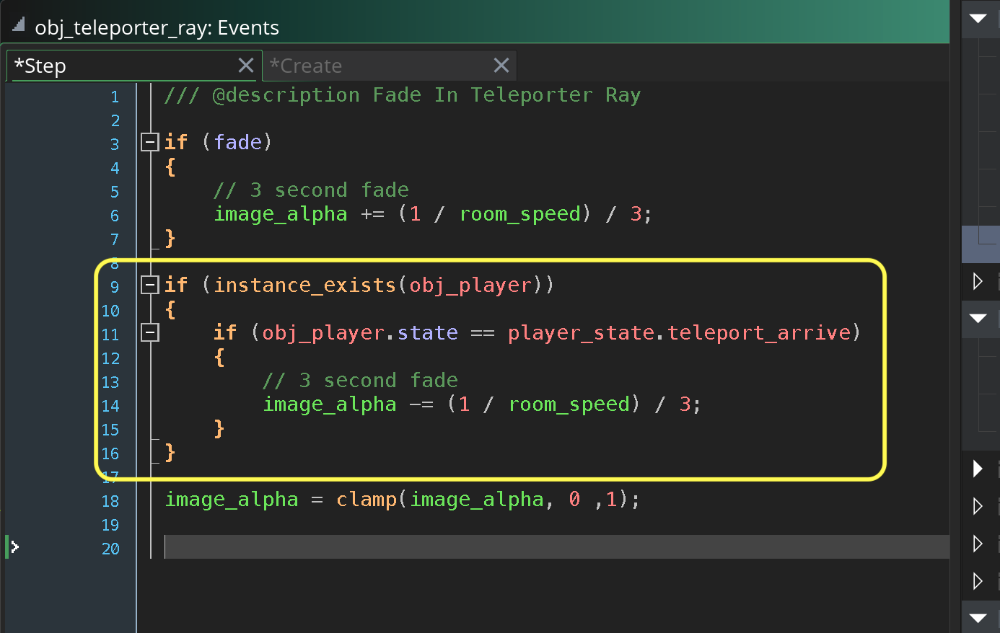
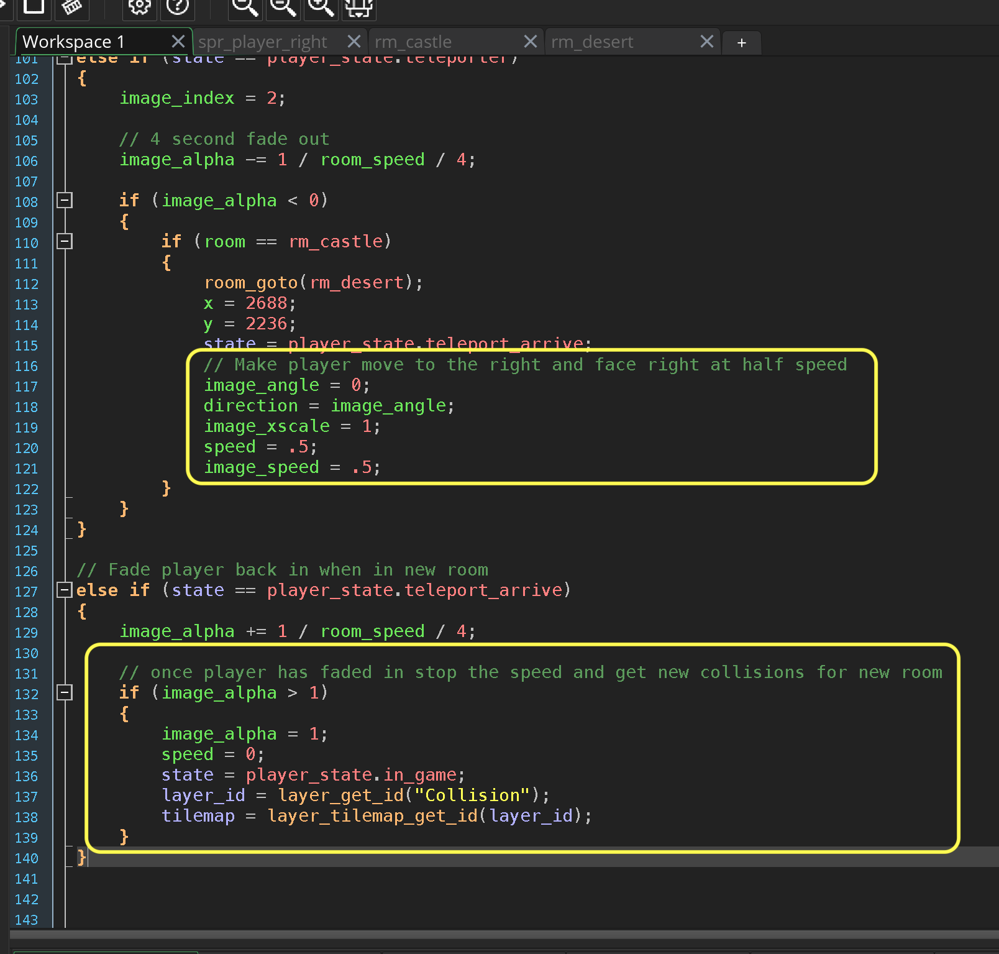
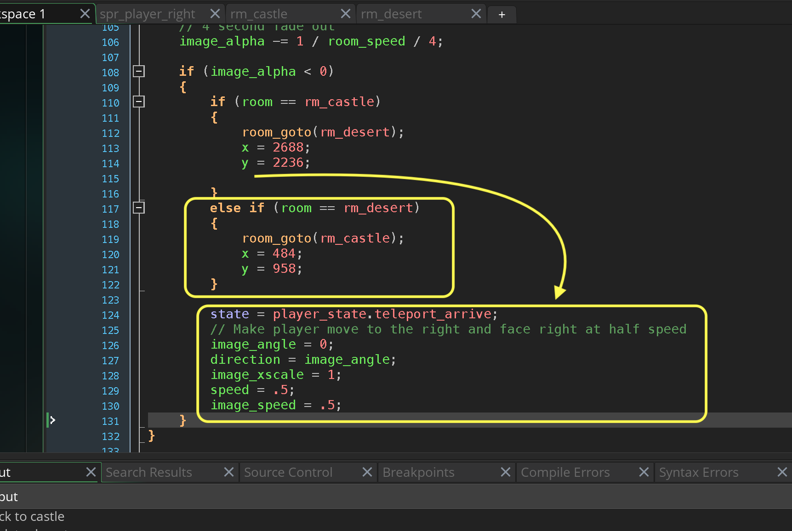

### Changing Rooms II

[previous](../changing-rooms/README.md#user-content-changing-rooms) • [home](../README.md#user-content-gms2-ue4-space-rocks) • [next](../refactor-player/README.md#user-content-refactoring-player-step-events)

Lets continue with getting the teleporter to work.

 

---

##### `Step 1.`\|`SPCRK`|:small_blue_diamond:

Play the game and make sure the player switches to the appropriate idle frame.

https://user-images.githubusercontent.com/5504953/152676113-302e6a80-0091-4476-b5a7-7d768e85042c.mp4

##### `Step 2.`\|`FHIU`|:small_blue_diamond: :small_blue_diamond: 

Lets have the ray start as an invisible sprite.  We will fade it in when the player collides with the teleporter volume. Open up **obj_teleporter_ray** and press the <kbd>Add Event</kbd> and select a **Create** event. Make the sprite transparent and add a variable switch `fade` to indicate when to fade in the sprite.

##### `Step 3.`\|`SPCRK`|:small_blue_diamond: :small_blue_diamond: :small_blue_diamond:

Press the <kbd>Add Event</kbd> and select a **Step | Step** event. If **fade** is true then start to fade for 3 seconds (we take one divided by room speed (60) then divided by three to get three seconds of fading in.  We then clamp the value between 0 and 1.

##### `Step 4.`\|`SPCRK`|:small_blue_diamond: :small_blue_diamond: :small_blue_diamond: :small_blue_diamond:

Go back to the **obj_player | Collision** event and trigger the switch to start the fade.

##### `Step 5.`\|`SPCRK`| :small_orange_diamond:

Press the <kbd>Add Event</kbd> and select a **Create** event. Run towards the teleporter and see the ray fade in over 3 seconds.
	
https://user-images.githubusercontent.com/5504953/152676593-33cf33c1-fe87-45f0-acab-cf57c6db9117.mp4

##### `Step 6.`\|`SPCRK`| :small_orange_diamond: :small_blue_diamond:

Now lets have the player fade out while the teleporter ray fades in.  Open up **obj_player | Collision** event and add a fade out over 4 seconds. When player is faded out change rooms.

##### `Step 7.`\|`SPCRK`| :small_orange_diamond: :small_blue_diamond: :small_blue_diamond:

Now we have to fix two things.  We want to have one player with its stats and items going from room to room.  So remove the player from `rm_desert`.

##### `Step 8.`\|`SPCRK`| :small_orange_diamond: :small_blue_diamond: :small_blue_diamond: :small_blue_diamond:

Make the player in `rm_castle` persistent so they don't get deleted when changing levels.

##### `Step 9.`\|`SPCRK`| :small_orange_diamond: :small_blue_diamond: :small_blue_diamond: :small_blue_diamond: :small_blue_diamond:

Now we need to get the location in the desert for where we moved the teleporter.  I put the cursor in the center of the teleporter and record the x and y values.

##### `Step 10.`\|`SPCRK`| :large_blue_diamond:

Now we go back to **obj_player | End Step** and add the x and y location of the teleporter in the desert room right after we change rooms.

##### `Step 11.`\|`SPCRK`| :large_blue_diamond: :small_blue_diamond: 

Now *press* the <kbd>Play</kbd> button in the top menu bar to launch the game. Now you do change rooms but the player is invisible and it triggers another teleporter transition.  Lets fix this.

https://user-images.githubusercontent.com/5504953/152677288-a6d5045a-c84c-4b3e-a424-71624e73d3c8.mp4

##### `Step 12.`\|`SPCRK`| :large_blue_diamond: :small_blue_diamond: :small_blue_diamond: 

Open up **obj_player | Create** event script and add a `teleport_arrive` to the `player_state`.

##### `Step 13.`\|`SPCRK`| :large_blue_diamond: :small_blue_diamond: :small_blue_diamond:  :small_blue_diamond: 

Open up the **obj_player | Collision** event and only allow this state change when you are `in_game`.  This will stop the triggering of endless back and forth between teleporter rays.

##### `Step 14.`\|`SPCRK`| :large_blue_diamond: :small_blue_diamond: :small_blue_diamond: :small_blue_diamond:  :small_blue_diamond: 

Now open up **obj_player | End Step** and a a state change when we change rooms.  Go from `teleporter` to `teleport_arrive`.  Then when in the `teleport_arrive` state fade in the player.

##### `Step 15.`\|`SPCRK`| :large_blue_diamond: :small_orange_diamond: 

Now *press* the <kbd>Play</kbd> button in the top menu bar to launch the game. Now you fade in when in the new room.  We now should have the ray already in and fade the ray out.  We will also have the player move out of the teleporter before switching back to `in_game` so that it doesn't trigger an endless back and forth.

https://user-images.githubusercontent.com/5504953/152677827-113749fc-c28c-4212-968b-924c05d534fd.mp4

##### `Step 16.`\|`SPCRK`| :large_blue_diamond: :small_orange_diamond:   :small_blue_diamond: 

Now open up **obj_teleporter_ray | Create** event. Check to see if the player exists.  Only set the `image_alpha` to `0` if the state is `in_game`. Set it to `1` if the state is `teleporter arrive`.

##### `Step 17.`\|`SPCRK`| :large_blue_diamond: :small_orange_diamond: :small_blue_diamond: :small_blue_diamond:

Open up **obj_teleporter_ray | Step** event and add a fade out when the state is `teleporter_arrive`.

##### `Step 18.`\|`SPCRK`| :large_blue_diamond: :small_orange_diamond: :small_blue_diamond: :small_blue_diamond: :small_blue_diamond:

Now *press* the <kbd>Play</kbd> button in the top menu bar to launch the game. Now the teleporter ray fades out as the player fades in. We just now need to walk the player outside the room then return to `in_game` state and give control back to the player.

https://user-images.githubusercontent.com/5504953/152678524-635972c0-fdbe-4cfe-a4f0-0f800f9711b1.mp4

##### `Step 19.`\|`SPCRK`| :large_blue_diamond: :small_orange_diamond: :small_blue_diamond: :small_blue_diamond: :small_blue_diamond: :small_blue_diamond:

Open up **obj_player | End Step** event and when we change rooms we set the direction and image angle to `0` (moving right) and half the speed of the aninmation and player.  We then in `teleport_arrive` state add a check for when the `image_alpha` is greater than `1` we put the alpha back to `1`, set the `speed` to `0` and change the state to `player_state.in_game`.  We also need to read the new tilemaps.

##### `Step 20.`\|`SPCRK`| :large_blue_diamond: :large_blue_diamond:

Now *press* the <kbd>Play</kbd> button in the top menu bar to launch the game. Now the transition is complete but we cannot go back to the castle through the teleporter.

https://user-images.githubusercontent.com/5504953/152679086-364898f6-bb82-45db-857d-8f19452f53b1.mp4

##### `Step 21.`\|`SPCRK`| :large_blue_diamond: :large_blue_diamond: :small_blue_diamond:

Now we go back to **obj_player | End Step** and remove the common elements outsid eof the room if statements.  In both rooms we will chnage states to `teleport_arrive`, and go right at half speed.  We will also add a room change from `rm_desert` to `rm_castle`.  I went into `rm_castle` and found that for my room `484` on the **x** `958` on the **y** brough the player back to the correct position.

##### `Step 22.`\|`SPCRK`| :large_blue_diamond: :large_blue_diamond: :small_blue_diamond: :small_blue_diamond:

Now *press* the <kbd>Play</kbd> button in the top menu bar to launch the game. Now you can can go back and forth.  That is it for changing rooms!

https://user-images.githubusercontent.com/5504953/152679692-18c296aa-2786-437a-9a2f-fa646edf43fd.mp4

___

| [previous](../changing-rooms/README.md#user-content-changing-rooms)| [home](../README.md#user-content-gms2-ue4-space-rocks) | [next](../refactor-player/README.md#user-content-refactoring-player-step-events)|
|---|---|---|
