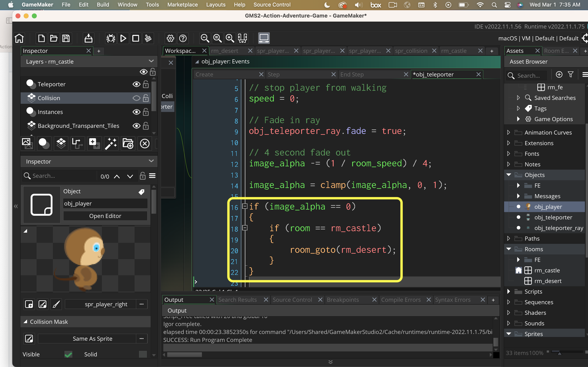

### Changing Rooms II

[previous](../) • [home](../README.md#user-content-gms2-ue4-space-rocks) • [next](../)

Lets continue with getting the teleporter to work.

 

---

##### `Step 1.`\|`SPCRK`|:small_blue_diamond:

Play the game and make sure the player switches to the appropriate idle frame.

https://user-images.githubusercontent.com/5504953/152676113-302e6a80-0091-4476-b5a7-7d768e85042c.mp4

##### `Step 2.`\|`FHIU`|:small_blue_diamond: :small_blue_diamond: 

Lets have the ray start as an invisible sprite.  We will fade it in when the player collides with the teleporter volume. Open up **obj_teleporter_ray** and press the <kbd>Add Event</kbd> and select a **Create** event. Make the sprite transparent and add a variable switch `fade` to indicate when to fade in the sprite.

##### `Step 3.`\|`SPCRK`|:small_blue_diamond: :small_blue_diamond: :small_blue_diamond:

Press the <kbd>Add Event</kbd> and select a **Step | Step** event. If **fade** is true then start to fade for 3 seconds (we take one divided by room speed (60) then divided by three to get three seconds of fading in.  We then clamp the value between 0 and 1.

##### `Step 4.`\|`SPCRK`|:small_blue_diamond: :small_blue_diamond: :small_blue_diamond: :small_blue_diamond:

Go back to the **obj_player | Collision** event and trigger the switch to start the fade.

##### `Step 5.`\|`SPCRK`| :small_orange_diamond:

Press the <kbd>Add Event</kbd> and select a **Create** event. Run towards the teleporter and see the ray fade in over 3 seconds.
	
https://user-images.githubusercontent.com/5504953/152676593-33cf33c1-fe87-45f0-acab-cf57c6db9117.mp4

##### `Step 6.`\|`SPCRK`| :small_orange_diamond: :small_blue_diamond:

Now lets have the player fade out while the teleporter ray fades in.  Open up **obj_player | Collision** event and add a fade out over 4 seconds.

##### `Step 7.`\|`SPCRK`| :small_orange_diamond: :small_blue_diamond: :small_blue_diamond:

Add a translucency to the player and call an alarm to change rooms:
		<h3>obj_player: Collision | obj_teleporter Event</h3>	

##### `Step 8.`\|`SPCRK`| :small_orange_diamond: :small_blue_diamond: :small_blue_diamond: :small_blue_diamond:

Run the game by pressing the  Play Button and run towards the teleporter. Now this should be good enough until we change rooms.

##### `Step 9.`\|`SPCRK`| :small_orange_diamond: :small_blue_diamond: :small_blue_diamond: :small_blue_diamond: :small_blue_diamond:

Now create a new event on the player and select Alarm | Alarm0 and add to the script a room change:

##### `Step 10.`\|`SPCRK`| :large_blue_diamond:

	Run the game by pressing the  Play Button and run towards the teleporter. Now this should be good enough until we change rooms.

##### `Step 11.`\|`SPCRK`| :large_blue_diamond: :small_blue_diamond: 

	I cut the fade off a bit short so I will adjust the timing.  On the next page we will deal with the desert room and getting back to a playable state.

##### `Step 12.`\|`SPCRK`| :large_blue_diamond: :small_blue_diamond: :small_blue_diamond: 

There are two problems.  When we change rooms we don't get an new gamepad input and also the player is a new player.  So the state is back to INGAME and you can control the player which is not what we want.  We want the object and its state to persist from level to level.

	Go to rm_desert and go to the Instances layer.  Delete obj_player and obj_gamepad.

 
	Open obj_gamepad and obj_player and press the Persistent radio button.

##### `Step 13.`\|`SPCRK`| :large_blue_diamond: :small_blue_diamond: :small_blue_diamond:  :small_blue_diamond: 

	Run the game by pressing the  Play Button and run towards the teleporter. Now when you change rooms the player should still be stuck in the TELEPORTER state.

##### `Step 14.`\|`SPCRK`| :large_blue_diamond: :small_blue_diamond: :small_blue_diamond: :small_blue_diamond:  :small_blue_diamond: 

We need to teleport the player to the new location of the teleporter. Open rm_desert and put a cursor on where the very center of the teleporter is located and read the coordinates. In my case it was (320, 2230):

##### `Step 15.`\|`SPCRK`| :large_blue_diamond: :small_orange_diamond: 

Open the player alarm0 event script and change the x and y coordinates::
<h3>obj_player: Alarm0 Event</h3>

##### `Step 16.`\|`SPCRK`| :large_blue_diamond: :small_orange_diamond:   :small_blue_diamond: 

Run the game by pressing the  Play Button and run towards the teleporter. Now when you change rooms the player now lands in the teleporter.

##### `Step 17.`\|`SPCRK`| :large_blue_diamond: :small_orange_diamond: :small_blue_diamond: :small_blue_diamond:

Now we need to switch states as we change rooms. Open script the create event script on the player and add another Macro player state called TELEPORTERLEAVE.

##### `Step 18.`\|`SPCRK`| :large_blue_diamond: :small_orange_diamond: :small_blue_diamond: :small_blue_diamond: :small_blue_diamond:

Open the player alarm0 event and change the player state.

##### `Step 19.`\|`SPCRK`| :large_blue_diamond: :small_orange_diamond: :small_blue_diamond: :small_blue_diamond: :small_blue_diamond: :small_blue_diamond:

Now we want the player to walk out to the right.  In the player step add a state to check to see if you are in TELEPORTERLEAVE and if so move to the right.

		Call an alarm1 to then go back to GAMEPLAY state.

##### `Step 20.`\|`SPCRK`| :large_blue_diamond: :large_blue_diamond:

Go to obj_player and add an Alarm | Alarm1 event. Then make the image alpha solid again, change the state back to INGAME and get the layer_id and tilemap for this new room (otherwise it will be the one from the previous room as the player persists through levels).

##### `Step 21.`\|`SPCRK`| :large_blue_diamond: :large_blue_diamond: :small_blue_diamond:

Run the game by pressing the  Play Button and run towards the teleporter. Now when you change rooms the player now lands in the teleporter and you can control them back in regular game state.

___

| [previous](../)| [home](../README.md#user-content-gms2-ue4-space-rocks) | [next](../)|
|---|---|---|
