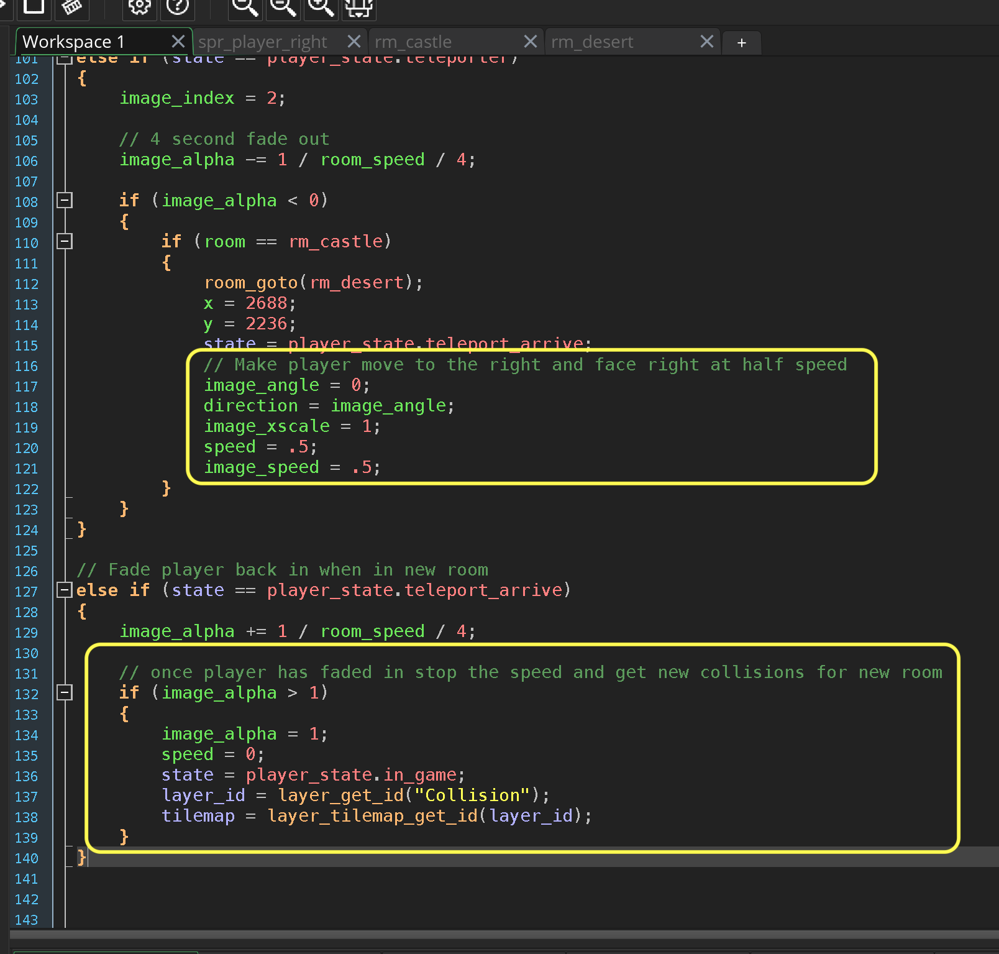
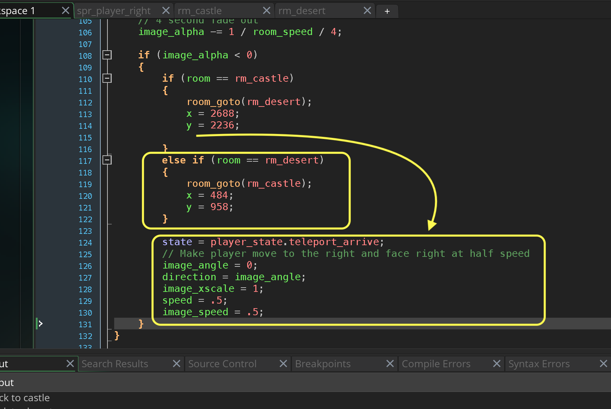

### Changing Rooms III

[previous](../changing-rooms-ii/README.md#user-content-changing-rooms-ii) • [home](..//README.md#user-content-gms2-action-adventure-game) • [next](../refactor-player/README.md#user-content-refactoring-player-step-events)

Chapter introduction here.

 

---

##### `Step 1.`\|`TDAAG`|:small_blue_diamond:

Now *press* the <kbd>Play</kbd> button in the top menu bar to launch the game. Now the teleporter ray fades out as the player fades in. We just now need to walk the player outside the room then return to `in_game` state and give control back to the player.

https://user-images.githubusercontent.com/5504953/152678524-635972c0-fdbe-4cfe-a4f0-0f800f9711b1.mp4

##### `Step 2.`\|`TDAAG`|:small_blue_diamond: :small_blue_diamond: 

Open up **obj_player | End Step** event and when we change rooms we set the direction and image angle to `0` (moving right) and half the speed of the aninmation and player.  We then in `teleport_arrive` state add a check for when the `image_alpha` is greater than `1` we put the alpha back to `1`, set the `speed` to `0` and change the state to `player_state.in_game`.  We also need to read the new tilemaps.

##### `Step 3.`\|`TDAAG`|:small_blue_diamond: :small_blue_diamond: :small_blue_diamond:

Now *press* the <kbd>Play</kbd> button in the top menu bar to launch the game. Now the transition is complete but we cannot go back to the castle through the teleporter.

https://user-images.githubusercontent.com/5504953/152679086-364898f6-bb82-45db-857d-8f19452f53b1.mp4

##### `Step 4.`\|`TDAAG`|:small_blue_diamond: :small_blue_diamond: :small_blue_diamond: :small_blue_diamond:

Now we go back to **obj_player | End Step** and remove the common elements outsid eof the room if statements.  In both rooms we will chnage states to `teleport_arrive`, and go right at half speed.  We will also add a room change from `rm_desert` to `rm_castle`.  I went into `rm_castle` and found that for my room `484` on the **x** `958` on the **y** brough the player back to the correct position.

##### `Step 5.`\|`TDAAG`| :small_orange_diamond:

Now *press* the <kbd>Play</kbd> button in the top menu bar to launch the game. Now you can can go back and forth.  That is it for changing rooms!

https://user-images.githubusercontent.com/5504953/152679692-18c296aa-2786-437a-9a2f-fa646edf43fd.mp4

##### `Step 6.`\|`TDAAG`| :small_orange_diamond: :small_blue_diamond:

Select the **File | Save Project**, then press **File | Quit** (PC) **Game Maker | Quit** on Mac to make sure everything in the game is saved.

##### `Step 7.`\|`TDAAG`| :small_orange_diamond: :small_blue_diamond: :small_blue_diamond:

Open up **P4V**.  Select the top folder and press the **Add** button.  We want to add all the new files we created during this last session.  Add these files to the last change list you used at the begining of the session. Make sure the message accurately represents what you have done. Press the <kbd>OK</kbd> button.

##### `Step 8.`\|`TDAAG`| :small_orange_diamond: :small_blue_diamond: :small_blue_diamond: :small_blue_diamond:

Now you can submit the changelist by pressing both <kbd>Submit</kbd> buttons.

<!--  -->

| [previous](../changing-rooms-ii/README.md#user-content-changing-rooms-ii)| [home](..//README.md#user-content-gms2-action-adventure-game) | [next](../refactor-player/README.md#user-content-refactoring-player-step-events)|
|---|---|---|
