### Changing Rooms

[previous](../resolve-collision/README.md#user-content-resolve-collision) • [home](../README.md#user-content-gms2-ue4-space-rocks) • [next](../)

Lets now add another level and change rooms.  We will add a teleporter to the level to be the device that gets us back and forth between rooms.

 

---

##### `Step 1.`\|`SPCRK`|:small_blue_diamond:

Download the teleporter ray sprite here: [spr_teleporter_ray.png](images/spr_teleporter_ray.png).
		
*Right click* on **Sprites** and select **New | Sprite** and name it `spr_teleporter_ray`. Press the Import button and go to the folder you downloaded `spr_teleporter_ray.png`. 

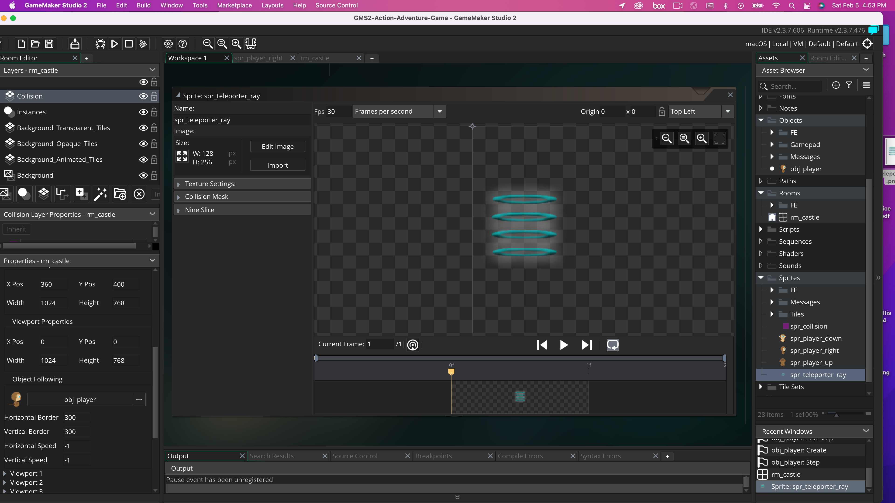

##### `Step 2.`\|`FHIU`|:small_blue_diamond: :small_blue_diamond: 

Now do the exact same thing and create a new sprite and Import [spr_teleporter.png](images/spr_teleporter.png).

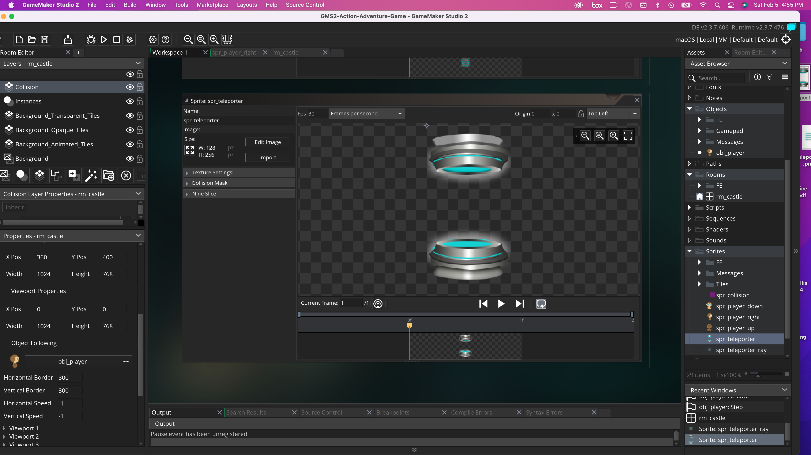

##### `Step 3.`\|`SPCRK`|:small_blue_diamond: :small_blue_diamond: :small_blue_diamond:

Now we want the teleporter only to trigger when you are in the center middle of it. We will make the collision volume (which is a trigger volume to activate the room change) very small. Open the **Collision Mask** in `spr_teleporter` and change the **Mode** from **Automatic** to `Manual`. Then change **Left** to `60`, **Right** to `67`, **Top** to `100` and **Bottom** to `140`. Now we have a collision volume that is triggered inside the teleporter.

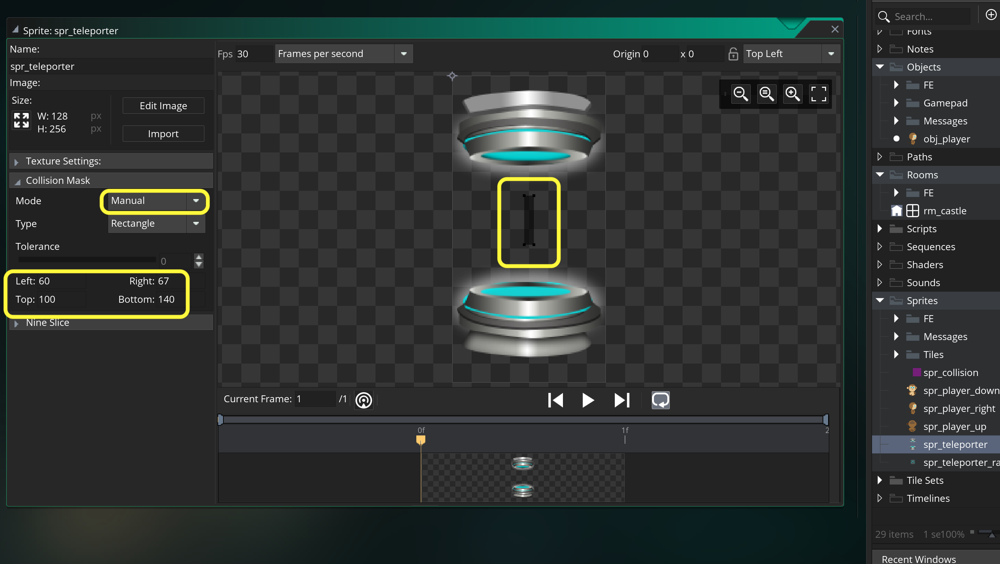

##### `Step 4.`\|`SPCRK`|:small_blue_diamond: :small_blue_diamond: :small_blue_diamond: :small_blue_diamond:

We need to create a small finite state machine for the player.  We have to watch for a few things:

* If the player collides with the teleporter go to the second room
* Change state of player to out of game.
* Stop user control
* When in new room start in `teleporter` state, walk off teleporter
* Change state back to ingame.

Lets use an enumerator to store the player state.  An enumerator is a constant which makes it non-mutable (cannot be altered at run time) name that will represent the state of the player. Open the player create event and add at the top (typically we will place macros before variables):

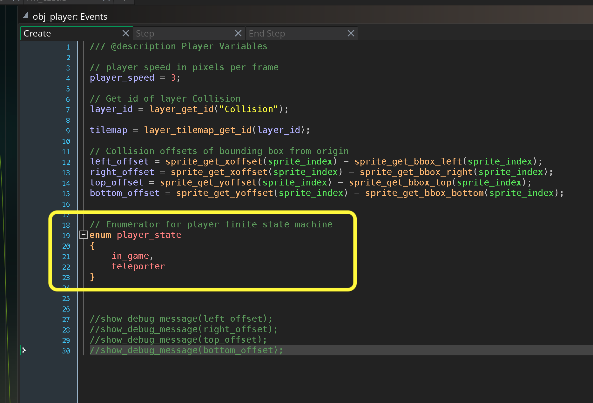

##### `Step 5.`\|`SPCRK`| :small_orange_diamond:

Now lets create variable that stores the macro containing the player state. The player starts the game in `player_state.in_game` so we will default to this state.  Open the **obj_player | Create** event and add to the bottom:

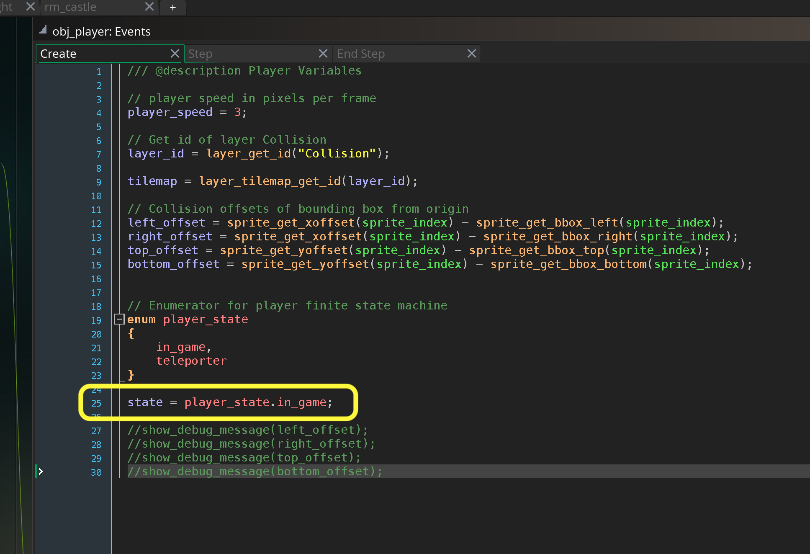

##### `Step 6.`\|`SPCRK`| :small_orange_diamond: :small_blue_diamond:

Create a new **Game Object** and bind the `spr_teleporter` sprite to it and call it `obj_teleporter`.

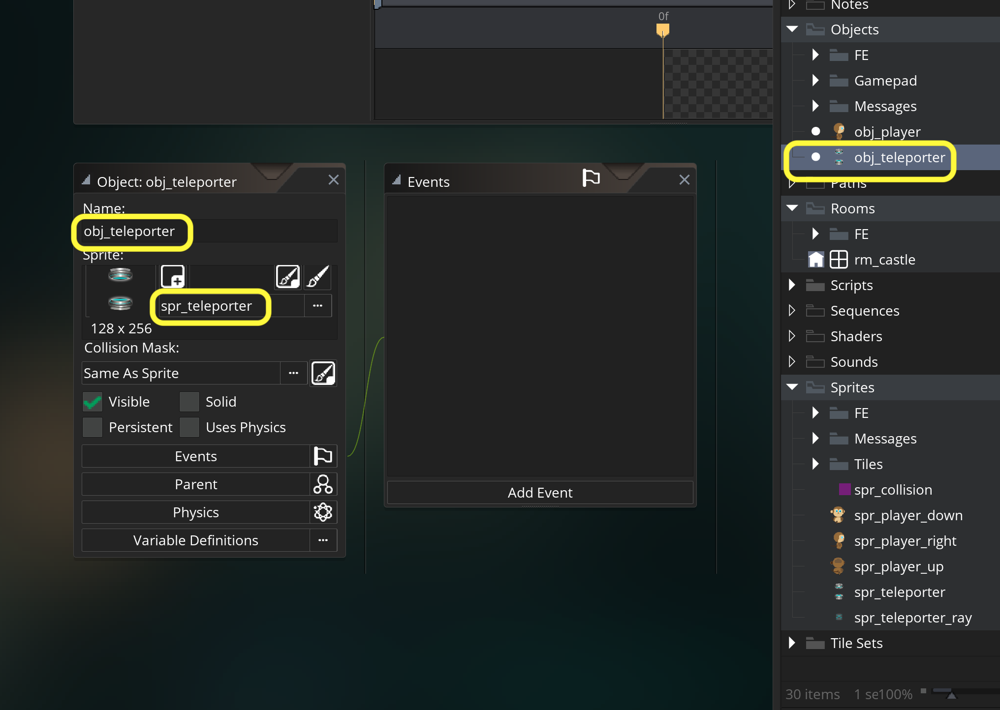

##### `Step 7.`\|`SPCRK`| :small_orange_diamond: :small_blue_diamond: :small_blue_diamond:

Create a new **Game Object** and bind the `spr_teleporter_ray` sprite to it and call it `obj_teleporter_ray`.

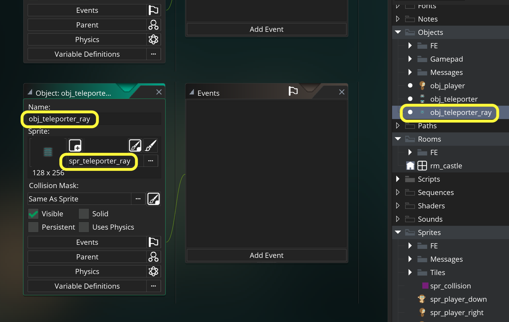

##### `Step 8.`\|`SPCRK`| :small_orange_diamond: :small_blue_diamond: :small_blue_diamond: :small_blue_diamond:

Go to **rm_castle** and add a new **instance** layer that will be on top of the player.  Call it `Teleporter`. Now drag and drop `obj_teleporter` and `obj_teleporter_ray` onto the **Teleporter** layer.

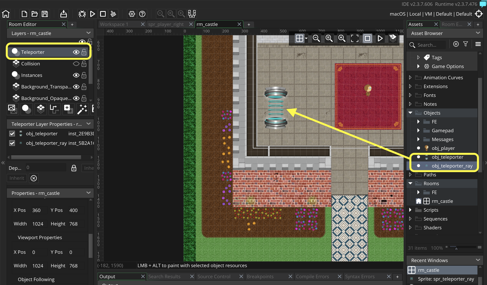

##### `Step 9.`\|`SPCRK`| :small_orange_diamond: :small_blue_diamond: :small_blue_diamond: :small_blue_diamond: :small_blue_diamond:

Now we need a room to teleport to.  We won't get too complicated, let's create a new room and make it into a desert.  Right click on **rm_castle** and select **Duplicate**.  Name this room `rm_desert`.

##### `Step 10.`\|`SPCRK`| :large_blue_diamond:

Select Background_Opaque_Tiles layer and select the sand tile.  Pick the Paint Bucket or Erase tool and start replacing all the opaque objects with sand. 

https://user-images.githubusercontent.com/5504953/152674654-5916db84-cb07-4500-b1ea-5ab543b395ab.mp4

##### `Step 11.`\|`SPCRK`| :large_blue_diamond: :small_blue_diamond: 

Select the Collision layer in `rm_desert` and press the eyeball button to make the collision layer visible. Pick the Erase tool and start removing all collisions not on the outer edge. Fill in any gaps and just surround the room so the player cannot escape.

https://user-images.githubusercontent.com/5504953/152674813-9d50c639-a97e-4d4e-8e38-c91c7e41fd08.mp4

##### `Step 12.`\|`SPCRK`| :large_blue_diamond: :small_blue_diamond: :small_blue_diamond: 

Turn off the collision layer.

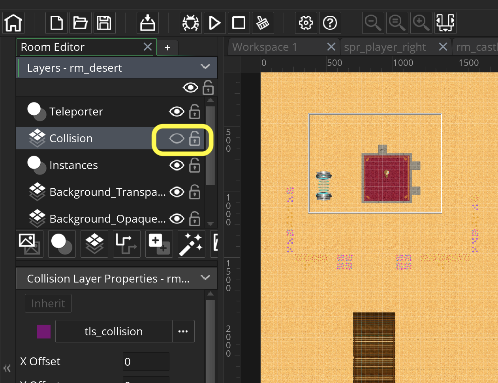

##### `Step 13.`\|`SPCRK`| :large_blue_diamond: :small_blue_diamond: :small_blue_diamond:  :small_blue_diamond: 

Rather than erasing the animated and transparent tiles we can just delete the entire layers. Delete **Background_Transparent_Tiles** and **Background_Animated_Tiles**.

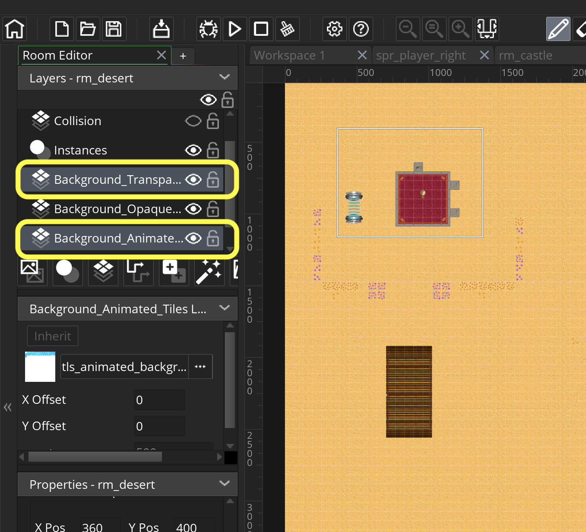

##### `Step 14.`\|`SPCRK`| :large_blue_diamond: :small_blue_diamond: :small_blue_diamond: :small_blue_diamond:  :small_blue_diamond: 

Select the **Teleporter** layer and move the teleporter and ray to a different part of the room. 

##### `Step 15.`\|`SPCRK`| :large_blue_diamond: :small_orange_diamond: 

Add a collision volume for both teleporters in **rm_desert** and **rm_castle**.  Move the **Collision** layer to the top layer in both rooms. Then turn off collision layer visibility.

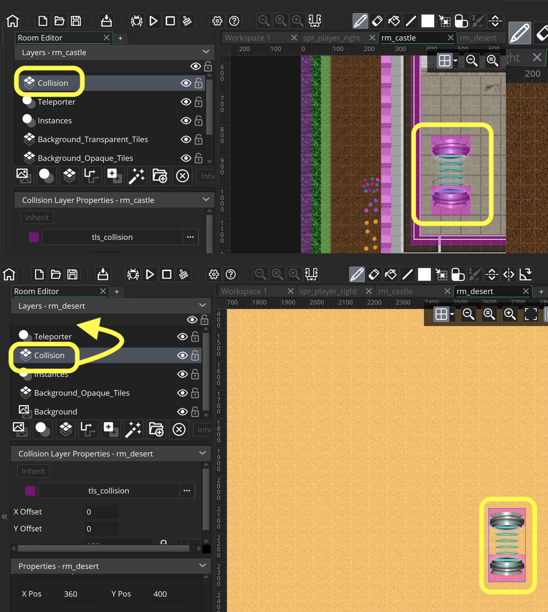

##### `Step 16.`\|`SPCRK`| :large_blue_diamond: :small_orange_diamond:   :small_blue_diamond: 

##### `Step 17.`\|`SPCRK`| :large_blue_diamond: :small_orange_diamond: :small_blue_diamond: :small_blue_diamond:

Now we want to restrict player movement to when the player is in the teleporter by changing the stateINGAME state. So we will add a check to the obj_player Step Event:

##### `Step 18.`\|`SPCRK`| :large_blue_diamond: :small_orange_diamond: :small_blue_diamond: :small_blue_diamond: :small_blue_diamond:

Run the game by pressing the  Play Button. Now it should be back to exaclty the same as it was before we added this check as the game starts with the player in this INGAME state.

##### `Step 19.`\|`SPCRK`| :large_blue_diamond: :small_orange_diamond: :small_blue_diamond: :small_blue_diamond: :small_blue_diamond: :small_blue_diamond:

When the player is in the teleporter we want to change the player state.  So first we need to check for a collision with the teleporter in obj_player Collision | obj_teleporter Event:
<h3>obj_player: Collision | obj_teleporter Event</h3>

##### `Step 20.`\|`SPCRK`| :large_blue_diamond: :large_blue_diamond:

Run the game by pressing the  Play Button and run towards the teleporter. You will notice that the player stops but still keeps walking stuck in the last animation state.

##### `Step 21.`\|`SPCRK`| :large_blue_diamond: :large_blue_diamond: :small_blue_diamond:

Now lets test the game. When you collide with the teleporter the player gets stuck in its last animation state and does nothing. So our state is changing succesfully. Now we need to do a few things. Add to the collision event a change to the appropriate idle animation:

___

| [previous](../resolve-collision/README.md#user-content-resolve-collision)| [home](../README.md#user-content-gms2-ue4-space-rocks) | [next](../)|
|---|---|---|
