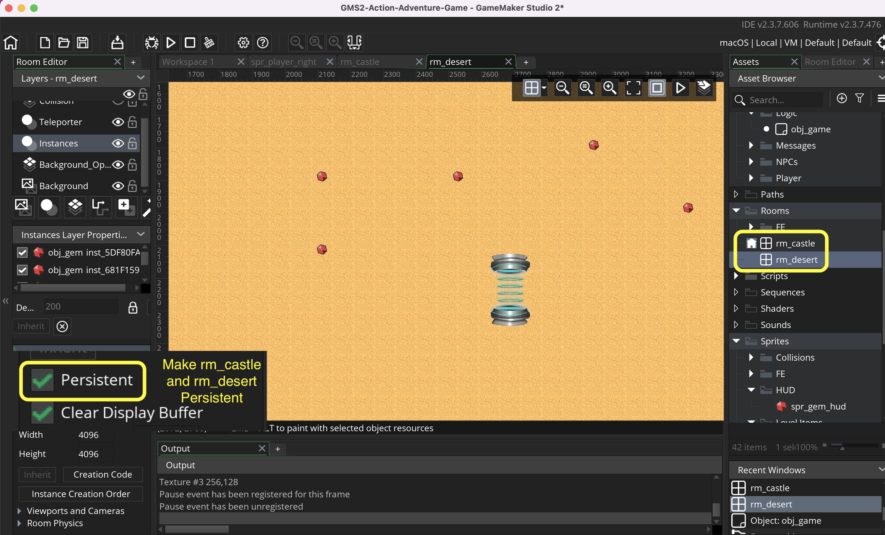

### Collectables II

[previous](../collectables/README.md#user-content-collectables) • [home](../README.md#user-content-gms2-ue4-space-rocks) • [next](../pathfinding/README.md#user-content-pathfinding-zombie)

Let's finish up collecting gems.

 

---

##### `Step 1.`\|`SPCRK`|:small_blue_diamond:

 Not only can objects persist but rooms can as well.  If we want rooms to *keep* their state and not get purged we can make them persistent as well. Go to the game and open `rm_castle` and `rm_desert` and click the radio button called `Persistent`.

##### `Step 2.`\|`FHIU`|:small_blue_diamond: :small_blue_diamond: 

Now *press* the <kbd>Play</kbd> button in the top menu bar to launch the game. Now when you go room to room the status of the gems are the same, they do not reset.

https://user-images.githubusercontent.com/5504953/153779092-5257a953-d60d-48b3-bd46-3a9f3de532d4.mp4

##### `Step 3.`\|`SPCRK`|:small_blue_diamond: :small_blue_diamond: :small_blue_diamond:

Now back to drawing the HUD again. Lets make a Font for the HUD. Create a new Font and pick one you like with a size of 10 points, set it to a thicker type and call it <tt><b>fnt_hud</b></tt>:

Lets draw the title <tt><b>"Gems: "</b></tt> on the HUD. Open DrawGUI Event in <tt><b>obj_game_controller</b></tt> and add to the end of the script:

Run the game by pressing the  <tt><b>Play Button</b></tt>. Now the HUD has a text title on it.

##### `Step 4.`\|`SPCRK`|:small_blue_diamond: :small_blue_diamond: :small_blue_diamond: :small_blue_diamond:

Now lets add the actual icon of the gem that we want to show on the screen how many you have collected. Add to the end of the Draw GUI event on the game controller:
		<h3><tt><b>obj_game_controller: Draw GUI Event</b></tt></h3>

##### `Step 5.`\|`SPCRK`| :small_orange_diamond:

Run the game by pressing the  <tt><b>Play Button</b></tt>. Run around collect Gems. Do you see gems adding up in the menu?  Also go from room to room.  Do you see a problem arise?

##### `Step 6.`\|`SPCRK`| :small_orange_diamond: :small_blue_diamond:

Each time you return to the room the gems reappear, their status is not saved. The rooms are set back to their original settings. What we need to do is make the rooms persistent. Go to the game and open <tt><b>rm_castle</b></tt> and <tt><b>rm_desert</b></tt> and click the radio button called <tt><b>Persistent</b></tt>. 
		<h3><tt><b>rm_castle</b></tt></h3>

##### `Step 7.`\|`SPCRK`| :small_orange_diamond: :small_blue_diamond: :small_blue_diamond:

Run the game by pressing the  <tt><b>Play Button</b></tt>. Test the game and the rooms should now remember the gems taken and not respawn them.

##### `Step 8.`\|`SPCRK`| :small_orange_diamond: :small_blue_diamond: :small_blue_diamond: :small_blue_diamond:

##### `Step 9.`\|`SPCRK`| :small_orange_diamond: :small_blue_diamond: :small_blue_diamond: :small_blue_diamond: :small_blue_diamond:

##### `Step 10.`\|`SPCRK`| :large_blue_diamond:

##### `Step 11.`\|`SPCRK`| :large_blue_diamond: :small_blue_diamond: 

##### `Step 12.`\|`SPCRK`| :large_blue_diamond: :small_blue_diamond: :small_blue_diamond: 

##### `Step 13.`\|`SPCRK`| :large_blue_diamond: :small_blue_diamond: :small_blue_diamond:  :small_blue_diamond: 

##### `Step 14.`\|`SPCRK`| :large_blue_diamond: :small_blue_diamond: :small_blue_diamond: :small_blue_diamond:  :small_blue_diamond: 

##### `Step 15.`\|`SPCRK`| :large_blue_diamond: :small_orange_diamond: 

##### `Step 16.`\|`SPCRK`| :large_blue_diamond: :small_orange_diamond:   :small_blue_diamond: 

##### `Step 17.`\|`SPCRK`| :large_blue_diamond: :small_orange_diamond: :small_blue_diamond: :small_blue_diamond:

##### `Step 18.`\|`SPCRK`| :large_blue_diamond: :small_orange_diamond: :small_blue_diamond: :small_blue_diamond: :small_blue_diamond:

##### `Step 19.`\|`SPCRK`| :large_blue_diamond: :small_orange_diamond: :small_blue_diamond: :small_blue_diamond: :small_blue_diamond: :small_blue_diamond:

##### `Step 20.`\|`SPCRK`| :large_blue_diamond: :large_blue_diamond:

##### `Step 21.`\|`SPCRK`| :large_blue_diamond: :large_blue_diamond: :small_blue_diamond:

___

| [previous](../collectables/README.md#user-content-collectables)| [home](../README.md#user-content-gms2-ue4-space-rocks) | [next](../pathfinding/README.md#user-content-pathfinding-zombie)|
|---|---|---|
