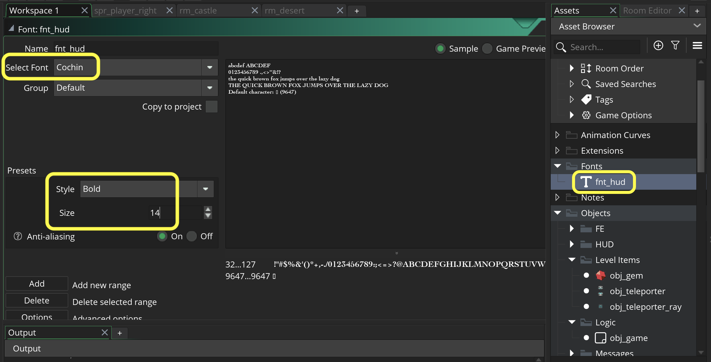

### Collectables II

[previous](../collectables/README.md#user-content-collectables) • [home](../README.md#user-content-gms2-ue4-space-rocks) • [next](../pathfinding/README.md#user-content-pathfinding-zombie)

Let's finish up collecting gems.

 

---

##### `Step 1.`\|`TDAAG`|:small_blue_diamond:

 Not only can objects persist but rooms can as well.  If we want rooms to *keep* their state and not get purged we can make them persistent as well. Go to the game and open `rm_castle` and `rm_desert` and click the radio button called `Persistent`.

##### `Step 2.`\|`TDAAG`|:small_blue_diamond: :small_blue_diamond: 

Now *press* the <kbd>Play</kbd> button in the top menu bar to launch the game. Now when you go room to room the status of the gems are the same, they do not reset. But there is a remaining issue now that the rooms are persistent the ray doesn't fade after coming back to the first room.

https://user-images.githubusercontent.com/5504953/153779092-5257a953-d60d-48b3-bd46-3a9f3de532d4.mp4

##### `Step 3.`\|`TDAAG`|:small_blue_diamond: :small_blue_diamond: :small_blue_diamond:

Before the **Create** event ran on **obj_teleporter_ray** which resetn `obj_teleporter_ray.fade` to `false`.  Now since we made the room **Persistent** the **Create** event does not run, so the fade stays `true`.  This means that it both adds and subtracts from the ray `image_alpha` which makes it stay at `1`.  We need to open up **teleport_send** and switch off `fade` before the room changes and it is no longer accessible.

##### `Step 4.`\|`TDAAG`|:small_blue_diamond: :small_blue_diamond: :small_blue_diamond: :small_blue_diamond:

Now *press* the <kbd>Play</kbd> button in the top menu bar to launch the game. Now we should have fixed all issues with screen transitions!

https://user-images.githubusercontent.com/5504953/153876892-ca4542a5-1f61-40a7-9fdb-f95abac8f0a5.mp4

##### `Step 5.`\|`TDAAG`| :small_orange_diamond:

Now back to drawing the HUD again. Lets make a Font for the HUD. We are using the default font which has an unkown type and size and might be different on different operating systems. *Create* a new **Font** and pick one you like with a size of roughly 14 points, set it to a **Bold** type and call it `fnt_hud`.

##### `Step 6.`\|`TDAAG`| :small_orange_diamond: :small_blue_diamond:

Open up **obj_game | Draw GUI** event and add the font to display.

##### `Step 7.`\|`TDAAG`| :small_orange_diamond: :small_blue_diamond: :small_blue_diamond:

Now *press* the <kbd>Play</kbd> button in the top menu bar to launch the game. Now we should have completed everything we need to deal with collectible items.

https://user-images.githubusercontent.com/5504953/153881267-24e8eee8-9fd8-4374-8ace-29d094a78cbb.mp4

##### `Step 8.`\|`TDAAG`| :small_orange_diamond: :small_blue_diamond: :small_blue_diamond: :small_blue_diamond:

Select the **File | Save Project** then press **File | Quit** to make sure everything in the game is saved. If you are using **GitHub** open up **GitHub Desktop** and add a title and longer description (if necessary) and press the <kbd>Commit to main</kbd> button. Finish by pressing **Push origin** to update the server with the latest changes.

___

<!--  -->

| [previous](../collectables/README.md#user-content-collectables)| [home](../README.md#user-content-gms2-ue4-space-rocks) | [next](../pathfinding/README.md#user-content-pathfinding-zombie)|
|---|---|---|
