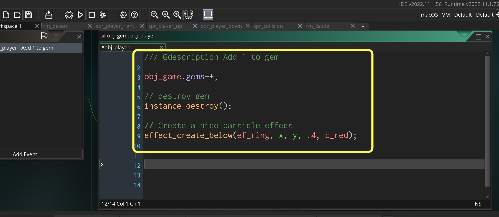
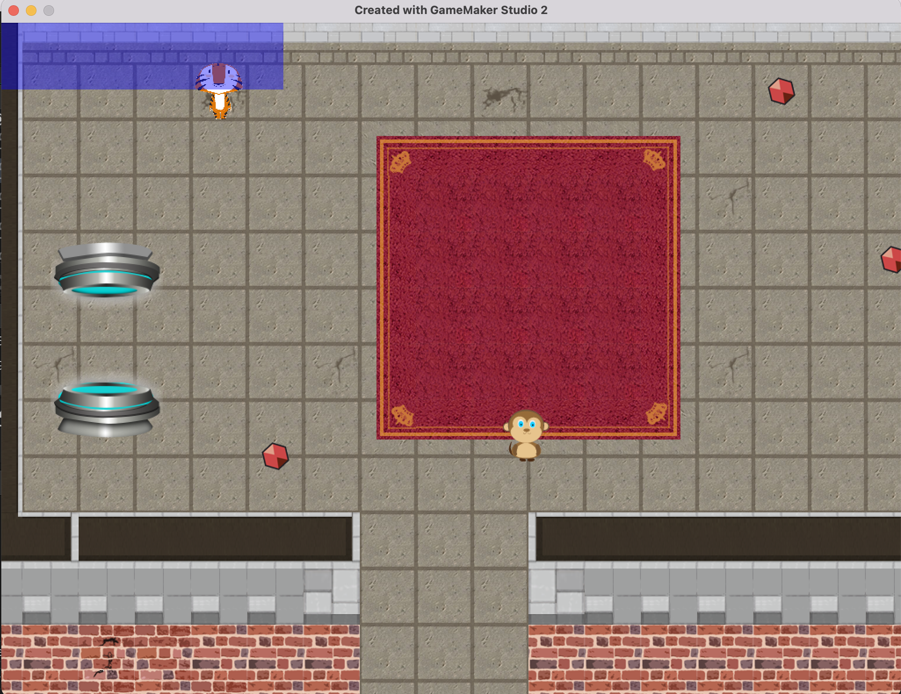

### Collectables

[previous](../) • [home](../README.md#user-content-gms2-ue4-space-rocks) • [next](../)

Lets add an object for the player to collect in the game.  We will use a rare gem.

 

---

##### `Step 1.`\|`SPCRK`|:small_blue_diamond:

Download [spr_gem.png](images/spr_gem.png) as a collectible for the game. Right click on the **Sprites** title in the **Resources** menu and select **Create | Sprite**.  Press the **Import** button and navigate to the sprite you just doownloaded. Name the sprite `spr_gem`.

##### `Step 2.`\|`FHIU`|:small_blue_diamond: :small_blue_diamond: 

Repeat the above and create a new **Sprite** then import [spr_gem_hud.png](images/spr_gem_hud.png), naming it `spr_gem_hud`.	

##### `Step 3.`\|`SPCRK`|:small_blue_diamond: :small_blue_diamond: :small_blue_diamond:

Now we have a lot of sprites in our sprites folder, lets clean them up. Right click on the **Sprites** title in the **Resources** menu and select **Add Group**. Call it `Player`. Drag the 3 player sprites into the folder.

https://user-images.githubusercontent.com/5504953/153754499-c3fb6628-cf69-4596-bd88-a2ffba3ad973.mp4

##### `Step 4.`\|`SPCRK`|:small_blue_diamond: :small_blue_diamond: :small_blue_diamond: :small_blue_diamond:

Organize the rest of the sprite folder to your liking.

https://user-images.githubusercontent.com/5504953/153754704-716a7d58-6e16-444f-8736-b315b2d4cc27.mp4

##### `Step 5.`\|`SPCRK`| :small_orange_diamond:

Organize your game objects into groups as well.

##### `Step 6.`\|`SPCRK`| :small_orange_diamond: :small_blue_diamond:

Add a new Game Object and call it `obj_gem` and bind `spr_gem` to it and place it in a logical group.

##### `Step 7.`\|`SPCRK`| :small_orange_diamond: :small_blue_diamond: :small_blue_diamond:

Add a new Game Object and call it `obj_gem_hud` and bind `spr_gem_hud` to it and place it in a logical group.

##### `Step 8.`\|`SPCRK`| :small_orange_diamond: :small_blue_diamond: :small_blue_diamond: :small_blue_diamond:

We want to add the full size gems into the rooms to collect.  First lets center both horizontally and vertically the **Origin** on `spr_gem`. Add a new **Instance Layer** called `PickUps` to both rooms and move just above **Backgrounds**. Now lets add 5 gems in `rm_castle` and 5 gems in `rm_desert` to this new layer.

https://user-images.githubusercontent.com/5504953/153755297-e9a06c22-b1f4-40b2-9af9-852538eea9aa.mp4

##### `Step 9.`\|`SPCRK`| :small_orange_diamond: :small_blue_diamond: :small_blue_diamond: :small_blue_diamond: :small_blue_diamond:

Now the player will be picking up these gems, so they will disapear when the player collects them. We don't want to have a variable saved on the gem object itself. Lets keep track of it in a game controller. Add a new game object and call it `obj_game`. Create a **Group** called `Logic` to put it in.  Do NOT assign a sprite to it.

##### `Step 10.`\|`SPCRK`| :large_blue_diamond:

Add a **Create** event to `obj_game` and add a variable called `gems` to track how many gems we have collected. We start with `0` gems.

##### `Step 11.`\|`SPCRK`| :large_blue_diamond: :small_blue_diamond: 

Drag and drop **obj_game** into `rm_castle` anywhere in the level on the **Instances** layer.

##### `Step 12.`\|`SPCRK`| :large_blue_diamond: :small_blue_diamond: :small_blue_diamond: 

Now when the gem collides with the player we want the `gem` count to go up by `1` and the gem in the level to dissapear. Create a new collision collision on the **obj_gem** object with the player and add a point, destroy the gem and add an effect to sell the interaction and give positive feedback to the user action:

##### `Step 13.`\|`SPCRK`| :large_blue_diamond: :small_blue_diamond: :small_blue_diamond:  :small_blue_diamond: 

Now *press* the <kbd>Play</kbd> button in the top menu bar to launch the game. Go and collect the gems.  They should disappear with a simple particle effect like so:

https://user-images.githubusercontent.com/5504953/153760303-8d051614-ec7d-4cce-b7a6-a6560890a7d5.mp4

##### `Step 14.`\|`SPCRK`| :large_blue_diamond: :small_blue_diamond: :small_blue_diamond: :small_blue_diamond:  :small_blue_diamond: 

Now we are going to draw a small version of the gem on the Heads Up Display (HUD) on the top of the screen. We will use our **obj_game** for this and add a **Draw GUI** event type. First lets draw a rectangle to higlight the HUD. 

##### `Step 15.`\|`SPCRK`| :large_blue_diamond: :small_orange_diamond: 

v Look at the HUD.  It is a bit ugly and you can't see what is happening behind it.  

##### `Step 16.`\|`SPCRK`| :large_blue_diamond: :small_orange_diamond:   :small_blue_diamond: 

I don't like fact that the blue obscures the game screen. Lets make it transluscent. 
		
Lets look at the manual for [draw_set_alpha(real)](https://docs.yoyogames.com/source/dadiospice/002_reference/drawing/colour%20and%20blending/draw_set_alpha.html). Now the tricky thing is that if you don't *reset* the alpha back to 1` it will affect every other sprite that it gets to after it draws the hud. This might include game objects in the room.  The draw event carries over to all future draw events that come after it.  Open up **obj_game | Draw GUI** script and add the alpha. Don't forget to reset it so you don't affect the alpha of future draw events for other objects.

##### `Step 17.`\|`SPCRK`| :large_blue_diamond: :small_orange_diamond: :small_blue_diamond: :small_blue_diamond:

Now *press* the <kbd>Play</kbd> button in the top menu bar to launch the game. Look at the HUD.  Now that is a lot better as you can still see behind the HUD.

##### `Step 18.`\|`SPCRK`| :large_blue_diamond: :small_orange_diamond: :small_blue_diamond: :small_blue_diamond: :small_blue_diamond:

Now lets add a visual representation of the gems you collected.  First lets change the color to white an draw a title: "Gems: ".  Then lets loop through the `obj_game` gems and draw them one next to the other.  We will us the [draw_sprite(sprite, subimg, x, y)](https://docs.yoyogames.com/source/dadiospice/002_reference/drawing/drawing%20sprites%20and%20backgrounds/draw_sprite.html) function to perform this action.

##### `Step 19.`\|`SPCRK`| :large_blue_diamond: :small_orange_diamond: :small_blue_diamond: :small_blue_diamond: :small_blue_diamond: :small_blue_diamond:

Now *press* the <kbd>Play</kbd> button in the top menu bar to launch the game. Now go between levels by entering the teleporter to see what happens. Notice the HUD appears only in **rm_castle** and then disappears in the next room. In fact we get a crash with an error message when we collect a gem in the sand level. 

https://user-images.githubusercontent.com/5504953/153761422-6cdbc248-04fd-43f8-bf5f-3c42cacf7a0b.mp4

##### `Step 20.`\|`SPCRK`| :large_blue_diamond: :large_blue_diamond:

We need the controller to persist just like the player so it carries to all levels. Open **obj_game** and click on the **Persistent** radio button:

##### `Step 21.`\|`SPCRK`| :large_blue_diamond: :large_blue_diamond: :small_blue_diamond:

Now *press* the <kbd>Play</kbd> button in the top menu bar to launch the game. Now test the game again and voila, the HUD stays active on all rooms no matter how many times you go back and forth. But there is a problem.  It doesn't remember which gems were collected in each room they get reset.

___

| [previous](../)| [home](../README.md#user-content-gms2-ue4-space-rocks) | [next](../)|
|---|---|---|
