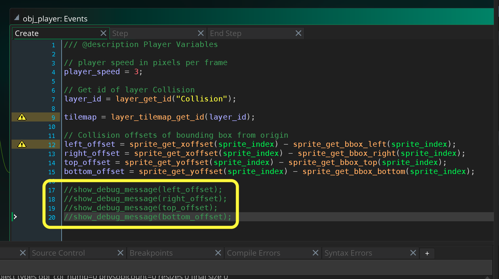

### Four Corner Collision Check

[previous](../collision-volume/README.md#user-content-creating-collision-volume-in-room) • [home](../README.md#user-content-gms2-ue4-space-rocks) • [next](../resolve-collision/README.md#user-content-resolve-collision)

We need to get access to the **TileSheet** and check on each corner of the player's collision volume if there is a collision between the player and the tile(s) they are standing on.  If there is we will move the player back outside the collision volume in the **End Step**.  Remember when we are using `vspeed` and `hspeed` the player does not move until AFTER the **Step Event** runs.  We first need to get access to the collision layer we just created.

 

---

##### `Step 1.`\|`TDAAG`|:small_blue_diamond:

Open up **P4v**.  Select the top folder of the **GameMaker** project. Press the <kbd>Checkout</kbd> button.  Checkout out all files in P4V so that they are all writable (otherwise they will be read only and none of the changes will be saved). Select a **New** changelist and add a message describing the unit of work you will be performing. Press the <kbd>OK</kbd> button.

Open up the project you are working on in **GameMaker**. 

##### `Step 2.`\|`TDAAG`|:small_blue_diamond: :small_blue_diamond: 

We will be using a function called `layer_get_id(layer_name) `to get access to the layer. Remember `layer_name` is a string so it is the name of the layer surrounded by quotation marks, for example: "the_name_of_the_layer".

Now *double click* on `obj_player` and edit the **Create Event** and add get a variable to hold the reference to the id of the **Collision** layer we created in the room:

##### `Step 3.`\|`TDAAG`|:small_blue_diamond: :small_blue_diamond: :small_blue_diamond:

Now that we have the  **ID** for the layer, we need a variable to store the reference to the tilemap that is used by that layer. Since a layer can be of different types (game objects, backgrounds etc..) we need access to the **Tilemap**.

We will be using `layer_tilemap_get_id(layer_id)` to get access to the tilemap so we can check whether there is a collision on a specific point in the room. This function can be used to retrieve the **unique ID** value of the tilemap element on a layer.

Open up **obj_player | Create Event**.

We also need to know how far the edge of the collision volume from the **Origin** of the sprite for each direction.  We will be using `sprite_get_bbox_left` to get the left hand pixel of the collision mox.

##### `Step 4.`\|`TDAAG`|:small_blue_diamond: :small_blue_diamond: :small_blue_diamond: :small_blue_diamond:

What will be the return  if we subtract `sprite_get_xoffset(sprite_index)`from `sprite_get_bbox_left(sprite_index)`?  We get the distance from the origin to the edge of the collision volume.  This will be how much we need to displace the character by relative to the edge of the collision in game.  Lets look at a diagram:

`sprite_get_xoffset(sprite_index)` gives us the local position of the x and y offset of the **Origin** in the sprite.  We need to ensure it is the same in ALL of our sprites!

##### `Step 5.`\|`TDAAG`| :small_orange_diamond:

`sprite_get_bbox_left(sprite_index)` gives us the distance from **Origin** to the left side of the bounding box. 

##### `Step 6.`\|`TDAAG`| :small_orange_diamond: :small_blue_diamond:

So lets get the offset for all four sides and save it in the **obj_player | Create** event.

##### `Step 7.`\|`TDAAG`| :small_orange_diamond: :small_blue_diamond: :small_blue_diamond:

To make the collision as simple as possible we want the collision volume to be identical in all sprites regardless of the direction.  We don't want the size of the collision changing when the player changes animation. For collisions to work properly all animations HAVE to have the same collision volume. Lets tighten the volume a bit on the horizontal axis and top as we want the player to get close to the walls with as little a gap as possible.

Open all of the player sprites and change the **Collision Mask Mode** from **Automatic** to **Manual** and adjust **Left** and **Top** to `4`.  Adjust **Right** to `55` and leave the **Bottom** to `63`.  Make sure you do this exactly the same on ALL player sprites:

##### `Step 8.`\|`TDAAG`| :small_orange_diamond: :small_blue_diamond: :small_blue_diamond: :small_blue_diamond:

So lets visualize what the value we are trying to aquire?

##### `Step 9.`\|`TDAAG`| :small_orange_diamond: :small_blue_diamond: :small_blue_diamond: :small_blue_diamond: :small_blue_diamond:

Lets add some print statements to the player's create event and print some debug to confirm our above assumptions.  Do we get the value we expect?

##### `Step 10.`\|`TDAAG`| :large_blue_diamond:

Now *press* the <kbd>Play</kbd> button in the top menu bar to launch the game.  Look at the Output window and confirm that these variables are doing what we think they should be.  This should match what we calculated above.  If it doesn't look for errors in the code.

##### `Step 11.`\|`TDAAG`| :large_blue_diamond: :small_blue_diamond: 

Lets go back to the player and comment out the debug printing as we no longer need this information.

##### `Step 12.`\|`TDAAG`| :large_blue_diamond: :small_blue_diamond: :small_blue_diamond: 

Select the **File | Save Project**, then press **File | Quit** (PC) **Game Maker | Quit** on Mac to make sure everything in the game is saved.

##### `Step 13.`\|`TDAAG`| :large_blue_diamond: :small_blue_diamond: :small_blue_diamond:  :small_blue_diamond: 

Open up **P4V**.  Select the top folder and press the **Add** button.  We want to add all the new files we created during this last session.  Add these files to the last change list you used at the begining of the session. Make sure the message accurately represents what you have done. Press the <kbd>OK</kbd> button.

##### `Step 14.`\|`TDAAG`| :large_blue_diamond: :small_blue_diamond: :small_blue_diamond: :small_blue_diamond:  :small_blue_diamond: 

Now you can submit the changelist by pressing both <kbd>Submit</kbd> buttons.

<!--  -->

| [previous](../collision-volume/README.md#user-content-creating-collision-volume-in-room)| [home](../README.md#user-content-gms2-ue4-space-rocks) | [next](../resolve-collision/README.md#user-content-resolve-collision)|
|---|---|---|
