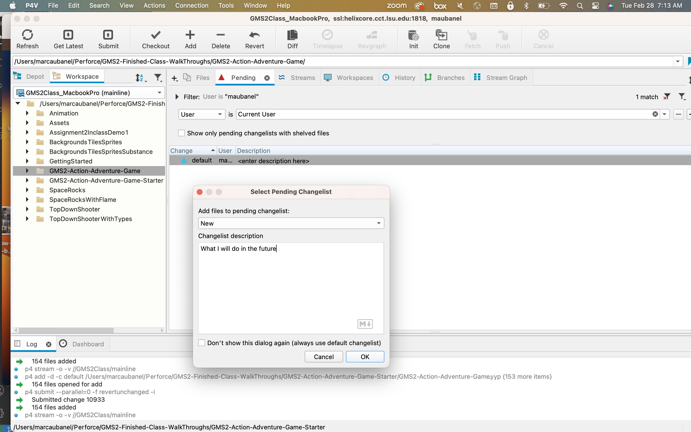

### Creating Collision Volume in Room

[previous](../player-anim/README.md#user-content-importing-player-animations) • [home](../README.md#user-content-gms2-ue4-space-rocks) • [next](../collision-check/README.md#user-content-four-corner-collision-check)

Now we use sprites as tiles for backgrounds and non-moving objects because they render faster than game objects (which include Sprites). Objects have a lot of overhead (all the variables and functionality that come with this class) that make them much more &quot;expensive&quot;. 

Now we don't know what tiles in our layer we should collide with. We are going to create a layer for collisions that will be hidden in the final game. It will have one hidden tile attached to it that we will use for collision.  
    
 

---

##### `Step 1.`\|`TDAAG`|:small_blue_diamond:

Open up **P4v**.  Select the top folder of the **GameMaker** project. Press the <kbd>Checkout</kbd> button.  Checkout out all files in P4V so that they are all writable (otherwise they will be read only and none of the changes will be saved). Select a **New** changelist and add a message describing the unit of work you will be performing. Press the <kbd>OK</kbd> button.

Open up the project you are working on in **GameMaker**. 

##### `Step 2.`\|`TDAAG`|:small_blue_diamond: :small_blue_diamond: 

Lets start by creating a new sprite and call it `spr_collision`. Change the size to `32` by `32`. Click the <kbd>Edit Image</kbd> button. We will create a 32 by 32 block with a solid color. Use the bucket tool to fill in with a pink color (or any other color that is not being used in your level currently). Double click on the layer and change the **Opacity** to `35`%.

##### `Step 3.`\|`TDAAG`|:small_blue_diamond: :small_blue_diamond: :small_blue_diamond:

This needs to be part of a tileset. The one rule about a **Tile Set** in **GameMaker** is that the first tile **has** to be empty. Go to the **Resize Sprite** and click on the **Resize Canvas** selection and set the ***Width*** to `64`. Also, click on the <kbd>-></kbd> next to it so the blank space is on the left hand side and the pink square on the right hand side (right justifying the sprite we have created). Press the <kbd>Apply</kbd> button to accept the changes.

https://user-images.githubusercontent.com/5504953/152643207-ff6b49af-8d03-4f4b-89dd-61684c192b28.mp4

##### `Step 4.`\|`TDAAG`|:small_blue_diamond: :small_blue_diamond: :small_blue_diamond: :small_blue_diamond:

Create a new **Tileset** and call it `tls_collision`. Assign the `spr_collision` sprite we just prepared to the tileset.

##### `Step 5.`\|`TDAAG`| :small_orange_diamond:

Click on Tileset Properties button and set the Tile Width and Tile Height to 32:

##### `Step 6.`\|`TDAAG`| :small_orange_diamond: :small_blue_diamond:

Since we will not be rendering this layer in the game we want it on the to player (that is why we made it partially translucent.  This way we can see each 32 by 32 section that has collision on it.  Assign **TLS_Collision** to this layer.

Open the room **rm_castle**. *Create* a new **Tile Layer** on the very top and call it `Collision`.

##### `Step 7.`\|`TDAAG`| :small_orange_diamond: :small_blue_diamond: :small_blue_diamond:

Select the Collision layer and the newly created tileset and paint every tile that you want the player to not be able to walk on. Make sure that you block the outside of the entire level and all areas you don’t want the player to walk on. Because of the perspective when we are moving up we will move the collision tile one tile above the meeting between ground and walls so the player can go in front of objects and give the illusions of 3 dimensions. 

Start with the outside edges, then do the castle, the water and the graveyard.

https://user-images.githubusercontent.com/5504953/152644052-99bc71a4-cc71-478e-bcdb-e0da4ee643a6.mp4

##### `Step 8.`\|`TDAAG`| :small_orange_diamond: :small_blue_diamond: :small_blue_diamond: :small_blue_diamond:

You can double check your work by turning layer visibity on and off on all but the collision layer to make sure that you block out all unwanted areas to walk on and that you can't escape the room.

https://user-images.githubusercontent.com/5504953/152644222-5acfcf8e-cd8d-4f85-8188-ce9aca716019.mp4

##### `Step 9.`\|`TDAAG`| :small_orange_diamond: :small_blue_diamond: :small_blue_diamond: :small_blue_diamond: :small_blue_diamond:

Select the **File | Save Project**, then press **File | Quit** (PC) **Game Maker | Quit** on Mac to make sure everything in the game is saved.

##### `Step 10.`\|`TDAAG`| :large_blue_diamond:

Open up **P4V**.  Select the top folder and press the **Add** button.  We want to add all the new files we created during this last session.  Add these files to the last change list you used at the begining of the session. Make sure the message accurately represents what you have done. Press the <kbd>OK</kbd> button.

##### `Step 11.`\|`TDAAG`| :large_blue_diamond: :small_blue_diamond: 

Now you can submit the changelist by pressing both <kbd>Submit</kbd> buttons.

<!--  -->

| [previous](../player-anim/README.md#user-content-importing-player-animations)| [home](../README.md#user-content-gms2-ue4-space-rocks) | [next](../collision-check/README.md#user-content-four-corner-collision-check)|
|---|---|---|
