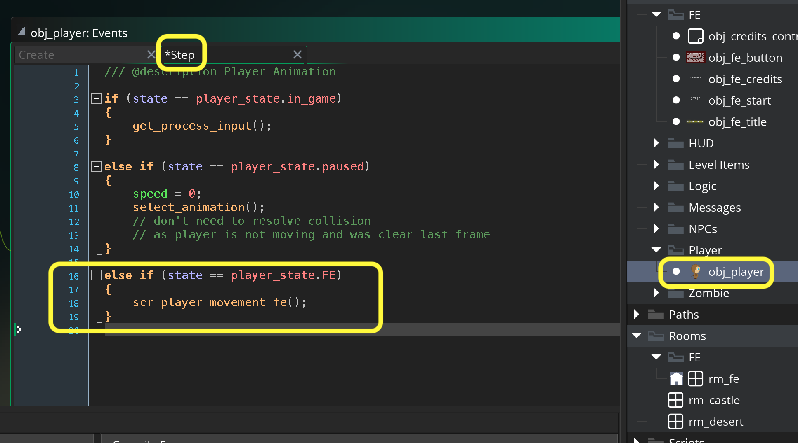

### Front End

[previous](../pathfinding-iii/README.md#user-content-pathfinding-zombie-iii) • [home](../README.md#user-content-gms2-ue4-space-rocks) • [next](../audio/README.md#user-content-audio-sfx)

We have completed a front end for you.  To activate it requires a few steps. It uses our main character to start the game.  I am a big fan of bringing game elements into the user experience and UI.  I like the idea of starting the game before you start the game!

 

---

##### `Step 1.`\|`SPCRK`|:small_blue_diamond:

  First lets add another state for the player called FE.  Open the **obj_player: Create** event and add another **enumerator** called `FE`.
		

##### `Step 2.`\|`FHIU`|:small_blue_diamond: :small_blue_diamond: 

We are also going to change the starting state of the player to FE in the **obj_player: Create** event.

##### `Step 3.`\|`SPCRK`|:small_blue_diamond: :small_blue_diamond: :small_blue_diamond:

Remove the player from `rm_castle`.

##### `Step 4.`\|`SPCRK`|:small_blue_diamond: :small_blue_diamond: :small_blue_diamond: :small_blue_diamond:

Move `rm_fe` from the top of the **Room Order** list.  

##### `Step 5.`\|`SPCRK`| :small_orange_diamond:

Drag and drop **obj_player** into rm_fe. Make sure you place the player right in the middle of the **Credits** and **Start** buttons.

##### `Step 6.`\|`SPCRK`| :small_orange_diamond: :small_blue_diamond:

Now *press* the <kbd>Play</kbd> button in the top menu bar to launch the game. Now try moving the player but nothing happens.  As we have no scripts for the player being in the **FE** state.

https://user-images.githubusercontent.com/5504953/154776237-24b85500-d647-47dc-8d9e-7c7afa899536.mp4

##### `Step 7.`\|`SPCRK`| :small_orange_diamond: :small_blue_diamond: :small_blue_diamond:

Open up the **obj_player Step** event and add a call to `scr_player_movement_fe()` so that the player can only move on the x axis and is restrained between the two buttons.

##### `Step 8.`\|`SPCRK`| :small_orange_diamond: :small_blue_diamond: :small_blue_diamond: :small_blue_diamond:

Now *press* the <kbd>Play</kbd> button in the top menu bar to launch the game. The player can now turn and will idle but does not move. Our collisions need to be loaded as the collision detection is expecting this information.

https://user-images.githubusercontent.com/5504953/154776909-c7d80f8c-aafa-4aea-98ba-9748776d763c.mp4

##### `Step 9.`\|`SPCRK`| :small_orange_diamond: :small_blue_diamond: :small_blue_diamond: :small_blue_diamond: :small_blue_diamond:

Create a new room called `rm_credits`.  Drag and drop `obj_credits_controller` into the **Instances** layer of the new room.

##### `Step 10.`\|`SPCRK`| :large_blue_diamond:

Now *press* the <kbd>Play</kbd> button in the top menu bar to launch the game. Now go to the **Credits** button and press the <kbd>Return/Enter</kbd> key.  You will go to the credits.  You can wait until the end of the credit roll or press the <kbd>Esc</kbd> key to exit back to the main menu.  You can open up `obj_credits_controller | Create` event and alter the credits.

https://user-images.githubusercontent.com/5504953/154804573-2c4fda98-745c-48a7-9e11-7b6e69b0e22e.mp4

##### `Step 11.`\|`SPCRK`| :large_blue_diamond: :small_blue_diamond: 

Now *press* the <kbd>Play</kbd> button in the top menu bar to launch the game. Now try going to the game.  Woops, we get into the game level and we are stuck and start in the wrong spot.

https://user-images.githubusercontent.com/5504953/154804991-49b895bc-c5f6-44c4-9688-0b496d10e82a.mp4

##### `Step 12.`\|`SPCRK`| :large_blue_diamond: :small_blue_diamond: :small_blue_diamond: 

##### `Step 13.`\|`SPCRK`| :large_blue_diamond: :small_blue_diamond: :small_blue_diamond:  :small_blue_diamond: 

##### `Step 14.`\|`SPCRK`| :large_blue_diamond: :small_blue_diamond: :small_blue_diamond: :small_blue_diamond:  :small_blue_diamond: 

##### `Step 15.`\|`SPCRK`| :large_blue_diamond: :small_orange_diamond: 

##### `Step 16.`\|`SPCRK`| :large_blue_diamond: :small_orange_diamond:   :small_blue_diamond: 

##### `Step 17.`\|`SPCRK`| :large_blue_diamond: :small_orange_diamond: :small_blue_diamond: :small_blue_diamond:

Open up the rm_castle and press the Creation Code button and make sure we get the collision volumes when we first enter this room:
		rm_castle

Now you should be able to escape out of the front end room and credit room to quit the game but NOT from the game back to the FE.  Add a Step | Step event to obj_game_controller and restart game if escape is pressed:

		obj_game_controller: Step Event
        

Run the game by pressing the  Play Button. Press escape in all rooms and it should work properly!

___

| [previous](../pathfinding-iii/README.md#user-content-pathfinding-zombie-iii)| [home](../README.md#user-content-gms2-ue4-space-rocks) | [next](../audio/README.md#user-content-audio-sfx)|
|---|---|---|
