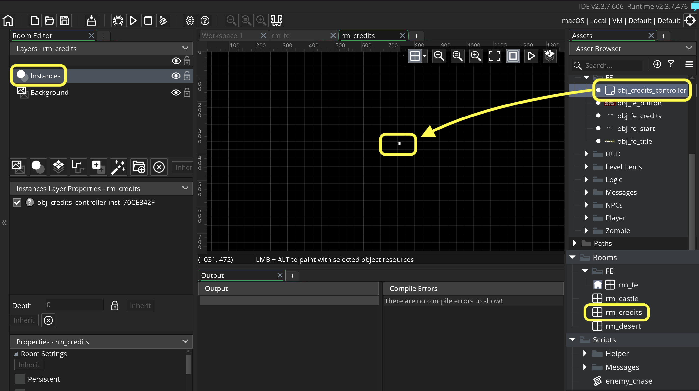
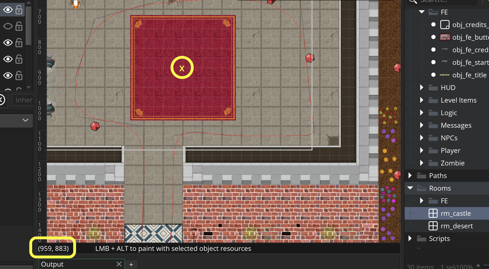
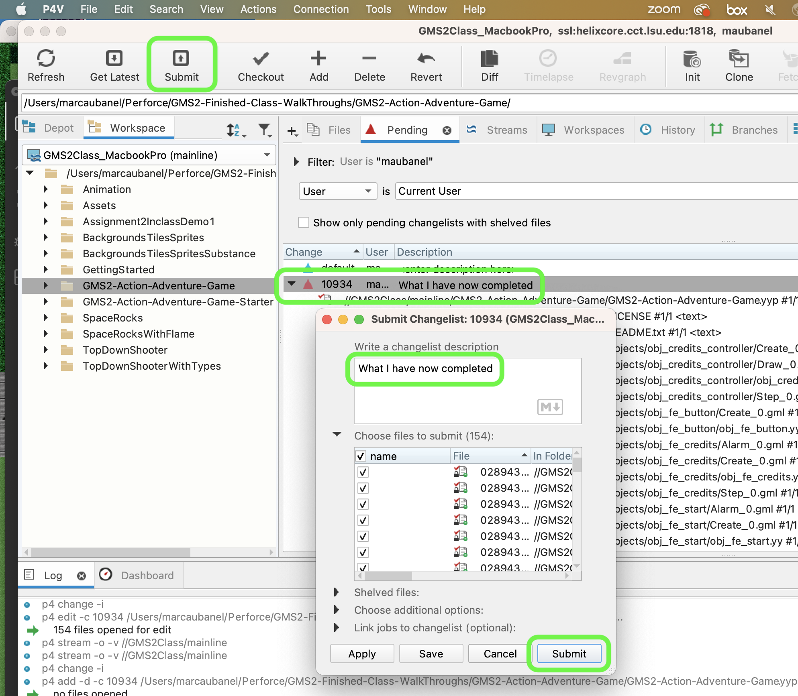

### Front End

[previous](../pathfinding-iii/README.md#user-content-pathfinding-zombie-iii) • [home](..//README.md#user-content-gms2-action-adventure-game) • [next](../audio/README.md#user-content-audio-sfx)

We have completed a front end for you.  To activate it requires a few steps. It uses our main character to start the game.  I am a big fan of bringing game elements into the user experience and UI.  I like the idea of starting the game before you start the game!

 

---

##### `Step 1.`\|`TDAAG`|:small_blue_diamond:

Open up **P4v**.  Select the top folder of the **GameMaker** project. Press the <kbd>Checkout</kbd> button.  Checkout out all files in P4V so that they are all writable (otherwise they will be read only and none of the changes will be saved). Select a **New** changelist and add a message describing the unit of work you will be performing. Press the <kbd>OK</kbd> button.

Open up the project you are working on in **GameMaker**. 

##### `Step 2.`\|`TDAAG`|:small_blue_diamond: :small_blue_diamond: 

First lets add another state for the player called FE.  Open the **obj_player: Create** event and add another **enumerator** called `FE`.

##### `Step 3.`\|`TDAAG`|:small_blue_diamond: :small_blue_diamond: :small_blue_diamond:

We are also going to change the starting state of the player to FE in the **obj_player: Create** event.

##### `Step 4.`\|`TDAAG`|:small_blue_diamond: :small_blue_diamond: :small_blue_diamond: :small_blue_diamond:

Remove the player from `rm_castle`.

##### `Step 5.`\|`TDAAG`| :small_orange_diamond:

Move `rm_fe` from the top of the **Room Order** list.  

##### `Step 6.`\|`TDAAG`| :small_orange_diamond: :small_blue_diamond:

Drag and drop **obj_player** into rm_fe. Make sure you place the player right in the middle of the **Credits** and **Start** buttons.

##### `Step 7.`\|`TDAAG`| :small_orange_diamond: :small_blue_diamond: :small_blue_diamond:

Now *press* the <kbd>Play</kbd> button in the top menu bar to launch the game. Now try moving the player but nothing happens.  As we have no scripts for the player being in the **FE** state.

https://user-images.githubusercontent.com/5504953/154776237-24b85500-d647-47dc-8d9e-7c7afa899536.mp4

##### `Step 8.`\|`TDAAG`| :small_orange_diamond: :small_blue_diamond: :small_blue_diamond: :small_blue_diamond:

Open up the **obj_player Step** event and add a call to `scr_player_movement_fe()` so that the player can only move on the x axis and is restrained between the two buttons.

##### `Step 9.`\|`TDAAG`| :small_orange_diamond: :small_blue_diamond: :small_blue_diamond: :small_blue_diamond: :small_blue_diamond:

Now *press* the <kbd>Play</kbd> button in the top menu bar to launch the game. The player can now turn and will idle but does not move. Our collisions need to be loaded as the collision detection is expecting this information.

https://user-images.githubusercontent.com/5504953/154776909-c7d80f8c-aafa-4aea-98ba-9748776d763c.mp4

##### `Step 10.`\|`TDAAG`| :large_blue_diamond:

Create a new room called `rm_credits`.  Drag and drop `obj_credits_controller` into the **Instances** layer of the new room.

##### `Step 11.`\|`TDAAG`| :large_blue_diamond: :small_blue_diamond: 

Now *press* the <kbd>Play</kbd> button in the top menu bar to launch the game. Now go to the **Credits** button and press the <kbd>Return/Enter</kbd> key.  You will go to the credits.  You can wait until the end of the credit roll or press the <kbd>Esc</kbd> key to exit back to the main menu.  You can open up `obj_credits_controller | Create` event and alter the credits.

https://user-images.githubusercontent.com/5504953/154804573-2c4fda98-745c-48a7-9e11-7b6e69b0e22e.mp4

##### `Step 12.`\|`TDAAG`| :large_blue_diamond: :small_blue_diamond: :small_blue_diamond: 

Now *press* the <kbd>Play</kbd> button in the top menu bar to launch the game. Now try going to the game.  Woops, we get into the game level and we are stuck and start in the wrong spot.

https://user-images.githubusercontent.com/5504953/154804991-49b895bc-c5f6-44c4-9688-0b496d10e82a.mp4

##### `Step 13.`\|`TDAAG`| :large_blue_diamond: :small_blue_diamond: :small_blue_diamond:  :small_blue_diamond: 

Open up `rm_castle` and place the cursor where you want to start.  I have picked the middle of the carpet.  Right down the **x** and **y** value in the bottom left corner.  We will use these to position the player in this part of the room.

##### `Step 14.`\|`TDAAG`| :large_blue_diamond: :small_blue_diamond: :small_blue_diamond: :small_blue_diamond:  :small_blue_diamond: 

The player is teleported in **obj_fe_start | Alarm0** event.  After the switching of rooms move the `obj_player`'s **x** and **y** position to match the starting position in the room.

##### `Step 15.`\|`TDAAG`| :large_blue_diamond: :small_orange_diamond: 

Now *press* the <kbd>Play</kbd> button in the top menu bar to launch the game. Now try going to the game. Go to the **Start** button and press enter and you will enter the screen at the correct part.  But the collisions are all messed up.  We need to load the collision tiles so the collision detection works!

##### `Step 16.`\|`TDAAG`| :large_blue_diamond: :small_orange_diamond:   :small_blue_diamond: 

Open up the **rm_castle** and press the **Creation Code** button and make sure we get the collision volumes every time we enter this room.

##### `Step 17.`\|`TDAAG`| :large_blue_diamond: :small_orange_diamond: :small_blue_diamond: :small_blue_diamond:

Now *press* the <kbd>Play</kbd> button in the top menu bar to launch the game. Now when you go to the game the collisions work again!

https://user-images.githubusercontent.com/5504953/154805619-79ab07b0-c6b0-4d27-8255-2a2f69138463.mp4

##### `Step 18.`\|`TDAAG`| :large_blue_diamond: :small_orange_diamond: :small_blue_diamond: :small_blue_diamond: :small_blue_diamond:

Now you should be able to escape out of the front end room and credit room to quit the game but NOT from the game back to the FE.  Add a **Step | Step** event to **obj_game** and restart game if escape is pressed:

##### `Step 19.`\|`TDAAG`| :large_blue_diamond: :small_orange_diamond: :small_blue_diamond: :small_blue_diamond: :small_blue_diamond: :small_blue_diamond:

Now *press* the <kbd>Play</kbd> button in the top menu bar to launch the game. Press escape in the game and it should go back to the Front End.  Press escape in the Front End and it should quit the game!

https://user-images.githubusercontent.com/5504953/154806975-80789afa-cefe-476b-915c-6f3cb48f9d39.mp4

##### `Step 20.`\|`TDAAG`| :large_blue_diamond: :large_blue_diamond:

Select the **File | Save Project**, then press **File | Quit** (PC) **Game Maker | Quit** on Mac to make sure everything in the game is saved.

##### `Step 21.`\|`TDAAG`| :large_blue_diamond: :large_blue_diamond: :small_blue_diamond:

Open up **P4V**.  Select the top folder and press the **Add** button.  We want to add all the new files we created during this last session.  Add these files to the last change list you used at the begining of the session. Make sure the message accurately represents what you have done. Press the <kbd>OK</kbd> button.

##### `Step 22.`\|`TDAAG`| :large_blue_diamond: :large_blue_diamond: :small_blue_diamond: :small_blue_diamond:

Now you can submit the changelist by pressing both <kbd>Submit</kbd> buttons.

<!--  -->

| [previous](../pathfinding-iii/README.md#user-content-pathfinding-zombie-iii)| [home](..//README.md#user-content-gms2-action-adventure-game) | [next](../audio/README.md#user-content-audio-sfx)|
|---|---|---|
