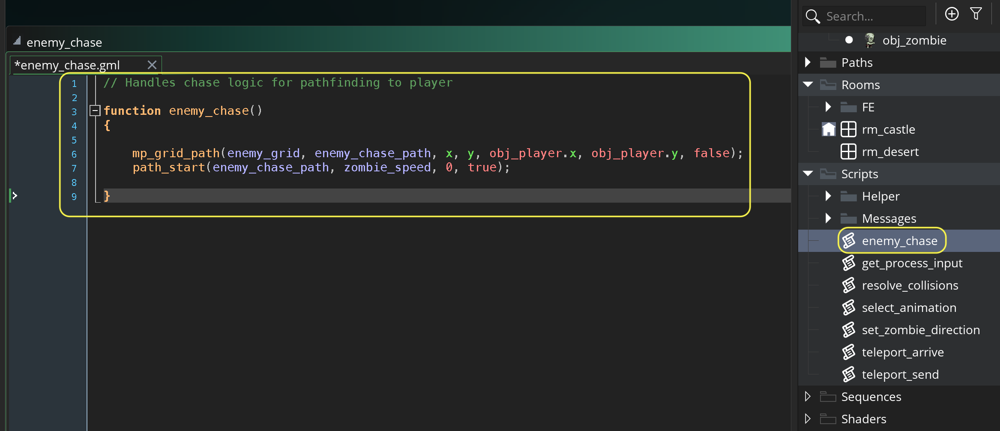

### Pathfinding Zombie II

[previous](../pathfinding/README.md#user-content-pathfinding-zombie) • [home](../README.md#user-content-gms2-ue4-space-rocks) • [next](../pathfinding-iii/README.md#user-content-pathfinding-zombie-iii)

Lets get the zombie to chase the player while avoiding collisions.

 

---

##### `Step 1.`\|`TDAAG`|:small_blue_diamond:

Now *press* the <kbd>Play</kbd> button in the top menu bar to launch the game. Approach the zombie and it should stop the path then get stuck in the **chase** state when you get too close. It will do nothing for now but they should stop patrolling and just stop.

https://user-images.githubusercontent.com/5504953/154679300-1d24dade-3540-46a3-a256-1ada77e68bf2.mp4

##### `Step 2.`\|`TDAAG`|:small_blue_diamond: :small_blue_diamond: 

OK, that worked! Since this is in a step event every frame we will be stopping the pathfinding and changing states.  We only need to do this once.  We can use the state as a switch and only make a change if the zombie is in `patrol` state. Reopen **obj_zombie: End Step** event.

##### `Step 3.`\|`TDAAG`|:small_blue_diamond: :small_blue_diamond: :small_blue_diamond:

Now how do we have the zombie chase the player without running over water, a wall or any other part you don't want the enemy to walk on (typically the same areas the player can't walk on). We will now use GameMaker's pathfinding to create a path to chase the player. This pathfinding goes along a path that is full of free cells.  
	
We need to get access to the collision layer id (just like the player does).  To do this we call the `layer_get_id(layer)`function. Open up the **obj_zombie: Create** event.

##### `Step 4.`\|`TDAAG`|:small_blue_diamond: :small_blue_diamond: :small_blue_diamond: :small_blue_diamond:

We need to get access to this to the tilemap this layer is using.  To do this we call the `layer_tilemap_get_id(layer id)` function. Reopen **obj_zombie: Create** event

##### `Step 5.`\|`TDAAG`| :small_orange_diamond:

We now need to create a grid of which tiles the enemy is allowed to enter and which they can't.  In **GameMaker** this ia an `mp_grid` (motion planning grid).  We will create a new **mp_grid** using `mp_grid_create(left, top, hcells, vcells, cellwidth, cellheight)`.

> With this function you can create an **mp_grid** for the motion planning functions. It returns an index that must be used in all other **mp_grid** function calls. The x and y coordinates indicate the position of the top-left corner of the grid, hcells and vcells indicate the number of horizontal and vertical cells to be created within the grid, and cell width and cell height indicate the size of the cells in pixels. You can create and maintain multiple grid structures at the same moment if you need them for different things, but be aware that these are complex functions and the more you use and the higher the cell resolution then the slower your game could be. - Gamemaker Manual

Open up the **obj_zombie: Create** event and create a new grid. We will go from the top left to the bottom right of the level.  Our grid will be the same size as our collision layer volumes at `32` pixels on cell height and cell width.

##### `Step 6.`\|`TDAAG`| :small_orange_diamond: :small_blue_diamond:

We need to add cells to the collision volume in this grid.  To do this we use the tilemap_get_at_pixel(tilemap_element_id, x, y). This was the same function call we used for the player to determine if the place they were standing in was correct.

We also need to add to the grid a forbidden area when we are in a collisoin area.  For this we will use `mp_grid_add_cell(id, h, v)`.

> With this function we can mark individual cells within the given MP grid as being "forbidden" meaning that the path finding functions will not ever cross them. Now, normally you work in x/y room coordinates, and not in MP grid cell coordinates. - GameMaker Manual

 Open up the **obj_zombie: Create** event and go through every 32 pixels and add collision areas to the map.

##### `Step 7.`\|`TDAAG`| :small_orange_diamond: :small_blue_diamond: :small_blue_diamond:

How do we test to know if we have done it correctly? We can't just start using it as we don't know if this is working correctly. What we want to do is overlay this grid to see if the red parts match where our collision volumes lie. We can create a temporary script and use the funnction `mp_grid_draw(grid)`. It is pretty self explanatory. Add a new **obj_zombie: Draw** event add visualize the grid with an alpha on top of the level.

##### `Step 8.`\|`TDAAG`| :small_orange_diamond: :small_blue_diamond: :small_blue_diamond: :small_blue_diamond:

Now *press* the <kbd>Play</kbd> button in the top menu bar to launch the game. Now you see that green is where the zombie can travel and red it blocked.  This looks correct to me.

##### `Step 9.`\|`TDAAG`| :small_orange_diamond: :small_blue_diamond: :small_blue_diamond: :small_blue_diamond: :small_blue_diamond:

Now that we are done with the **Draw** event on **obj_zombie** right click on it and select **Delete**.

##### `Step 10.`\|`TDAAG`| :large_blue_diamond:

We can also create paths using this grid information.  So we need to change the path from the one for patrol to one between the zombie and the player but avoiding the forbiden tiles. First we have to create a new path for the zombie to follow that leads to the player's location.  We cannot lose the patrol path as the zombie will need this again when the player escapes and the zombie needs to go back to patrolling. 

We will be using `path_add()`and set a chase speed of `2.5` in the zombie create. Open up **obj_zombie: Create** event and add antoher path.

##### `Step 11.`\|`TDAAG`| :large_blue_diamond: :small_blue_diamond: 

Now we set up this grid because gamemaker provides a function that dynamically creates a path based on this collision grid so the enemy won't run into a grid section. We can create a path dynamically in script using: `mp_grid_path(d, path, xstart, ystart, xgoal, ygoal, allowdiag).

Now we need to create a new script called `enemy_chase`.  In this script we will create a new path for the zombie between them and the player.  It will then start the zombie to follow this new path.

##### `Step 12.`\|`TDAAG`| :large_blue_diamond: :small_blue_diamond: :small_blue_diamond: 

Open up **obj_zombie** and create a new **Step** event. Check to see if we are in the chase state and then call a the above script that will chase the player.

##### `Step 13.`\|`TDAAG`| :large_blue_diamond: :small_blue_diamond: :small_blue_diamond:  :small_blue_diamond: 

Now *press* the <kbd>Play</kbd> button in the top menu bar to launch the game. Run up to the zombie then run away from it. Notice that it now follows you and doesn't run into collision areas.

https://user-images.githubusercontent.com/5504953/154688152-45af0a10-9b02-4f38-8d7d-d64857e9e16a.mp4

##### `Step 14.`\|`TDAAG`| :large_blue_diamond: :small_blue_diamond: :small_blue_diamond: :small_blue_diamond:  :small_blue_diamond: 

The zombie updates every frame so he mirrors your every move. This is annoying and we want to avoid mimicking the players moves step by step.  When moving we don't change our minds 30 times a second. We want to only update the movement ai every `20` frames. Now add to the **obj_zombie: Create** event a timer (similar to restricting bullets) for delaying re-pathing.

##### `Step 15.`\|`TDAAG`| :large_blue_diamond: :small_orange_diamond: 

Open `scr_enemy_chase` and only adjust path every 20 frames.

##### `Step 16.`\|`TDAAG`| :large_blue_diamond: :small_orange_diamond:   :small_blue_diamond: 

Now *press* the <kbd>Play</kbd> button in the top menu bar to launch the game.  The zombie should have a slight delay when you change directions and it should feel a little bit more natural. I found `20` a third of a second too short and changed the delay to `60` (I should have used `room_speed`). 

https://user-images.githubusercontent.com/5504953/154709487-78d141c0-631a-43f6-9838-fad5526f716c.mp4

##### `Step 17.`\|`TDAAG`| :large_blue_diamond: :small_orange_diamond: :small_blue_diamond: :small_blue_diamond:

When the player gets far enough away from the zombie this creature will need to find its way back to its patrol path and go back to patrolling.  So we need to switch back to `patrol` state when the player gets too far away. We need to get the enemy back to the starting point of his patrol. We will need a new state called `return_to_patrol`. Open the **obj_zombie | Create** create event and add to the **enumerator**.

##### `Step 18.`\|`TDAAG`| :large_blue_diamond: :small_orange_diamond: :small_blue_diamond: :small_blue_diamond: :small_blue_diamond:

Open the `scr_enemy_chase` scriptand add to the end of the script a check to see if it should chase else go back to `patrol`. We end the path of the enemy chase and switch to the `return_to_patrol` state when the player has gone twice the trigger distance away from the enemy.

##### `Step 19.`\|`TDAAG`| :large_blue_diamond: :small_orange_diamond: :small_blue_diamond: :small_blue_diamond: :small_blue_diamond: :small_blue_diamond:

Now *press* the <kbd>Play</kbd> button in the top menu bar to launch the game. Run up to the zombie then run away from it. The zombie will give up and freeze (run on spot) when you get far enough away. But notice the zombie does not go back to chase while in return?

https://user-images.githubusercontent.com/5504953/154713727-c00a543d-e218-4ca2-89a8-9c762adc47c2.mp4

##### `Step 20.`\|`TDAAG`| :large_blue_diamond: :large_blue_diamond:

First lets make sure that the zombie can go to `chase` state from either `patrol` **or** (`||`) `return_to_patrol` state.  Open up the **obj_zombie | End Step** event and add the condition.
        

##### `Step 21.`\|`TDAAG`| :large_blue_diamond: :large_blue_diamond: :small_blue_diamond:

Now *press* the <kbd>Play</kbd> button in the top menu bar to launch the game. Now the zombie will still freeze but will go back to chasing if you get too close when they are returning to patrol.

https://user-images.githubusercontent.com/5504953/154734839-4208406d-a1bc-4ce2-8ece-3ff1bf76f217.mp4

##### `Step 22.`\|`TDAAG`| :large_blue_diamond: :large_blue_diamond: :small_blue_diamond: :small_blue_diamond:

Select the **File | Save Project** then press **File | Quit** to make sure everything in the game is saved. If you are using **GitHub** open up **GitHub Desktop** and add a title and longer description (if necessary) and press the <kbd>Commit to main</kbd> button. Finish by pressing **Push origin** to update the server with the latest changes.

___

<!--  -->

| [previous](../pathfinding/README.md#user-content-pathfinding-zombie)| [home](../README.md#user-content-gms2-ue4-space-rocks) | [next](../pathfinding-iii/README.md#user-content-pathfinding-zombie-iii)|
|---|---|---|
