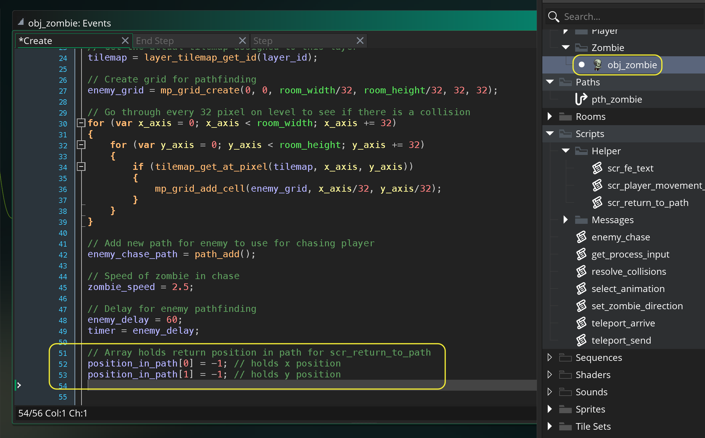
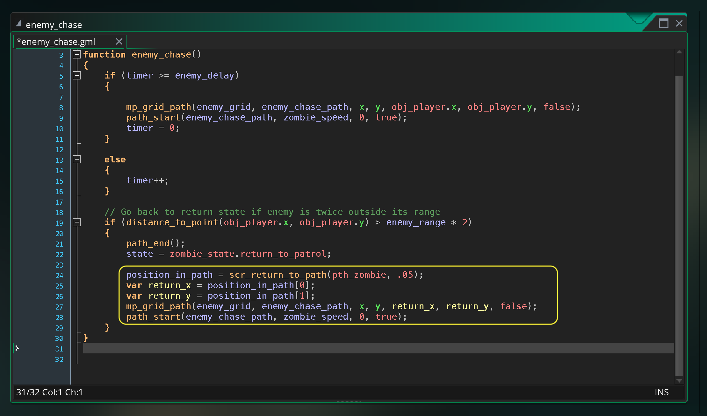
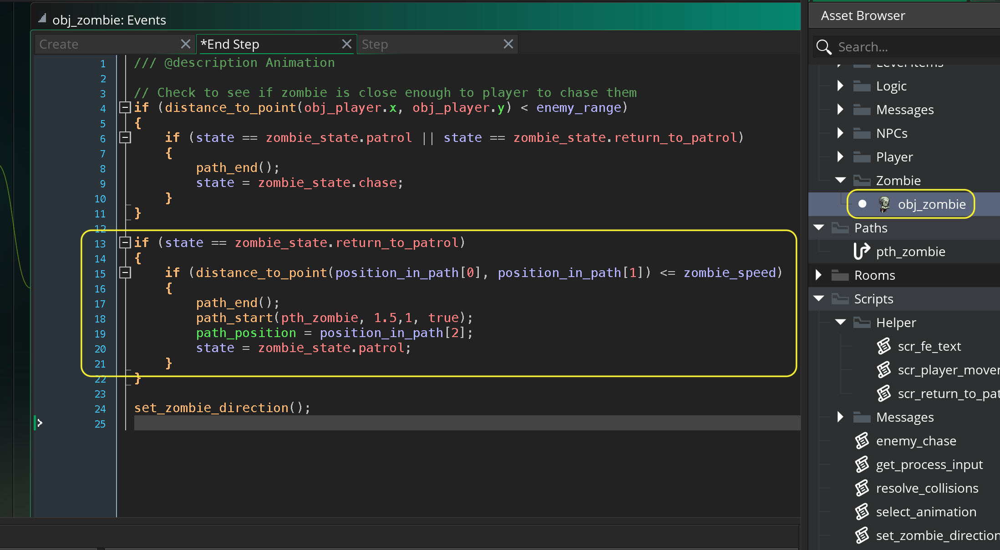

### Pathfinding Zombie III

[previous](../pathfinding-ii/README.md#user-content-pathfinding-zombie-ii) • [home](..//README.md#user-content-gms2-action-adventure-game) • [next](../front-end/README.md#user-content-front-end)

Returning zombie to path.

 

---

##### `Step 1.`\|`TDAAG`|:small_blue_diamond:

We want to find the nearest point on the path to return to.  We have provided a function called **Helper | scr_return_to_path(path, interval)**.  You pass it the path you would like to search for the closest point and how many intervals (a number between 0 and 1) you want to check for.  If you set the interval to .1 this would split the path into 10 parts and check it in 10 points evenly spaced.  This function returns an array with the closest (x, y) position on the path to return to as well as where along the path (a number between 0 and 1).  Lets initialize this array in the **obj_zombie | Create** event:

##### `Step 2.`\|`TDAAG`|:small_blue_diamond: :small_blue_diamond: 

We need to end the path of the zombie chasing.  We change the state to `return_to_path`. We call the function `scr_return_to_path(path, interval)` and pass it our initial patrolling enemy path `path_enemy` and check it `20` times along this long path (interval set to `.05`).  We get the return position for both x and y then set a new path and start it.  Open `enemy_chase` and add at the bottom:

##### `Step 3.`\|`TDAAG`|:small_blue_diamond: :small_blue_diamond: :small_blue_diamond:

Now *press* the <kbd>Play</kbd> button in the top menu bar to launch the game. Now you can escape from the chasing player and they will return to the nearest point on their path.  The zombie will get stuck there as we need to switch back to patrol.

https://user-images.githubusercontent.com/5504953/154773631-adc64040-e78f-4dc8-ab3e-049f498a7f29.mp4

##### `Step 4.`\|`TDAAG`|:small_blue_diamond: :small_blue_diamond: :small_blue_diamond: :small_blue_diamond:

Then we need to open up the zombie step event and add at the bottom a check to see if we are close enough to the path to return to `patrol` state.  If we are we end the previous path, start the original patrol path, update the position to the closest point that the player is at.  Open up **obj_zombie: End Step** event and make the addition.

##### `Step 5.`\|`TDAAG`| :small_orange_diamond:

Now *press* the <kbd>Play</kbd> button in the top menu bar to launch the game. Run up to the zombie then run away from it. The zombie will give up and return to the closest patrol spot then go back to patrolling. That is it for pathfinding a lot of work, but rewarding!

https://user-images.githubusercontent.com/5504953/154774361-12f01fe8-e0df-4fcf-8317-4cb2a93ed4c1.mp4

##### `Step 6.`\|`TDAAG`| :small_orange_diamond: :small_blue_diamond:

Select the **File | Save Project**, then press **File | Quit** (PC) **Game Maker | Quit** on Mac to make sure everything in the game is saved.

##### `Step 7.`\|`TDAAG`| :small_orange_diamond: :small_blue_diamond: :small_blue_diamond:

Open up **P4V**.  Select the top folder and press the **Add** button.  We want to add all the new files we created during this last session.  Add these files to the last change list you used at the begining of the session. Make sure the message accurately represents what you have done. Press the <kbd>OK</kbd> button.

##### `Step 8.`\|`TDAAG`| :small_orange_diamond: :small_blue_diamond: :small_blue_diamond: :small_blue_diamond:

Now you can submit the changelist by pressing both <kbd>Submit</kbd> buttons.

<!--  -->

| [previous](../pathfinding-ii/README.md#user-content-pathfinding-zombie-ii)| [home](..//README.md#user-content-gms2-action-adventure-game) | [next](../front-end/README.md#user-content-front-end)|
|---|---|---|
