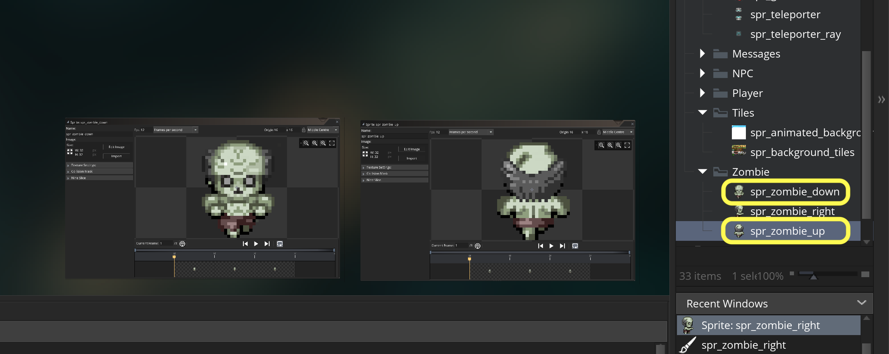
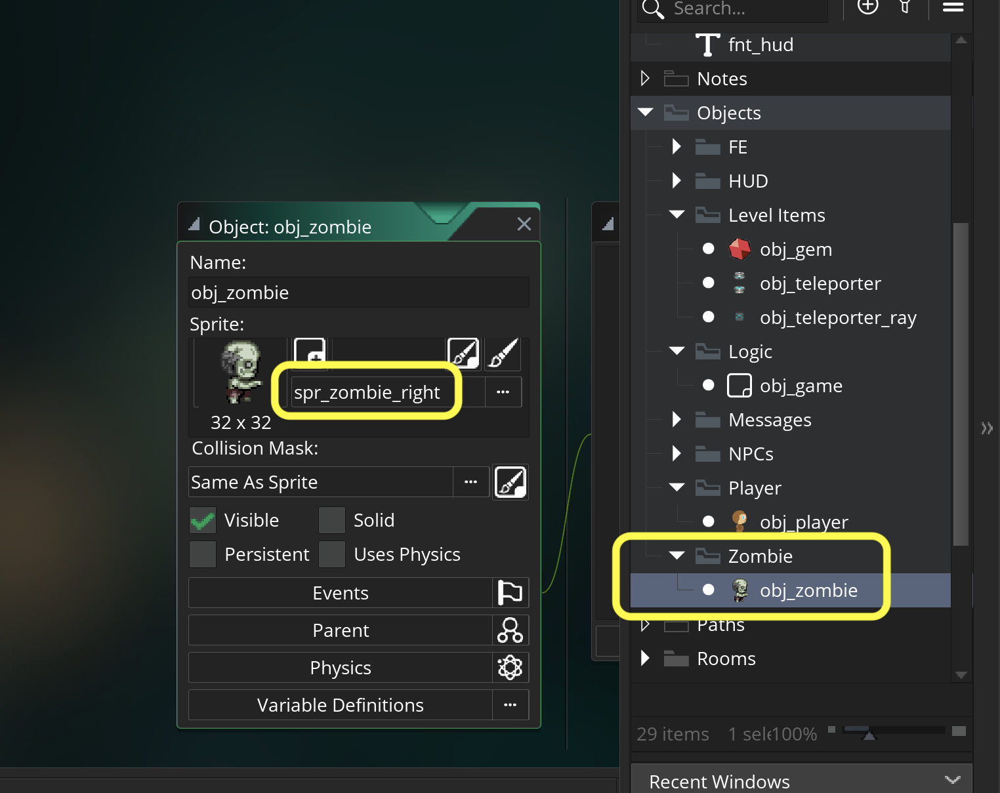
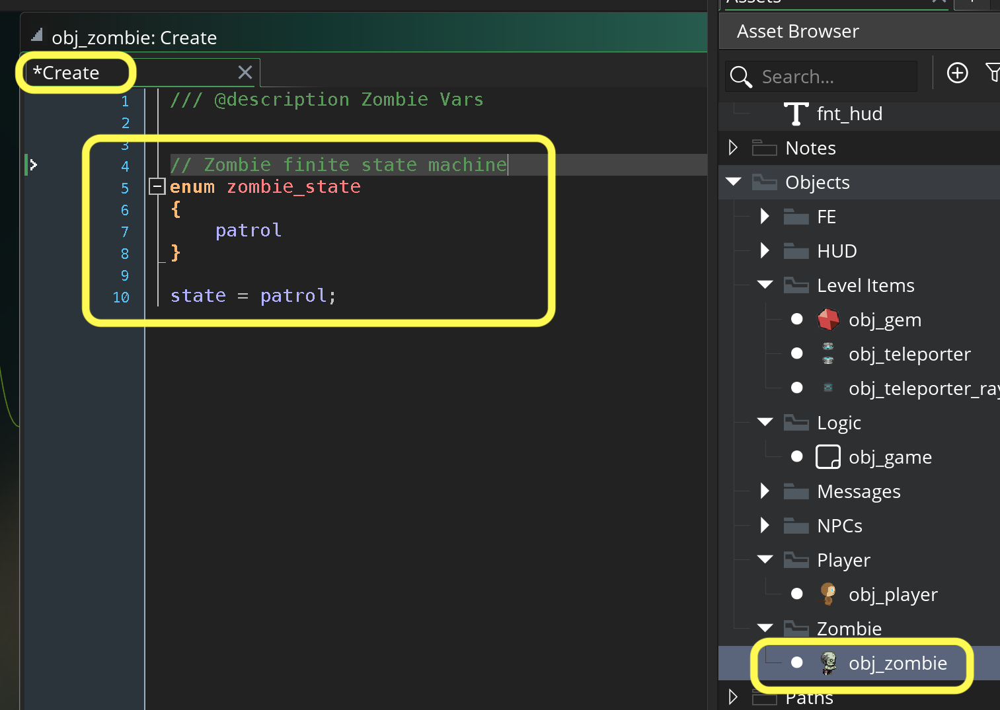
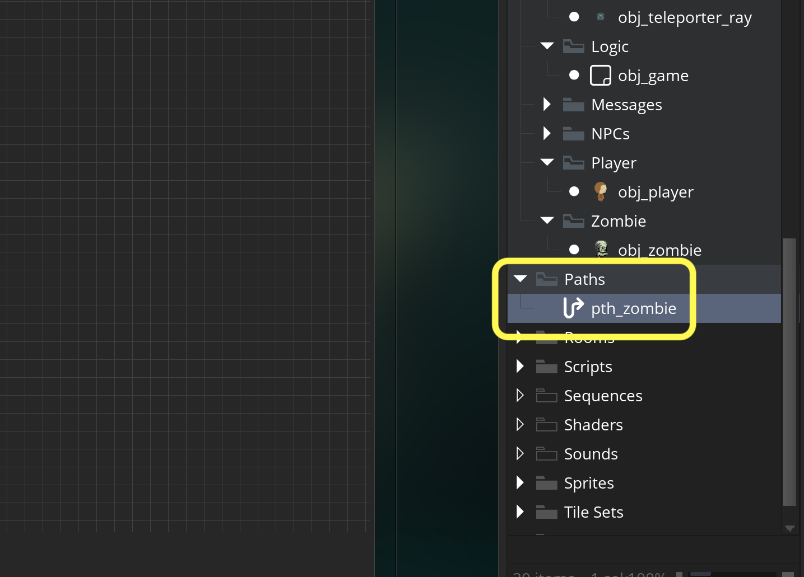
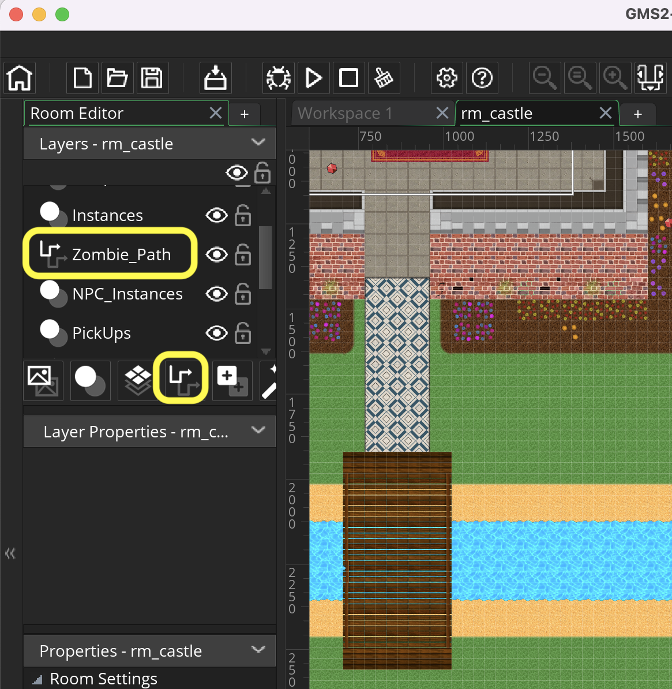

### Pathfinding Zombie

[previous](../collectables-ii/README.md#user-content-collectables-ii) • [home](../README.md#user-content-gms2-ue4-space-rocks) • [next](../pathfinding-ii/README.md#user-content-pathfinding-zombie-ii)

How do we get NPC's to chase the player?  We need to program logic so that the computer NPC can chase the player and respect the collisions in the room.  We need to update paths for the enemy so they can chase a target (in this case the player) but go around obstacles in a believable way.  GameMaker makes this fairly straight forward.  Lets take a look.

 

---

##### `Step 1.`\|`SPCRK`|:small_blue_diamond:

I have provided an enemy sprite for you. Download [spr_zombie_right.png](images/spr_zombie_right.png). Create a new folder in the Sprites section in the **Resources** called `Zombie`.  Create a new sprite and call it `spr_zombie_right`.

Press the <kbd>Edit Image</kbd> button and select **Image | Import Strip Image**.  Set the **Frame Width** and **Frame Height** to `32`.  Set the **Number of Frames** and **Frames per Row** to `3`. Press the <kbd>Convert</kbd> button.  Adjust the speed accordingly. Set the **Origin** to `Middle Center`.

https://user-images.githubusercontent.com/5504953/153884259-e371971d-f29e-4cba-82af-8a46eaa34615.mp4

##### `Step 2.`\|`FHIU`|:small_blue_diamond: :small_blue_diamond: 

Repeat this for [spr_zombie_up.png](images/spr_zombie_up.png) and [spr_zombie_down.png](images/spr_zombie_down.png). To keep the settings you can **Duplicate** `obj_zombie_right` twice.

##### `Step 3.`\|`SPCRK`|:small_blue_diamond: :small_blue_diamond: :small_blue_diamond:

*Add* a `Zombie` group to the **Objects** section. *Create* a new **Game Object** called `obj_zombie` and bind the `spr_zombie_right` sprite to it.

##### `Step 4.`\|`SPCRK`|:small_blue_diamond: :small_blue_diamond: :small_blue_diamond: :small_blue_diamond:

 The zombie will move between patrolling, chasing the player and returning ot patrol. The Zombie will have its own finite state machine. The first state we will create is a `patrol` state. We will again use an **enumerator** to store this global constant. So add a new **Create Event** on the `obj_zombie` and add:

##### `Step 5.`\|`SPCRK`| :small_orange_diamond:

Now we are going to create a path for the zombie to roam.  Now I am cautioning you that in the past this mode has been VERY slow and crashed often. Save your work now before starting. We will be using paths for the zombie to walk around the room with. This requires no logic and we just lay out a track to where the Zombie will roam. *Create* a new **Path** and call it `pth_zombie`: 

##### `Step 6.`\|`SPCRK`| :small_orange_diamond: :small_blue_diamond:

Now we open **rm_castle** and add a **Path Layer** and place it under the **Instances** layer and call it `Zombie_Path`. 
		

##### `Step 7.`\|`SPCRK`| :small_orange_diamond: :small_blue_diamond: :small_blue_diamond:

Select the path you just created path_enemy:

##### `Step 8.`\|`SPCRK`| :small_orange_diamond: :small_blue_diamond: :small_blue_diamond: :small_blue_diamond:

Press the **Smooth Curve** radio button in the path so that the turns are not all 90 degrees and the zombie moves more naturally along a curved path.

##### `Step 9.`\|`SPCRK`| :small_orange_diamond: :small_blue_diamond: :small_blue_diamond: :small_blue_diamond: :small_blue_diamond:

Left click around the level and draw a path for the zombie.  I started in the graveyard as I imagine this is where he will start his patrol of the level.  I need to make sure there is room for the zombie to get around collisions so I avoid going too close. Give the enemy a path for patrolling. Keep clicking until you cover the entire level and are back close to the beginning.  Press the **Closed** *radio button* and the loop will fill in by itself!

https://user-images.githubusercontent.com/5504953/153901584-e7aa95e0-ec03-4653-a2c9-a2da3a1259eb.mp4

##### `Step 10.`\|`SPCRK`| :large_blue_diamond:

		rm_castle

##### `Step 11.`\|`SPCRK`| :large_blue_diamond: :small_blue_diamond: 

		rm_castle

##### `Step 12.`\|`SPCRK`| :large_blue_diamond: :small_blue_diamond: :small_blue_diamond: 

	Scale the three zombie sprites to be 64 by 64 :

##### `Step 13.`\|`SPCRK`| :large_blue_diamond: :small_blue_diamond: :small_blue_diamond:  :small_blue_diamond: 

Place zombie into rm_castle and put him close to the start of your path. 
rm_castle

##### `Step 14.`\|`SPCRK`| :large_blue_diamond: :small_blue_diamond: :small_blue_diamond: :small_blue_diamond:  :small_blue_diamond: 

Now we need to trigger the obj_zombie> to follow this path. We will be using a new function that GameMaker provides. Paths do not start running by default we need to start them in code.  This is done through the <a href="gms2tutorials:///ShowHelp?keyword=path_start">path_start(path, speed, endaction, absolute)</a> function.
		
	To start the enemy down the path add to the bottom of the create event:

	obj_zombie: Create Event

##### `Step 15.`\|`SPCRK`| :large_blue_diamond: :small_orange_diamond: 

Run the game by pressing the  Play Button. Follow the zombie around and see how it follows the path.

##### `Step 16.`\|`SPCRK`| :large_blue_diamond: :small_orange_diamond:   :small_blue_diamond: 

I noticed that the sprite was following the path by its origin.  I moved the origin of all three sprites to Middle Center and adjusted the path so that the zombie did not pass any solid objects.

##### `Step 17.`\|`SPCRK`| :large_blue_diamond: :small_orange_diamond: :small_blue_diamond: :small_blue_diamond:

Add a new script called scr_set_zombie_directions.  The pathfniding uses the direction that the player is in so we can select the best sprite based on whether they are facing in the angle they are moving in.  Add to this new script:

##### `Step 18.`\|`SPCRK`| :large_blue_diamond: :small_orange_diamond: :small_blue_diamond: :small_blue_diamond: :small_blue_diamond:

Open up the zombie and add a regular step event to the enemy and call this new script:

		obj_zombie: Step | Step Event

##### `Step 19.`\|`SPCRK`| :large_blue_diamond: :small_orange_diamond: :small_blue_diamond: :small_blue_diamond: :small_blue_diamond: :small_blue_diamond:

Run the game by pressing the  Play Button. Follow the zombie around and see how it follows the path and faces the direction it is walking in.  Next up we will have the zombie chase the player.

##### `Step 20.`\|`SPCRK`| :large_blue_diamond: :large_blue_diamond:

We want the zombie to chase the player when he gets a certain distance away and can see the player (and can&rsquo;t see through walls). Open the zombie create event and add another marcro state called CHASE right after the previous macro and assign it a value of 1:
	obj_zombie: Create Event

##### `Step 21.`\|`SPCRK`| :large_blue_diamond: :large_blue_diamond: :small_blue_diamond:

We also want to know the range that triggers the zombie to chase the player. This will be calculated in pixels.  Lets start with a small number for testing, so you almost have to touch the enemy to get it to switch to CHASE. Add to the end of the zombie create event:
		obj_zombie: Create Event
        

___

| [previous](../collectables-ii/README.md#user-content-collectables-ii)| [home](../README.md#user-content-gms2-ue4-space-rocks) | [next](../pathfinding-ii/README.md#user-content-pathfinding-zombie-ii)|
|---|---|---|
