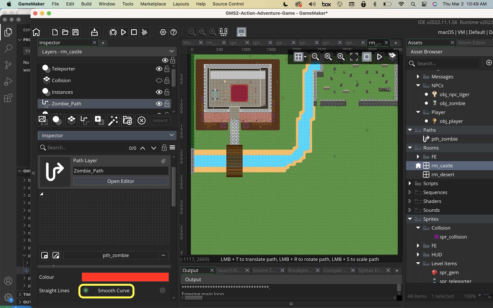

### Pathfinding Zombie

[previous](../collectables-ii/README.md#user-content-collectables-ii) • [home](..//README.md#user-content-gms2-action-adventure-game) • [next](../pathfinding-ii/README.md#user-content-pathfinding-zombie-ii)

How do we get NPC's to chase the player?  We need to program logic so that the computer NPC can chase the player and respect the collisions in the room.  We need to update paths for the enemy so they can chase a target (in this case the player) but go around obstacles in a believable way.  GameMaker makes this fairly straight forward.  Lets take a look.

 

---

##### `Step 1.`\|`TDAAG`|:small_blue_diamond:

Open up **P4v**.  Select the top folder of the **GameMaker** project. Press the <kbd>Checkout</kbd> button.  Checkout out all files in P4V so that they are all writable (otherwise they will be read only and none of the changes will be saved). Select a **New** changelist and add a message describing the unit of work you will be performing. Press the <kbd>OK</kbd> button.

Open up the project you are working on in **GameMaker**. 

##### `Step 2.`\|`TDAAG`|:small_blue_diamond: :small_blue_diamond: 

I have provided an enemy sprite for you. Download [spr_zombie_right.png](images/spr_zombie_right.png). Create a new folder in the Sprites section in the **Resources** called `Zombie`.  Create a new sprite and call it `spr_zombie_right`.

Press the <kbd>Edit Image</kbd> button and select **Image | Import Strip Image**.  Set the **Frame Width** and **Frame Height** to `32`.  Set the **Number of Frames** and **Frames per Row** to `3`. Press the <kbd>Convert</kbd> button.  Adjust the speed accordingly. Set the **Origin** to `Middle Center`.

https://user-images.githubusercontent.com/5504953/153884259-e371971d-f29e-4cba-82af-8a46eaa34615.mp4

##### `Step 3.`\|`TDAAG`|:small_blue_diamond: :small_blue_diamond: :small_blue_diamond:

Repeat this for [spr_zombie_up.png](images/spr_zombie_up.png) and [spr_zombie_down.png](images/spr_zombie_down.png). To keep the settings you can **Duplicate** `obj_zombie_right` twice.

##### `Step 4.`\|`TDAAG`|:small_blue_diamond: :small_blue_diamond: :small_blue_diamond: :small_blue_diamond:

*Add* a `Zombie` group to the **Objects** section. *Create* a new **Game Object** called `obj_zombie` and bind the `spr_zombie_right` sprite to it.

##### `Step 5.`\|`TDAAG`| :small_orange_diamond:

 The zombie will move between patrolling, chasing the player and returning ot patrol. The Zombie will have its own finite state machine. The first state we will create is a `patrol` state. We will again use an **enumerator** to store this global constant. So add a new **Create Event** on the `obj_zombie` and add:

##### `Step 6.`\|`TDAAG`| :small_orange_diamond: :small_blue_diamond:

Now we are going to create a path for the zombie to roam.  Now I am cautioning you that in the past this mode has been VERY slow and crashed often. Save your work now before starting. We will be using paths for the zombie to walk around the room with. This requires no logic and we just lay out a track to where the Zombie will roam. *Create* a new **Path** and call it `pth_zombie`: 

##### `Step 7.`\|`TDAAG`| :small_orange_diamond: :small_blue_diamond: :small_blue_diamond:

Now we open **rm_castle** and add a **Path Layer** and place it under the **Instances** layer and call it `Zombie_Path`. 
		

##### `Step 8.`\|`TDAAG`| :small_orange_diamond: :small_blue_diamond: :small_blue_diamond: :small_blue_diamond:

Select the path you just created path_enemy:

##### `Step 9.`\|`TDAAG`| :small_orange_diamond: :small_blue_diamond: :small_blue_diamond: :small_blue_diamond: :small_blue_diamond:

Press the **Smooth Curve** radio button in the path so that the turns are not all 90 degrees and the zombie moves more naturally along a curved path.

##### `Step 10.`\|`TDAAG`| :large_blue_diamond:

Left click around the level and draw a path for the zombie.  I started in the graveyard as I imagine this is where he will start his patrol of the level.  I need to make sure there is room for the zombie to get around collisions so I avoid going too close. Give the enemy a path for patrolling. Keep clicking until you cover the entire level and are back close to the beginning.  Press the **Closed** *radio button* and the loop will fill in by itself!

https://user-images.githubusercontent.com/5504953/153901584-e7aa95e0-ec03-4653-a2c9-a2da3a1259eb.mp4

##### `Step 11.`\|`TDAAG`| :large_blue_diamond: :small_blue_diamond: 

Add a new **Instance Layer** to `rm_castle` called `Zombie`. Place it at the top of the hierarchy.  *Add* an instance of **obj_zombie** into this new layer close to the start of the path. 

##### `Step 12.`\|`TDAAG`| :large_blue_diamond: :small_blue_diamond: :small_blue_diamond: 

Scale the three zombie sprites to be `64` by `64` to match the player size.

https://user-images.githubusercontent.com/5504953/153904021-234bed24-eaab-47a1-8bfd-c8a4ac790573.mp4

##### `Step 13.`\|`TDAAG`| :large_blue_diamond: :small_blue_diamond: :small_blue_diamond:  :small_blue_diamond: 
	
Now we need to trigger the **obj_zombie** to follow this path. We will be using a function that **GameMaker** provides. Paths do not start running by default we need to start them in code.  This is done through the [path_start(path, speed, endaction, absolute]() function.
		
To start the enemy down the path add to the bottom of the create event in **obj_zombie**.

##### `Step 14.`\|`TDAAG`| :large_blue_diamond: :small_blue_diamond: :small_blue_diamond: :small_blue_diamond:  :small_blue_diamond: 

Now *press* the <kbd>Play</kbd> button in the top menu bar to launch the game. Woops there is an error.

##### `Step 15.`\|`TDAAG`| :large_blue_diamond: :small_orange_diamond: 

Since we have not run this script yet we did not notice that there is a run time error.  I accessed the state incorrectly.

##### `Step 16.`\|`TDAAG`| :large_blue_diamond: :small_orange_diamond:   :small_blue_diamond: 

Now *press* the <kbd>Play</kbd> button in the top menu bar to launch the game. Follow the zombie around and see how it follows the path. Make any adjustments so that the zombie does not pass through any solid objects.

https://user-images.githubusercontent.com/5504953/153908779-c2fc767d-09ee-4942-9d9b-791a248ea926.mp4

##### `Step 17.`\|`TDAAG`| :large_blue_diamond: :small_orange_diamond: :small_blue_diamond: :small_blue_diamond:

Once you are happy with the zombie path and you have made edits to the original, lets make the zombie face the direction they are running in. Add a new script called `set_zombie_direction`.  The pathfniding uses the direction that the player is in so we can select the best sprite based on whether they are facing in the angle they are moving in.  

What we can divide **Direction** by `90` and if we round the result, get a sense of which of the 4 zones they are in .  This division returns a result of 1 to 4 with one condition returning 0 (0 / 90).  We use **default** to handle the case for 0 degrees which we would want to move right.  Default catches any number that doesn't match the supplied cases.

Add to this new script turning in four directions with 1 (90/90) being up, 2 (180 / 90) being left, 3 (270/90) being down, and 4 (360/90) and 0 (0/90) being right. 

##### `Step 18.`\|`TDAAG`| :large_blue_diamond: :small_orange_diamond: :small_blue_diamond: :small_blue_diamond: :small_blue_diamond:

Open up the **obj_zombie** and add a **Step | End Step** event to the enemy and call the above script.

##### `Step 19.`\|`TDAAG`| :large_blue_diamond: :small_orange_diamond: :small_blue_diamond: :small_blue_diamond: :small_blue_diamond: :small_blue_diamond:

Now *press* the <kbd>Play</kbd> button in the top menu bar to launch the game. Follow the zombie around and see how it follows the path and faces the direction they are walking in. 

https://user-images.githubusercontent.com/5504953/154675184-e768a44b-530e-459c-92af-cf087b59f8f9.mp4

##### `Step 20.`\|`TDAAG`| :large_blue_diamond: :large_blue_diamond:

We want the zombie to chase the player when he gets a certain distance away and can see the player (and can't see through walls). Open the **obj_zombie | Create** event and add another zombie state called `chase` right after the previous enum.

##### `Step 21.`\|`TDAAG`| :large_blue_diamond: :large_blue_diamond: :small_blue_diamond:

We also want to know the range that triggers the zombie to chase the player. This will be calculated in pixels.  Lets start with `200` pixels away from the player. 
        

##### `Step 22.`\|`TDAAG`| :large_blue_diamond: :large_blue_diamond: :small_blue_diamond: :small_blue_diamond:

So we will add to the zombie step event script and check to see that the distance between the enemy and the player is less than the enemy_range variable then switch to the `chase` state. We also terminate the path movement as the zombie is no longer following the path and will chase the player. Open up **obj_zombie: End Step** event and stop the zombie and change states.

<!--  -->

| [previous](../collectables-ii/README.md#user-content-collectables-ii)| [home](..//README.md#user-content-gms2-action-adventure-game) | [next](../pathfinding-ii/README.md#user-content-pathfinding-zombie-ii)|
|---|---|---|
