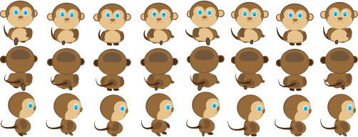
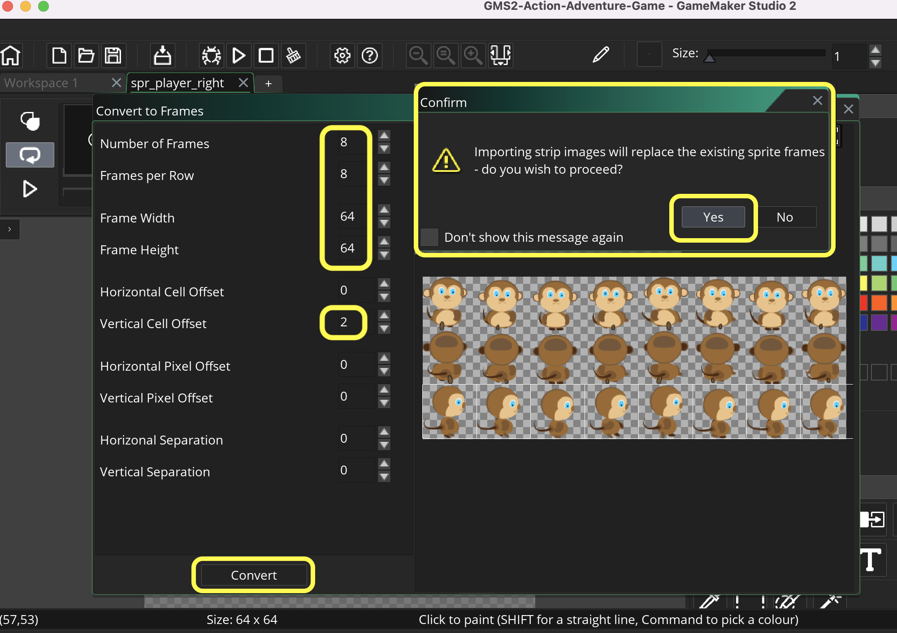

### Importing Player Animations

[previous](../room-size/README.md#user-content-room-size) • [home](../README.md#user-content-gms2-ue4-space-rocks) • [next](../)

Lets import the animations we need for our action adventure game.

 

---

##### `Step 1.`\|`SPCRK`|:small_blue_diamond:

Let's import a player to use. You can replace it but for the math to work you will need to use the same size sprite.  Downloadn [MonkeyAnim.png](images/MonkeyAnim.png).

##### `Step 2.`\|`FHIU`|:small_blue_diamond: :small_blue_diamond: 

*Right click* on **Sprites** and select **New | Sprite** and name it `spr_player_right`.

##### `Step 3.`\|`SPCRK`|:small_blue_diamond: :small_blue_diamond: :small_blue_diamond:

Double click on `spr_player_right` and select <kbd>Image | Import Strip Image</kbd>. Select `MondayAnim.png` and press the <kbd>Open</kbd> button.

##### `Step 4.`\|`SPCRK`|:small_blue_diamond: :small_blue_diamond: :small_blue_diamond: :small_blue_diamond:

This brings up the **Convert to Frames** window.  As you can see there are three rows of animation with 8 cells in each.  For walking right we are on the third bottom row.  The sprites are `64` by `64`.  Change **Number of Frames** and **Frames per Row** to `8` frames.  Change **Frame Width** and **Frame Height** to `64` pixels.  Now we want the third row so set the **Vertical Cell Offset** to `2`. Confrim the import.

##### `Step 5.`\|`SPCRK`| :small_orange_diamond:

Open the **spr_player_right** up again and change the framerate to `12` **FPS**.

##### `Step 6.`\|`SPCRK`| :small_orange_diamond: :small_blue_diamond:

Hit the <kbd>Play</kbd> button on the sprite and it should animate fairly qiuckly like so:

https://user-images.githubusercontent.com/5504953/152546988-1e473998-528f-49bb-a00f-06bfde5d2b52.mp4

##### `Step 7.`\|`SPCRK`| :small_orange_diamond: :small_blue_diamond: :small_blue_diamond:

Now change the **Origin** to `Middle Center`.

##### `Step 8.`\|`SPCRK`| :small_orange_diamond: :small_blue_diamond: :small_blue_diamond: :small_blue_diamond:

*Right click* on **Sprites** and select **New | Sprite** and name it `spr_player_up`. Repeat the above process and you should change **Vertical Cell Offset** to `1`. Press the <kbd>Convert</kbd> button.

##### `Step 9.`\|`SPCRK`| :small_orange_diamond: :small_blue_diamond: :small_blue_diamond: :small_blue_diamond: :small_blue_diamond:

Change the **Frames per Second** to `12`**Fps** and the **Origin** to `Middle Center`.

##### `Step 10.`\|`SPCRK`| :large_blue_diamond:

Now for left and right I can just invert the sprite as it is symmetrical on the x plane.  The down animation can't be the up animation inverted.  We need a seperate set of frames.  I will let you create and import the sprite sheet for `spr_player_down`. Change the **Frames per Second** to `12`**Fps** and the **Origin** to `Middle Center`.

##### `Step 11.`\|`SPCRK`| :large_blue_diamond: :small_blue_diamond: 

Open up **rm_castle** and make sure you are on the **Instances** layer.  Drag a copy of **obj_player** into the top left corner of the room inside the white box.

##### `Step 12.`\|`SPCRK`| :large_blue_diamond: :small_blue_diamond: :small_blue_diamond: 

Press the <kbd>Add Event</kbd> and select a **Create** event. Create a new variable called `player_speed` and set it to `3`.

##### `Step 13.`\|`SPCRK`| :large_blue_diamond: :small_blue_diamond: :small_blue_diamond:  :small_blue_diamond: 

First we get a vertical and horizontal scalar (-1, 0 or 1).  We subtract left key from right key to get horizontal and up key from down key press to get the vertical.  We then set either the `hspeed` to a multiplied scalar and set the other axis to `0`.  Our player can only move in four directions so if there is a `vspeed` then `hspeed` has to be `0` or vice versa.

##### `Step 14.`\|`SPCRK`| :large_blue_diamond: :small_blue_diamond: :small_blue_diamond: :small_blue_diamond:  :small_blue_diamond: 

##### `Step 15.`\|`SPCRK`| :large_blue_diamond: :small_orange_diamond: 

##### `Step 16.`\|`SPCRK`| :large_blue_diamond: :small_orange_diamond:   :small_blue_diamond: 

##### `Step 17.`\|`SPCRK`| :large_blue_diamond: :small_orange_diamond: :small_blue_diamond: :small_blue_diamond:

##### `Step 18.`\|`SPCRK`| :large_blue_diamond: :small_orange_diamond: :small_blue_diamond: :small_blue_diamond: :small_blue_diamond:

##### `Step 19.`\|`SPCRK`| :large_blue_diamond: :small_orange_diamond: :small_blue_diamond: :small_blue_diamond: :small_blue_diamond: :small_blue_diamond:

##### `Step 20.`\|`SPCRK`| :large_blue_diamond: :large_blue_diamond:

##### `Step 21.`\|`SPCRK`| :large_blue_diamond: :large_blue_diamond: :small_blue_diamond:

___

| [previous](../room-size/README.md#user-content-room-size)| [home](../README.md#user-content-gms2-ue4-space-rocks) | [next](../)|
|---|---|---|
