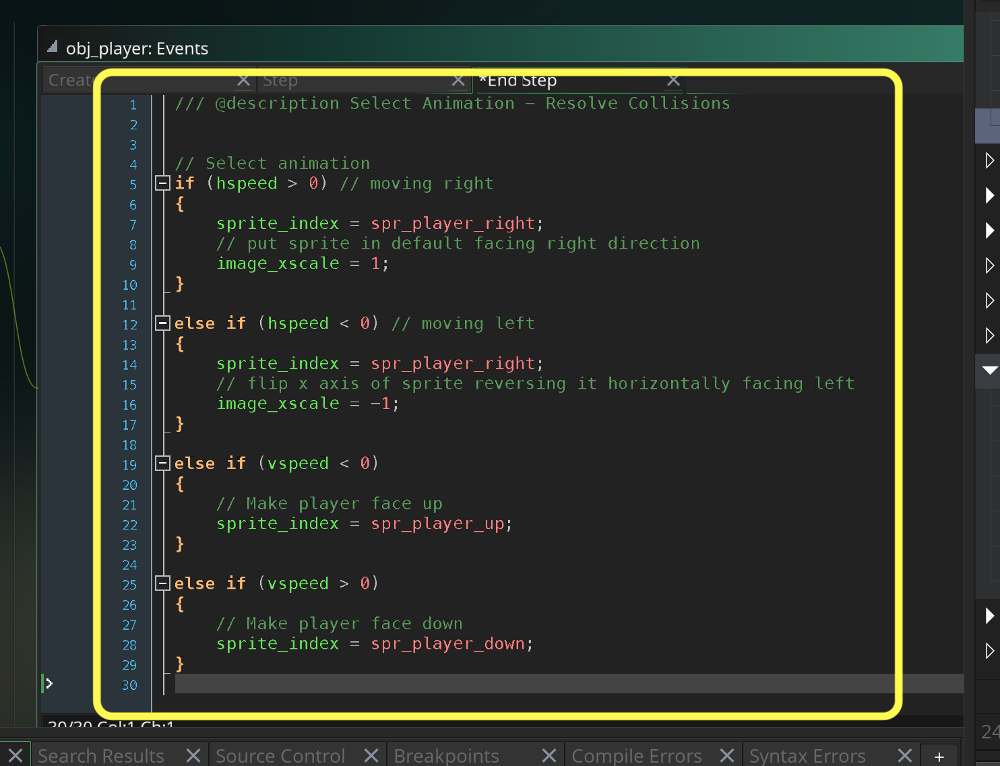

### Importing Player Animations

[previous](../room-size/README.md#user-content-room-size) • [home](../README.md#user-content-gms2-ue4-space-rocks) • [next](../collision-volume/README.md#user-content-creating-collision-volume-in-room)

Lets import the animations we need for our action adventure game.

 

---

##### `Step 1.`\|`TDAAG`|:small_blue_diamond:

Open up **P4v**.  Select the top folder of the **GameMaker** project. Press the <kbd>Checkout</kbd> button.  Checkout out all files in P4V so that they are all writable (otherwise they will be read only and none of the changes will be saved). Select a **New** changelist and add a message describing the unit of work you will be performing. Press the <kbd>OK</kbd> button.

Open up the project you are working on in **GameMaker**. 

##### `Step 2.`\|`TDAAG`|:small_blue_diamond: :small_blue_diamond: 

Let's import a player to use. You can replace it but for the math to work you will need to use the same size sprite.  Download [MonkeyAnim.png](images/MonkeyAnim.png).

##### `Step 3.`\|`TDAAG`|:small_blue_diamond: :small_blue_diamond: :small_blue_diamond:

*Right click* on **Sprites** and select **Create | Sprite** and name it `spr_player_right`.

##### `Step 4.`\|`TDAAG`|:small_blue_diamond: :small_blue_diamond: :small_blue_diamond: :small_blue_diamond:

Double click on `spr_player_right` and select <kbd>Edit Image</kbd>, then go to the top menu and pick <kbd>Image | Import Strip Image</kbd>. Select `MondayAnim.png` and press the <kbd>Open</kbd> button.

##### `Step 5.`\|`TDAAG`| :small_orange_diamond:

This brings up the **Convert to Frames** window.  As you can see there are three rows of animation with 8 cells in each.  For walking right we are on the third bottom row.  The sprites are `64` by `64`.  Change **Number of Frames** and **Frames per Row** to `8` frames.  Change **Frame Width** and **Frame Height** to `64` pixels.  Now we want the third row so set the **Vertical Cell Offset** to `2`. Confrim the import.

##### `Step 6.`\|`TDAAG`| :small_orange_diamond: :small_blue_diamond:

Open the **spr_player_right** up again and change the framerate to `12` **FPS**.

##### `Step 7.`\|`TDAAG`| :small_orange_diamond: :small_blue_diamond: :small_blue_diamond:

Hit the <kbd>Play</kbd> button on the sprite and it should animate fairly qiuckly like so:

https://user-images.githubusercontent.com/5504953/152546988-1e473998-528f-49bb-a00f-06bfde5d2b52.mp4

##### `Step 8.`\|`TDAAG`| :small_orange_diamond: :small_blue_diamond: :small_blue_diamond: :small_blue_diamond:

Now change the **Origin** to `Middle Center`.

##### `Step 9.`\|`TDAAG`| :small_orange_diamond: :small_blue_diamond: :small_blue_diamond: :small_blue_diamond: :small_blue_diamond:

*Right click* on **Sprites** and select **New | Sprite** and name it `spr_player_up`. Repeat the above process and you should change **Vertical Cell Offset** to `1`. Press the <kbd>Convert</kbd> button.

##### `Step 10.`\|`TDAAG`| :large_blue_diamond:

Change the **Frames per Second** to `12`**Fps** and the **Origin** to `Middle Center`.

##### `Step 11.`\|`TDAAG`| :large_blue_diamond: :small_blue_diamond: 

Now for left and right I can just invert the sprite as it is symmetrical on the x plane.  The down animation can't be the up animation inverted.  We need a seperate set of frames.  I will let you create and import the sprite sheet for `spr_player_down`. Change the **Frames per Second** to `12`**Fps** and the **Origin** to `Middle Center`.

##### `Step 12.`\|`TDAAG`| :large_blue_diamond: :small_blue_diamond: :small_blue_diamond: 

Create a new object by `right clicking` on **Objects** and select **Create | Object**.  Call it `obj_player` and assign the `spr_player_right` as the default sprite (they will start facing right).

##### `Step 13.`\|`TDAAG`| :large_blue_diamond: :small_blue_diamond: :small_blue_diamond:  :small_blue_diamond: 

Open up **rm_castle** and make sure you are on the **Instances** layer.  Drag a copy of **obj_player** into the top left corner of the room inside the white box.

##### `Step 14.`\|`TDAAG`| :large_blue_diamond: :small_blue_diamond: :small_blue_diamond: :small_blue_diamond:  :small_blue_diamond: 

With **Obj_Player)**, press the <kbd>Add Event</kbd> and select a **Create** event. Create a new variable called `player_speed` and set it to `3`.

##### `Step 15.`\|`TDAAG`| :large_blue_diamond: :small_orange_diamond: 

First we get a vertical and horizontal scalar (-1, 0 or 1).  We subtract left key from right key to get horizontal and up key from down key press to get the vertical.  We then set either the `hspeed` to a multiplied scalar and set the other axis to `0`.  Our player can only move in four directions so if there is a `vspeed` then `hspeed` has to be `0` or vice versa. For more details you can check out the [GMS2 Move in 4 Directions Tutorial](https://github.com/maubanel/GMS2-4-Directions). You can adopt one of its more advanced physics and controller models if you like!

Add a **Step Event** TO **Obj_Player** and type:

##### `Step 16.`\|`TDAAG`| :large_blue_diamond: :small_orange_diamond:   :small_blue_diamond: 

Now *press* the <kbd>Play</kbd> button in the top menu bar to launch the game. Now press in four directions and your player should move accordingly.  The only issue is if we are pressing left and right then press up and down while still holding left and right.  It doesn't respond.  Where if we select up or down and while still holding select left or right it will switch.  Lets make this consistent.

https://user-images.githubusercontent.com/5504953/221909573-b29c2106-46ac-492d-9e81-b00512fc56dd.mp4

##### `Step 17.`\|`TDAAG`| :large_blue_diamond: :small_orange_diamond: :small_blue_diamond: :small_blue_diamond:

Now to make this constant we need to add some logic. In the horizontal axis:

1. Check to see if a horizontal button is pressed and vertical button is not.
2. Or check to see if a horizontal button is pressed and it is the last button pressed (so pressed more recently than a vertical button)
3.  If either of the above are true then move horizontally else move vertically.

Now *press* the <kbd>Play</kbd> button in the top menu bar to launch the game. Now you should be able to turn while still holding the another button down consistently on both axis.

https://user-images.githubusercontent.com/5504953/152624841-a485a792-b9e1-4464-9ca9-09d62a52db56.mp4

##### `Step 18.`\|`TDAAG`| :large_blue_diamond: :small_orange_diamond: :small_blue_diamond: :small_blue_diamond: :small_blue_diamond:

Now for animations we need to wait until after the player has moved.  Press the <kbd>Add Event</kbd> and select a **Step | End Step** event. We will then add some logic to pick the sprite facing the correct direction.  Again, since the right walk cycle is symmetrical horizontally we can just mirror it to get the left direction.

##### `Step 19.`\|`TDAAG`| :large_blue_diamond: :small_orange_diamond: :small_blue_diamond: :small_blue_diamond: :small_blue_diamond: :small_blue_diamond:

Now *press* the <kbd>Play</kbd> button in the top menu bar to launch the game. Now the player faces the right direction, but keeps walking when stopped.

https://user-images.githubusercontent.com/5504953/152625525-620becea-0eea-433b-8277-263a4b807097.mp4

##### `Step 20.`\|`TDAAG`| :large_blue_diamond: :large_blue_diamond:

Open up all three animations and look for the frame where the two feet are next to each other on the ground.  The third frame (frame #2 because we start counting at 0) is the right frame in all animations.  So all we need to do for idle is to stay on frame 2 when the player is not moving.  Reopen **obj_player | End Step**.

##### `Step 21.`\|`TDAAG`| :large_blue_diamond: :large_blue_diamond: :small_blue_diamond:

Now *press* the <kbd>Play</kbd> button in the top menu bar to launch the game. Now stop in all four directions and make sure the idle frame is correct.

https://user-images.githubusercontent.com/5504953/152625805-c7b90fd5-5029-4555-9e16-a986fcb3d31c.mp4

##### `Step 22.`\|`TDAAG`| :large_blue_diamond: :large_blue_diamond: :small_blue_diamond: :small_blue_diamond:

Select the **File | Save Project**, then press **File | Quit** (PC) **Game Maker | Quit** on Mac to make sure everything in the game is saved.

##### `Step 23.`\|`TDAAG`| :large_blue_diamond: :large_blue_diamond: :small_blue_diamond: :small_blue_diamond: :small_blue_diamond:

Open up **P4V**.  Select the top folder and press the **Add** button.  We want to add all the new files we created during this last session.  Add these files to the last change list you used at the begining of the session. Make sure the message accurately represents what you have done. Press the <kbd>OK</kbd> button.

##### `Step 24.`\|`TDAAG`| :large_blue_diamond: :large_blue_diamond: :small_blue_diamond: :small_blue_diamond: :small_blue_diamond: :small_blue_diamond:

Now you can submit the changelist by pressing both <kbd>Submit</kbd> buttons.

___

<!--  -->

| [previous](../room-size/README.md#user-content-room-size)| [home](../README.md#user-content-gms2-ue4-space-rocks) | [next](../collision-volume/README.md#user-content-creating-collision-volume-in-room)|
|---|---|---|
