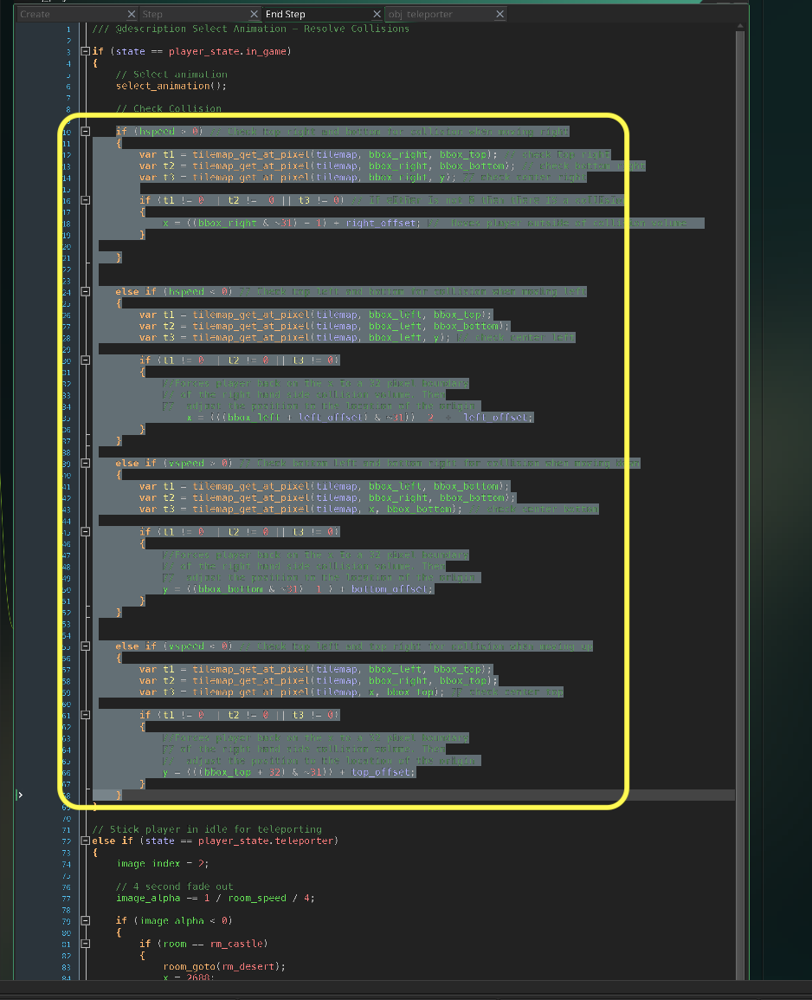
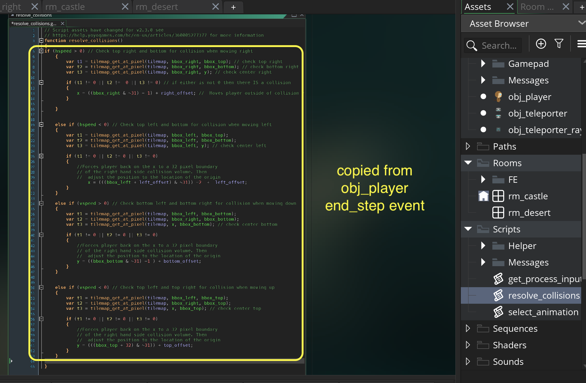
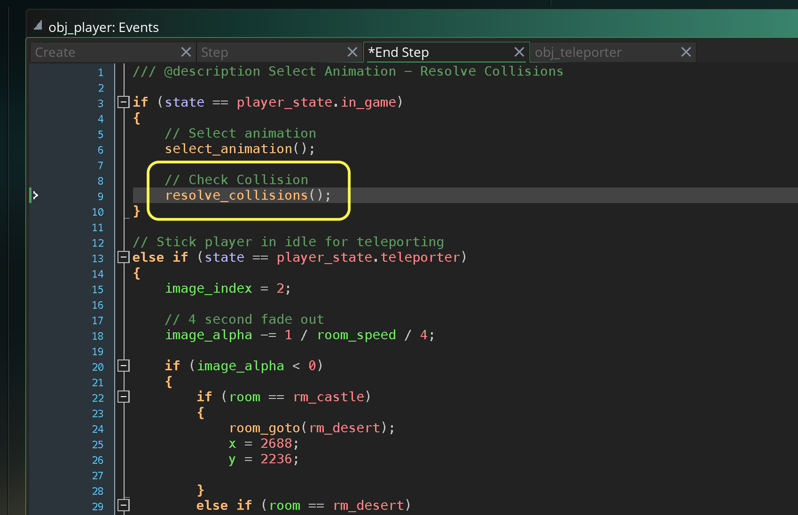
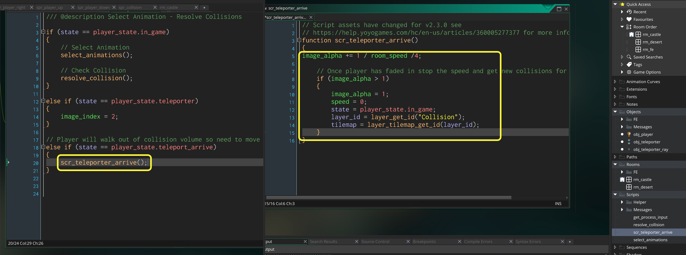

### Refactoring Player Step Events

[previous](../changing-rooms-iii/README.md#user-content-changing-rooms-iii) • [home](..//README.md#user-content-gms2-action-adventure-game) • [next](../basic-message/README.md#user-content-message-dialogue-box)

Now lets clean up and make our code a little more readable in our main player.  As the game grows this object can get quite a bit more code. Lets make it clear what is happening by separating each logical chunk into a function script.  This will allow us to clearly see:

* Get input
* Process input
* Select Animation
* Resolve Collisions

 

---

##### `Step 1.`\|`TDAAG`|:small_blue_diamond:

Open up **P4v**.  Select the top folder of the **GameMaker** project. Press the <kbd>Checkout</kbd> button.  Checkout out all files in P4V so that they are all writable (otherwise they will be read only and none of the changes will be saved). Select a **New** changelist and add a message describing the unit of work you will be performing. Press the <kbd>OK</kbd> button.

Open up the project you are working on in **GameMaker**. 

##### `Step 2.`\|`TDAAG`|:small_blue_diamond: :small_blue_diamond: 

Open up **obj_player | Step** event and copy all of the script inside the `if` statement.  Right click on **Scripts** and select **Create | Script**. This will create a new function.

##### `Step 3.`\|`TDAAG`|:small_blue_diamond: :small_blue_diamond: :small_blue_diamond:

Call this file `get_process_input`.  It will create an empty function with angle brackets. Paste the code you had copied above here.

##### `Step 4.`\|`TDAAG`|:small_blue_diamond: :small_blue_diamond: :small_blue_diamond: :small_blue_diamond:

Now go back to **obj_player | Step** event and delete the script you just pasted.  Replace it with a function call to `get_process_input()`.  This will lead to the exact same behavior but makes the code a bit easier to read.

##### `Step 5.`\|`TDAAG`| :small_orange_diamond:

Now *press* the <kbd>Play</kbd> button in the top menu bar to launch the game. Now it should be the same as before.

https://user-images.githubusercontent.com/5504953/152680300-de454759-27bc-4329-9ea9-433ea51e9575.mp4

##### `Step 6.`\|`TDAAG`| :small_orange_diamond: :small_blue_diamond:

Repeat this for animation.  Select the animation portion of **obj_player | End Step** and paste it into a new script function called `select_animations`.

##### `Step 7.`\|`TDAAG`| :small_orange_diamond: :small_blue_diamond: :small_blue_diamond:

Go back to **obj_player | End Step** and delete the animations.  Instead call the `select_animations()` function.

##### `Step 8.`\|`TDAAG`| :small_orange_diamond: :small_blue_diamond: :small_blue_diamond: :small_blue_diamond:

Now *press* the <kbd>Play</kbd> button in the top menu bar to launch the game. Now it should be the same as before.

https://user-images.githubusercontent.com/5504953/152680300-de454759-27bc-4329-9ea9-433ea51e9575.mp4

##### `Step 9.`\|`TDAAG`| :small_orange_diamond: :small_blue_diamond: :small_blue_diamond: :small_blue_diamond: :small_blue_diamond:

Go back to **obj_player | End Step** event and select and copy the collision checking code. 

##### `Step 10.`\|`TDAAG`| :large_blue_diamond:

Now create a new script called `resolve_collisions` and paste the collision script between the curly braces.

##### `Step 11.`\|`TDAAG`| :large_blue_diamond: :small_blue_diamond: 

Replace all of the collision script that you pasted in **obj_player | End Step** with a call to `resolve_collisions()` function.

##### `Step 12.`\|`TDAAG`| :large_blue_diamond: :small_blue_diamond: :small_blue_diamond: 

Now *press* the <kbd>Play</kbd> button in the top menu bar to launch the game. Test that the collisions still work the same as before.

https://user-images.githubusercontent.com/5504953/152680891-515cf713-3093-434e-a6d9-dcc86f3af3c8.mp4

##### `Step 13.`\|`TDAAG`| :large_blue_diamond: :small_blue_diamond: :small_blue_diamond:  :small_blue_diamond: 

Repeat this for teleport send and arrive, by moving the scripts to functions. Now test the teleporting to make sure it is the same.

##### `Step 14.`\|`TDAAG`| :large_blue_diamond: :small_blue_diamond: :small_blue_diamond: :small_blue_diamond:  :small_blue_diamond: 

Select the **File | Save Project**, then press **File | Quit** (PC) **Game Maker | Quit** on Mac to make sure everything in the game is saved.

##### `Step 15.`\|`TDAAG`| :large_blue_diamond: :small_orange_diamond: 

Open up **P4V**.  Select the top folder and press the **Add** button.  We want to add all the new files we created during this last session.  Add these files to the last change list you used at the begining of the session. Make sure the message accurately represents what you have done. Press the <kbd>OK</kbd> button.

##### `Step 16.`\|`TDAAG`| :large_blue_diamond: :small_orange_diamond:   :small_blue_diamond: 

Now you can submit the changelist by pressing both <kbd>Submit</kbd> buttons.

<!--  -->

| [previous](../changing-rooms-iii/README.md#user-content-changing-rooms-iii)| [home](..//README.md#user-content-gms2-action-adventure-game) | [next](../basic-message/README.md#user-content-message-dialogue-box)|
|---|---|---|
