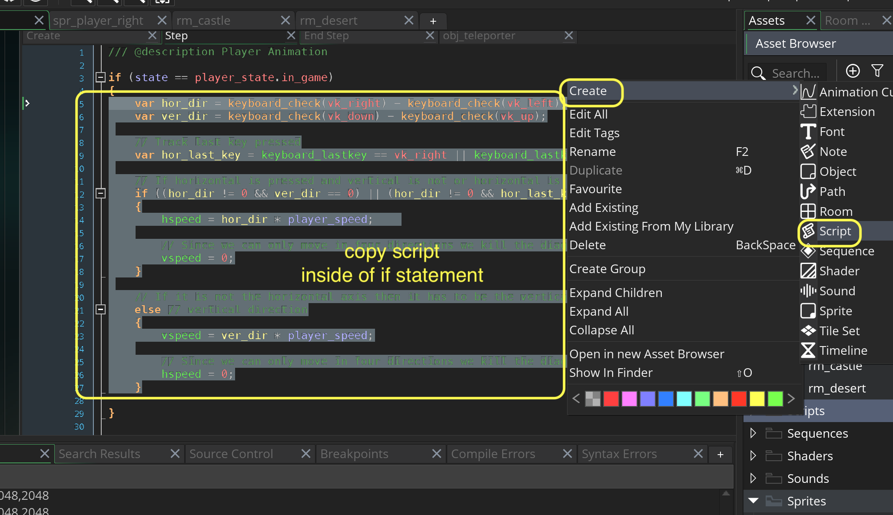
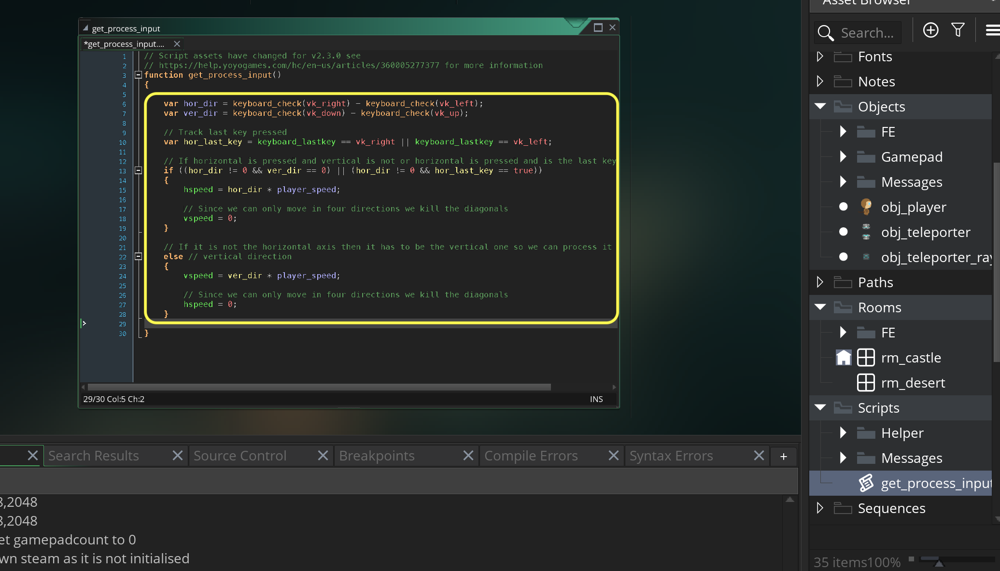
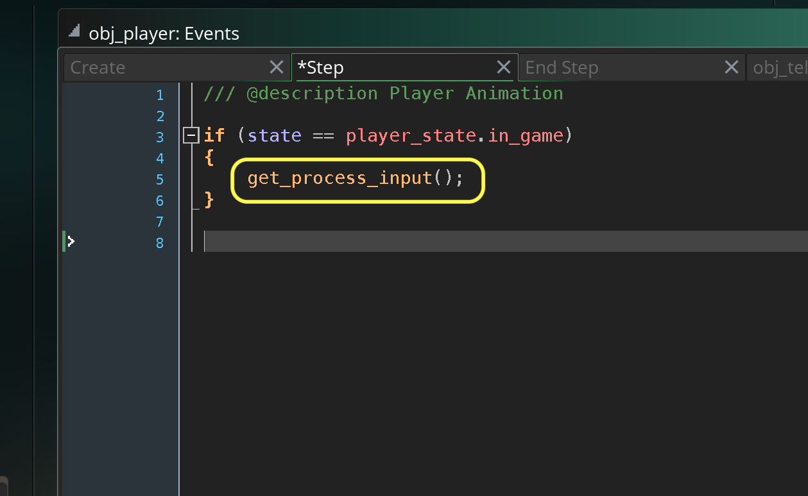
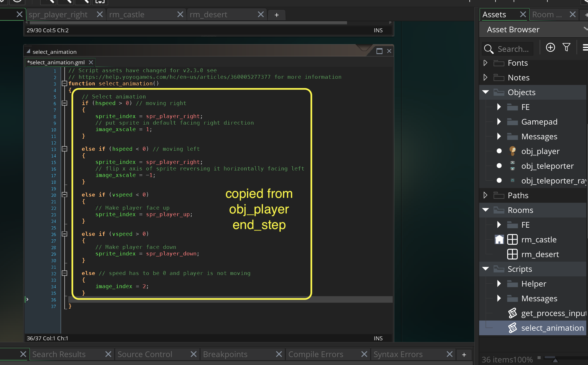
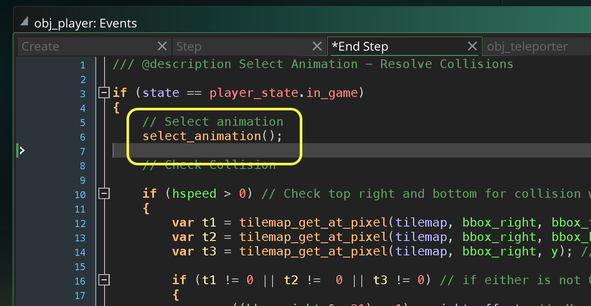

### Refactoring Player Step Events

[previous](../hanging-rooms-ii/README.md#user-content-changing-rooms-ii) • [home](../README.md#user-content-gms2-ue4-space-rocks) • [next](../)

Now lets clean up and make our code a little more readable in our main player.  As the game grows this object can get quite a bit more code. Lets make it clear what is happening by separating each logical chunk into a function script.  This will allow us to clearly see:

* Get input
* Process input
* Select Animation
* Resolve Collisions

 

---

##### `Step 1.`\|`SPCRK`|:small_blue_diamond:

Open up **obj_player | Step** event and copy all of the script inside the `if` statement.  Right click on **Scripts** and select **Create | Script**. This will create a new function.

##### `Step 2.`\|`FHIU`|:small_blue_diamond: :small_blue_diamond: 

Call this file `get_process_input`.  It will create an empty function with angle brackets. Paste the code you had copied above here.

##### `Step 3.`\|`SPCRK`|:small_blue_diamond: :small_blue_diamond: :small_blue_diamond:

Now go back to **obj_player | Step** event and delete the script you just pasted.  Replace it with a function call to `get_process_input()`.  This will lead to the exact same behavior but makes the code a bit easier to read.

##### `Step 4.`\|`SPCRK`|:small_blue_diamond: :small_blue_diamond: :small_blue_diamond: :small_blue_diamond:

Now *press* the <kbd>Play</kbd> button in the top menu bar to launch the game. Now it should be the same as before.

https://user-images.githubusercontent.com/5504953/152680300-de454759-27bc-4329-9ea9-433ea51e9575.mp4

##### `Step 5.`\|`SPCRK`| :small_orange_diamond:

Repeat this for animation.  Select the animation portion of **obj_player | End Step** and paste it into a new script function called `select_animations`.

##### `Step 6.`\|`SPCRK`| :small_orange_diamond: :small_blue_diamond:

Go back to **obj_player | End Step** and delete the animations.  Instead call the `select_animations()` function.

##### `Step 7.`\|`SPCRK`| :small_orange_diamond: :small_blue_diamond: :small_blue_diamond:

Now *press* the <kbd>Play</kbd> button in the top menu bar to launch the game. Now it should be the same as before.

https://user-images.githubusercontent.com/5504953/152680300-de454759-27bc-4329-9ea9-433ea51e9575.mp4

##### `Step 8.`\|`SPCRK`| :small_orange_diamond: :small_blue_diamond: :small_blue_diamond: :small_blue_diamond:

Now we want it to be off when the game is started at the beginning.  So we need to open the ray's step event and add a check for INGAME state and then set the alpha off.

##### `Step 9.`\|`SPCRK`| :small_orange_diamond: :small_blue_diamond: :small_blue_diamond: :small_blue_diamond: :small_blue_diamond:

Also don't forget that we spawned the ray previously.  Since we changed our design when we added the room we need to comment out or delete the instance_create_layer() call so we don't create multiple unecessary rays!

##### `Step 10.`\|`SPCRK`| :large_blue_diamond:

Run the game by pressing the  Play Button and run towards the teleporter. Now go back to the the castle room. Now it should be working as we planned.  This is enough, now lets look at adding some text boxes.

___

| [previous](../hanging-rooms-ii/README.md#user-content-changing-rooms-ii)| [home](../README.md#user-content-gms2-ue4-space-rocks) | [next](../)|
|---|---|---|
