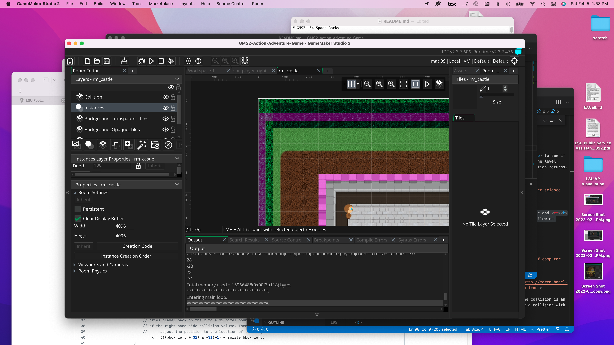
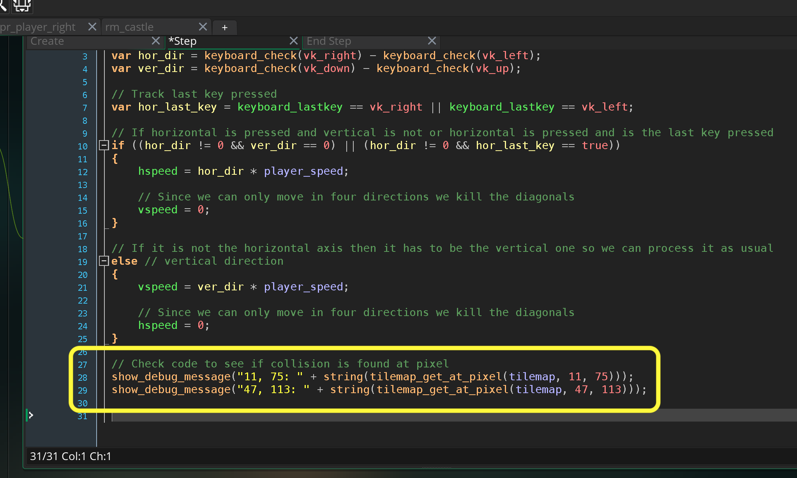
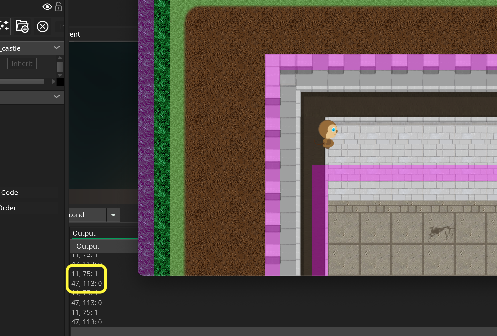
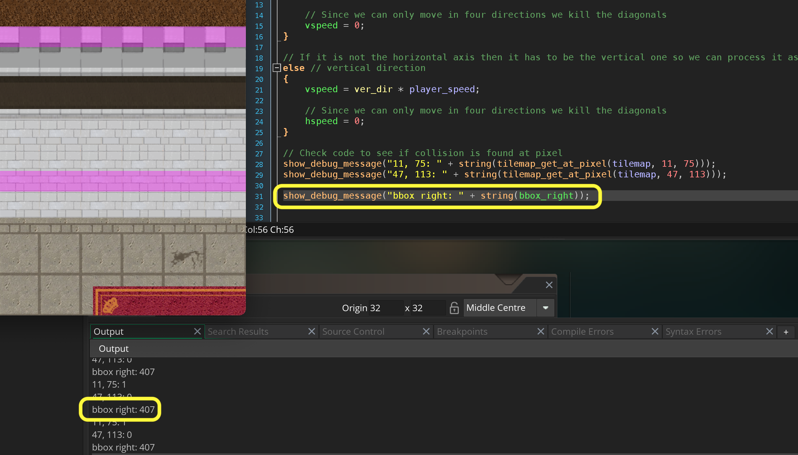
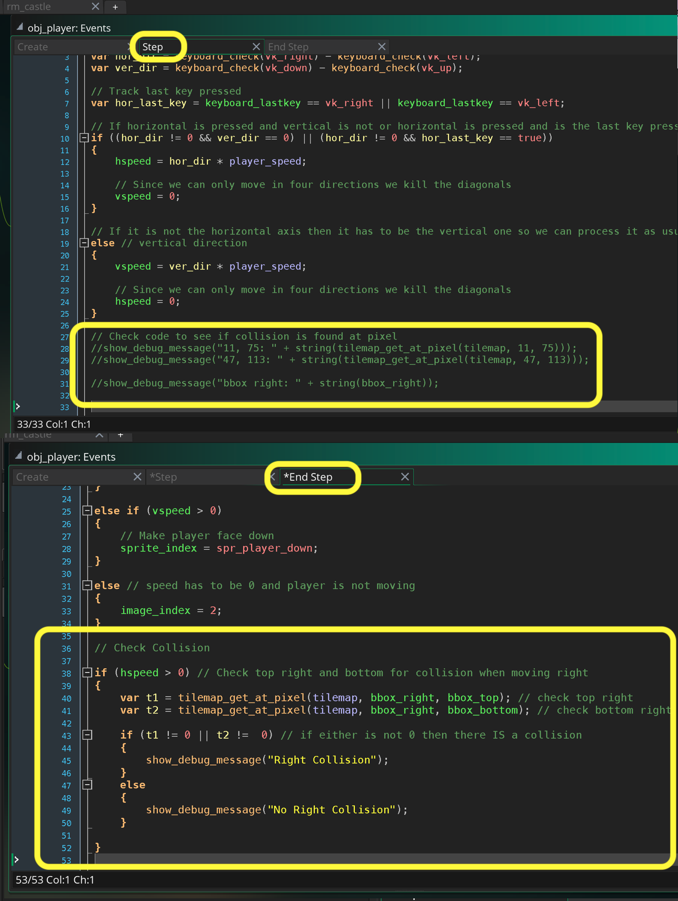

### Resolve Collision

[previous](../collision-check/README.md#user-content-four-corner-collision-check) • [home](../README.md#user-content-gms2-ue4-space-rocks) • [next](../)

What we will be doing is checking to see if the side in which the player is moving is overlapping with a collision volume that it will be put back outside the collision volume.

* Check to see two corners of direction we are moving in.  So for example if we are moving right we would check the top right corner pixel and bottom right corner pixel and see if any are overlapping with the Background_Collision_Tilestilemap.

* If either of these overlap move player back outside the boundary by adjusting the player position to a `32` by `32` boundary and subtract its relative position from its **origin** to the `sprite_bbox_right`

 

---

##### `Step 1.`\|`SPCRK`|:small_blue_diamond:

We will be using `tilemap_get_at_pixel(tilemap_element_id, x, y)` to see if there is a collision tile at the point in space.  Lets find two points in the level, one that has a collision and one that doesn't to test to see what this function returns. So at room position (11, 75) is on top of a collision volume and (47, 113) is in an open area. To do this put the cursor in the middle of the tile and the room x,y will be shown in the bottom left corner of the room. A

##### `Step 2.`\|`FHIU`|:small_blue_diamond: :small_blue_diamond: 

Add to the bottom of **obj_player | Step** event the following debug message to see what we get. I expect a 1 (true) for (11, 75) and 0 (false) for (47, 113). This would confirm we are getting a response on whether our collision tile is in this quadrant.

##### `Step 3.`\|`SPCRK`|:small_blue_diamond: :small_blue_diamond: :small_blue_diamond:

Now *press* the <kbd>Play</kbd> button in the top menu bar to launch the game. Now look in the **Output Window** at (11, 75) with the collision is an return of 1 (true) and the empty spot of (47, 113) is 0 (false).  So it is working as we expected!

##### `Step 4.`\|`SPCRK`|:small_blue_diamond: :small_blue_diamond: :small_blue_diamond: :small_blue_diamond:

Lets look at moving right.  We will worry about the top right and bottom right hand side of the bounding box of the player in world space. This can be found in bbox_right, bbox_bottom and bbox_top. This gives us the room position of the player's bounding box.  Here is an example:

##### `Step 5.`\|`SPCRK`| :small_orange_diamond:

Delete the `show_debug_message(string)` lines as we no longer need them.  We will instead check the top right and bottom right corner of the player collision volume to see if it collides with an occupied tile in the Background_Collision_Tileslayer.  
	
First we check that there is player movement (if the player is not moving there is no point in checking collisions).  First we will start by checking if the player is moving to the right (`hspeed > 0`).  We will create two local variables that stores the result of the top right and bottom right collision checks. 

Lastly we check to see if either `t1` or `t2` are not equal to `0` (no collision).  We will print a message again to indicate a collision when moving right. We need to do this in the end step AFTER we have changed the animation frame.

##### `Step 6.`\|`SPCRK`| :small_orange_diamond: :small_blue_diamond:

Now *press* the <kbd>Play</kbd> button in the top menu bar to launch the game. Run over the collision volume and see if we get the collision message.  When we exit it we should get the the non collision message.  This will only update if we are moving to the right. It is behaving for me the way I expect it to.

https://user-images.githubusercontent.com/5504953/152657786-6ad04b97-9e21-4402-b3fc-6a5114a1cb51.mp4

##### `Step 7.`\|`SPCRK`| :small_orange_diamond: :small_blue_diamond: :small_blue_diamond:

Let's replace the debug messages and actually align the sprite. There is a quick (computationally) way of doing this.  This only works with power of 2 sizes (our player is 64 by 64).  This aligns a player to a 32 pixel boundary using binary arithmetic: `x = x & ~31;`.

So since the right hand side is colliding we want to align to the right hand side of the sprite so we alter this to `x = ((bbox_right & ~31) - 1) + right_offset`.

Make changes to **obj_player | End Step** event.

##### `Step 8.`\|`SPCRK`| :small_orange_diamond: :small_blue_diamond: :small_blue_diamond: :small_blue_diamond:

##### `Step 9.`\|`SPCRK`| :small_orange_diamond: :small_blue_diamond: :small_blue_diamond: :small_blue_diamond: :small_blue_diamond:

##### `Step 10.`\|`SPCRK`| :large_blue_diamond:

##### `Step 11.`\|`SPCRK`| :large_blue_diamond: :small_blue_diamond: 

##### `Step 12.`\|`SPCRK`| :large_blue_diamond: :small_blue_diamond: :small_blue_diamond: 

##### `Step 13.`\|`SPCRK`| :large_blue_diamond: :small_blue_diamond: :small_blue_diamond:  :small_blue_diamond: 

##### `Step 14.`\|`SPCRK`| :large_blue_diamond: :small_blue_diamond: :small_blue_diamond: :small_blue_diamond:  :small_blue_diamond: 

##### `Step 15.`\|`SPCRK`| :large_blue_diamond: :small_orange_diamond: 

##### `Step 16.`\|`SPCRK`| :large_blue_diamond: :small_orange_diamond:   :small_blue_diamond: 

##### `Step 17.`\|`SPCRK`| :large_blue_diamond: :small_orange_diamond: :small_blue_diamond: :small_blue_diamond:

##### `Step 18.`\|`SPCRK`| :large_blue_diamond: :small_orange_diamond: :small_blue_diamond: :small_blue_diamond: :small_blue_diamond:

##### `Step 19.`\|`SPCRK`| :large_blue_diamond: :small_orange_diamond: :small_blue_diamond: :small_blue_diamond: :small_blue_diamond: :small_blue_diamond:

##### `Step 20.`\|`SPCRK`| :large_blue_diamond: :large_blue_diamond:

##### `Step 21.`\|`SPCRK`| :large_blue_diamond: :large_blue_diamond: :small_blue_diamond:

___

| [previous](../collision-check/README.md#user-content-four-corner-collision-check)| [home](../README.md#user-content-gms2-ue4-space-rocks) | [next](../)|
|---|---|---|
