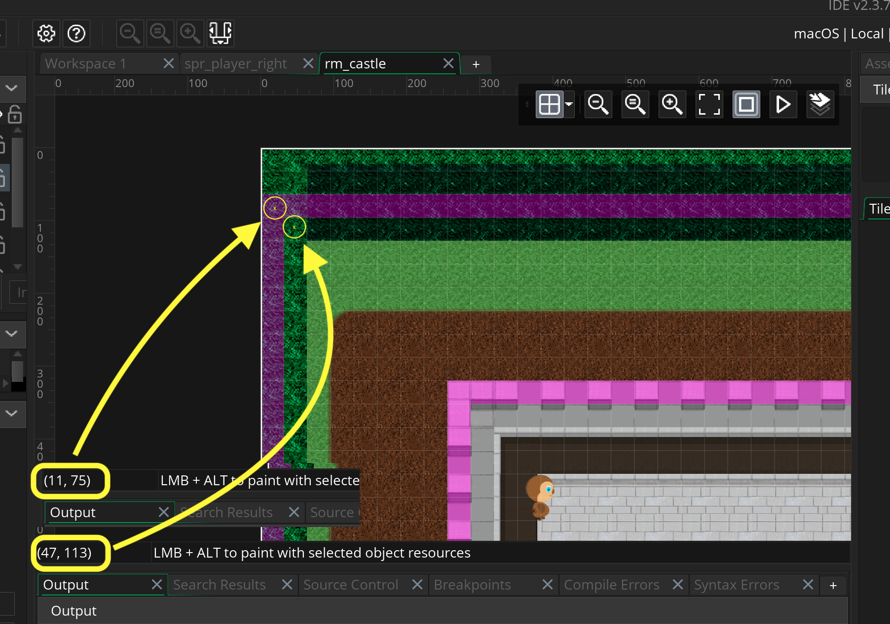
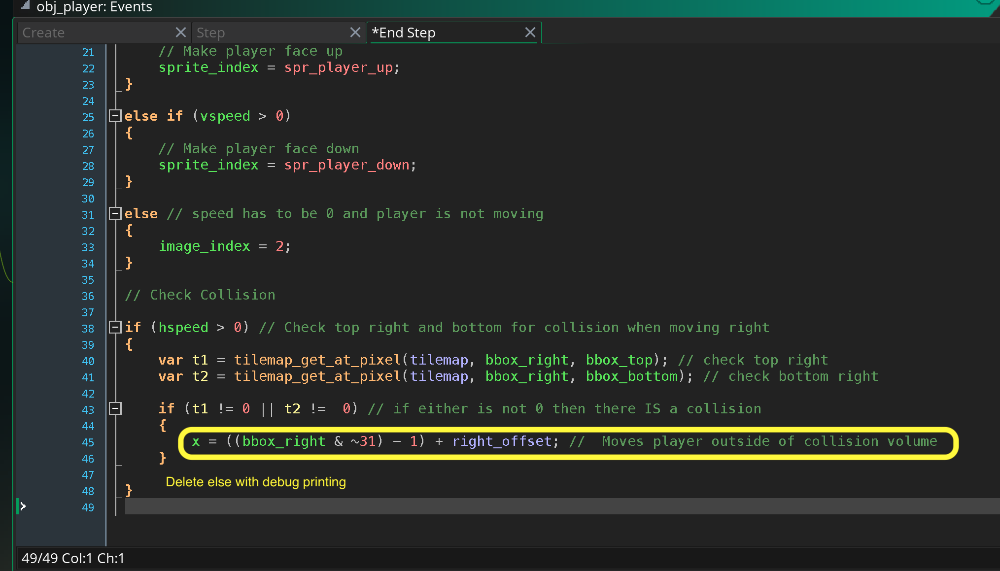
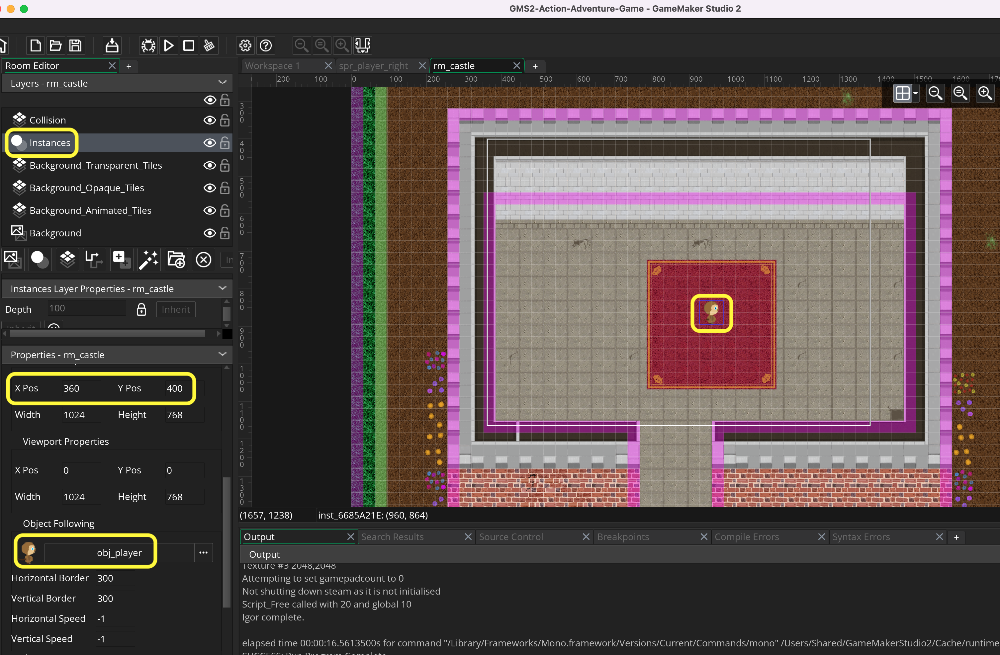
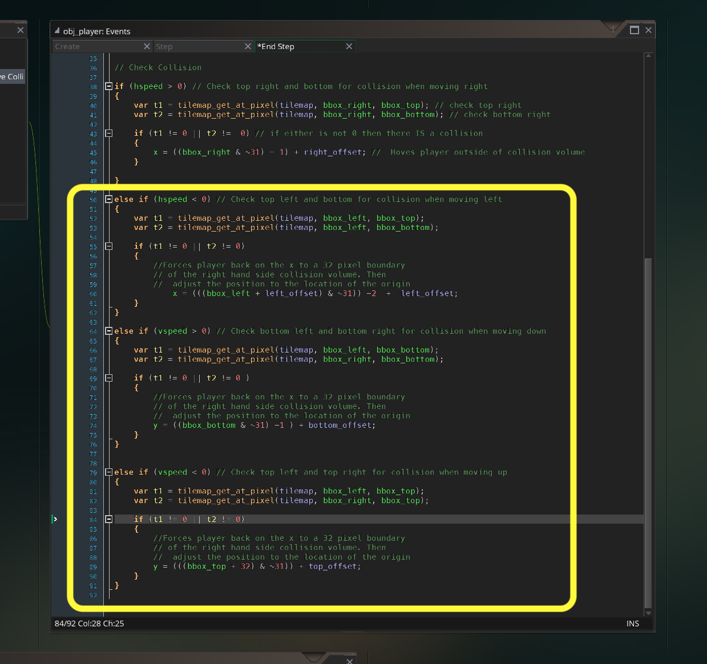
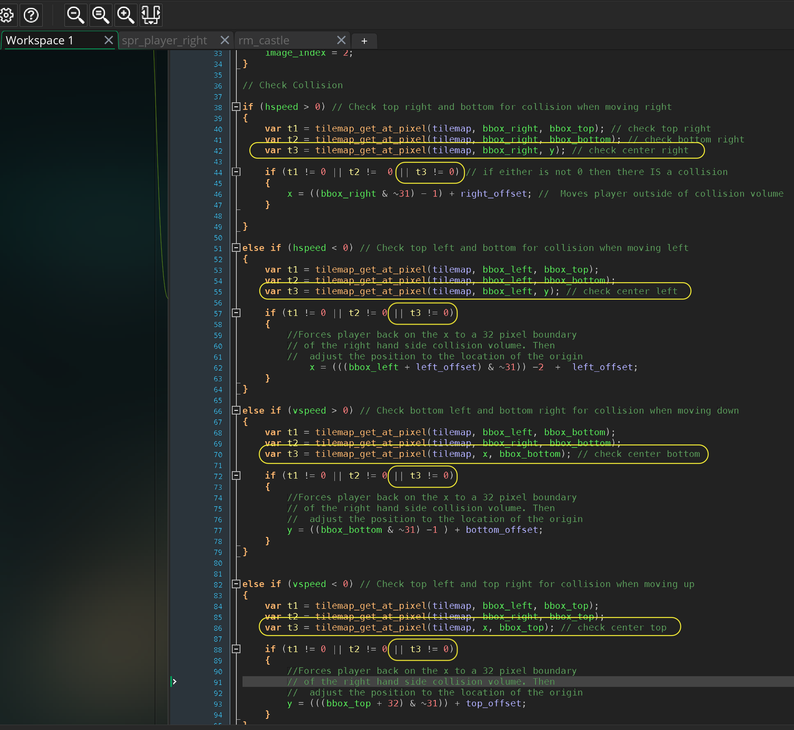

### Resolve Collision

<sub>[previous](../collision-check/README.md#user-content-four-corner-collision-check) • [home](..//README.md#user-content-gms2-action-adventure-game) • [next](../changing-rooms/README.md#user-content-changing-rooms)</sub>


What we will be doing is checking to see if the side in which the player is moving is overlapping with a collision volume that it will be put back outside the collision volume.

* Check to see two corners of direction we are moving in.  So for example if we are moving right we would check the top right corner pixel and bottom right corner pixel and see if any are overlapping with the Background_Collision_Tilestilemap.

* If either of these overlap move player back outside the boundary by adjusting the player position to a `32` by `32` boundary and subtract its relative position from its **origin** to the `sprite_bbox_right`

<br>

---


##### `Step 1.`\|`TDAAG`|:small_blue_diamond:

Open up **P4v**.  Select the top folder of the **GameMaker** project. Press the <kbd>Checkout</kbd> button.  Checkout out all files in P4V so that they are all writable (otherwise they will be read only and none of the changes will be saved). Select a **New** changelist and add a message describing the unit of work you will be performing. Press the <kbd>OK</kbd> button.

Open up the project you are working on in **GameMaker**. 


##### `Step 2.`\|`TDAAG`|:small_blue_diamond: :small_blue_diamond: 

We will be using `tilemap_get_at_pixel(tilemap_element_id, x, y)` to see if there is a collision tile at the point in space.  Lets find two points in the level, one that has a collision and one that doesn't to test to see what this function returns. So at room position (11, 75) is on top of a collision volume and (47, 113) is in an open area. To do this put the cursor in the middle of the tile and the room x,y will be shown in the bottom left corner of the room. A




##### `Step 3.`\|`TDAAG`|:small_blue_diamond: :small_blue_diamond: :small_blue_diamond:

Add to the bottom of **obj_player | Step** event the following debug message to see what we get. I expect a 1 (true) for (11, 75) and 0 (false) for (47, 113). This would confirm we are getting a response on whether our collision tile is in this quadrant.


##### `Step 4.`\|`TDAAG`|:small_blue_diamond: :small_blue_diamond: :small_blue_diamond: :small_blue_diamond:

Now *press* the <kbd>Play</kbd> button in the top menu bar to launch the game. Now look in the **Output Window** at (11, 75) with the collision is an return of 1 (true) and the empty spot of (47, 113) is 0 (false).  So it is working as we expected!


##### `Step 5.`\|`TDAAG`| :small_orange_diamond:

Lets look at moving right.  We will worry about the top right and bottom right hand side of the bounding box of the player in world space. This can be found in bbox_right, bbox_bottom and bbox_top. This gives us the room position of the player's bounding box.  Here is an example:


##### `Step 6.`\|`TDAAG`| :small_orange_diamond: :small_blue_diamond:

Delete the `show_debug_message(string)` lines as we no longer need them.  We will instead check the top right and bottom right corner of the player collision volume to see if it collides with an occupied tile in the Background_Collision_Tileslayer.  
	
First we check that there is player movement (if the player is not moving there is no point in checking collisions).  First we will start by checking if the player is moving to the right (`hspeed > 0`).  We will create two local variables that stores the result of the top right and bottom right collision checks. 

Lastly we check to see if either `t1` or `t2` are not equal to `0` (no collision).  We will print a message again to indicate a collision when moving right. We need to do this in the end step AFTER we have changed the animation frame.


##### `Step 7.`\|`TDAAG`| :small_orange_diamond: :small_blue_diamond: :small_blue_diamond:

Now *press* the <kbd>Play</kbd> button in the top menu bar to launch the game. Run over the collision volume and see if we get the collision message.  When we exit it we should get the the non collision message.  This will only update if we are moving to the right. It is behaving for me the way I expect it to.

https://user-images.githubusercontent.com/5504953/152657786-6ad04b97-9e21-4402-b3fc-6a5114a1cb51.mp4


##### `Step 8.`\|`TDAAG`| :small_orange_diamond: :small_blue_diamond: :small_blue_diamond: :small_blue_diamond:

Let's replace the debug messages and actually align the sprite. There is a quick (computationally) way of doing this.  This only works with power of 2 sizes (our player is 64 by 64).  This aligns a player to a 32 pixel boundary using binary arithmetic: `x = x & ~31;`.

So since the right hand side is colliding we want to align to the right hand side of the sprite so we alter this to `x = ((bbox_right & ~31) - 1) + right_offset`.

Make changes to **obj_player | End Step** event.




##### `Step 9.`\|`TDAAG`| :small_orange_diamond: :small_blue_diamond: :small_blue_diamond: :small_blue_diamond: :small_blue_diamond:

Now *press* the <kbd>Play</kbd> button in the top menu bar to launch the game. Run to the right and you should stop to the right of the collision volume.  Pleaes note that the other directions don't work so you can get stuck inside a collision volume.  We will fix this by adding more collision directions.

https://user-images.githubusercontent.com/5504953/152658087-5044cd66-775b-4a32-b557-89e08fc735d6.mp4


##### `Step 10.`\|`TDAAG`| :large_blue_diamond:


Now lets have the camera follow the player as well as starting in the middle of the castle.  Open up **rm_castle** and move the player to the center.  Open up **Viewport 0** and add `obj_player` to **Object Folowing**.  Lets adjust where the camera is at the begining of the level and make **X Pos** equal to `306` and **Y Pos** to `400`.  It should look like so:




##### `Step 11.`\|`TDAAG`| :large_blue_diamond: :small_blue_diamond: 

Lets do the other 3 directions.  Copy and paste the following to resolve collisions for moving left, down and up.

```
else if (hspeed < 0) // Check top left and bottom for collision when moving left
{
	var t1 = tilemap_get_at_pixel(tilemap, bbox_left, bbox_top);
	var t2 = tilemap_get_at_pixel(tilemap, bbox_left, bbox_bottom);

	if (t1 != 0 || t2 != 0)
	{
		//Forces player back on the x to a 32 pixel boundary
		// of the right hand side collision volume. Then
		//	adjust the position to the location of the origin 
		    x = (((bbox_left + left_offset) & ~31)) -2  +  left_offset;
	}
}

else if (vspeed > 0) // Check bottom left and bottom right for collision when moving down
{
	var t1 = tilemap_get_at_pixel(tilemap, bbox_left, bbox_bottom);
	var t2 = tilemap_get_at_pixel(tilemap, bbox_right, bbox_bottom);

	if (t1 != 0 || t2 != 0 )
	{
		//Forces player back on the x to a 32 pixel boundary
		// of the right hand side collision volume. Then
		//	adjust the position to the location of the origin 
		y = ((bbox_bottom & ~31) -1 ) + bottom_offset;
	}
}


else if (vspeed < 0) // Check top left and top right for collision when moving up
{
	var t1 = tilemap_get_at_pixel(tilemap, bbox_left, bbox_top);
	var t2 = tilemap_get_at_pixel(tilemap, bbox_right, bbox_top);

	if (t1 != 0 || t2 != 0)
	{
		//Forces player back on the x to a 32 pixel boundary
		// of the right hand side collision volume. Then
		//	adjust the position to the location of the origin 
		y = (((bbox_top + 32) & ~31)) + top_offset;
	}
}
```



##### `Step 12.`\|`TDAAG`| :large_blue_diamond: :small_blue_diamond: :small_blue_diamond: 

You should stop before each wall in all directions and not able to get through them.  There should be no jittering or artifacts either! Run around the entire level and make sure you can't enter an area you should not. Correct any errors you have in the collision volumes.

https://user-images.githubusercontent.com/5504953/152658933-1ed150f3-d286-4ce2-b6f1-4b9558042848.mp4


##### `Step 13.`\|`TDAAG`| :large_blue_diamond: :small_blue_diamond: :small_blue_diamond:  :small_blue_diamond: 

Now we are not meant to see the collision volumes, they should be invisible. When you are happy with them open **rm_castle** and select layer **Collision** and press the eyeball button to hide the layer.


##### `Step 14.`\|`TDAAG`| :large_blue_diamond: :small_blue_diamond: :small_blue_diamond: :small_blue_diamond:  :small_blue_diamond: 

Now *press* the <kbd>Play</kbd> button in the top menu bar to launch the game. Now you can walk around and the player should stop at the correct spot in the level. This works even though we can't see the tiles!

https://user-images.githubusercontent.com/5504953/152661007-0ba6390a-5b82-4707-b1c0-29f65a7e8972.mp4


##### `Step 15.`\|`TDAAG`| :large_blue_diamond: :small_orange_diamond: 

There is an issue if your sprite size is different from your collision size.  In this case our sprite is `64 x 64` and the collision square is `32 x 32`.  Now we only check the corners so if we enter a collision space where no corners touch we can pass through it like so:

https://user-images.githubusercontent.com/5504953/152661062-18f941dd-76e7-4ba0-a46e-ead8dab950a7.mp4


##### `Step 16.`\|`TDAAG`| :large_blue_diamond: :small_orange_diamond:   :small_blue_diamond: 

We need to add enough collision checking so that the gap between checks is not larger than the collision volume.  Lets add one more check in the middle right, left, bottom and top. We will now check if any of the three pionts collide.




##### `Step 17.`\|`TDAAG`| :large_blue_diamond: :small_orange_diamond: :small_blue_diamond: :small_blue_diamond:

I created a test cross of collisions to test to make sure I can't bypass the collisions. Now *press* the <kbd>Play</kbd> button in the top menu bar to launch the game. Now I have all collisions working.

Hide the collisions and erase the the test cross.

https://user-images.githubusercontent.com/5504953/152661428-d615cefb-1667-426a-86c8-5a313252d5cd.mp4


##### `Step 18.`\|`TDAAG`| :large_blue_diamond: :small_orange_diamond: :small_blue_diamond: :small_blue_diamond: :small_blue_diamond:

Select the **File | Save Project**, then press **File | Quit** (PC) **Game Maker | Quit** on Mac to make sure everything in the game is saved.


##### `Step 19.`\|`TDAAG`| :large_blue_diamond: :small_orange_diamond: :small_blue_diamond: :small_blue_diamond: :small_blue_diamond: :small_blue_diamond:

Open up **P4V**.  Select the top folder and press the **Add** button.  We want to add all the new files we created during this last session.  Add these files to the last change list you used at the begining of the session. Make sure the message accurately represents what you have done. Press the <kbd>OK</kbd> button.


##### `Step 20.`\|`TDAAG`| :large_blue_diamond: :large_blue_diamond:

Now you can submit the changelist by pressing both <kbd>Submit</kbd> buttons.


<!--  -->


| [previous](../collision-check/README.md#user-content-four-corner-collision-check)| [home](..//README.md#user-content-gms2-action-adventure-game) | [next](../changing-rooms/README.md#user-content-changing-rooms)|
|---|---|---|
