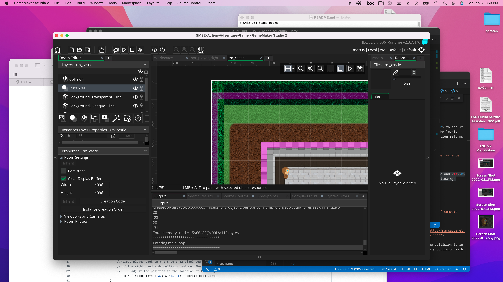

### Resolve Collision

[previous](../collision-check/README.md#user-content-four-corner-collision-check) • [home](../README.md#user-content-gms2-ue4-space-rocks) • [next](../)

What we will be doing is checking to see if the side in which the player is moving is overlapping with a collision volume that it will be put back outside the collision volume.

* Check to see two corners of direction we are moving in.  So for example if we are moving right we would check the top right corner pixel and bottom right corner pixel and see if any are overlapping with the Background_Collision_Tilestilemap.

* If either of these overlap move player back outside the boundary by adjusting the player position to a `32` by `32` boundary and subtract its relative position from its **origin** to the `sprite_bbox_right`

 

---

##### `Step 1.`\|`SPCRK`|:small_blue_diamond:

We will be using `user_get_at_pixel(tilemap_element_id, x, y)` to see if there is a collision tile at the point in space.  Lets find two points in the level, one that has a collision and one that doesn't to test to see what this function returns.

##### `Step 2.`\|`FHIU`|:small_blue_diamond: :small_blue_diamond: 

So at room position (52, 45)is on top of a collision volume and (110, 112) is in an open area. Add to **obj_player | Step** event the following debug message to see what we get. 

##### `Step 3.`\|`SPCRK`|:small_blue_diamond: :small_blue_diamond: :small_blue_diamond:

##### `Step 4.`\|`SPCRK`|:small_blue_diamond: :small_blue_diamond: :small_blue_diamond: :small_blue_diamond:

##### `Step 5.`\|`SPCRK`| :small_orange_diamond:

##### `Step 6.`\|`SPCRK`| :small_orange_diamond: :small_blue_diamond:

##### `Step 7.`\|`SPCRK`| :small_orange_diamond: :small_blue_diamond: :small_blue_diamond:

##### `Step 8.`\|`SPCRK`| :small_orange_diamond: :small_blue_diamond: :small_blue_diamond: :small_blue_diamond:

##### `Step 9.`\|`SPCRK`| :small_orange_diamond: :small_blue_diamond: :small_blue_diamond: :small_blue_diamond: :small_blue_diamond:

##### `Step 10.`\|`SPCRK`| :large_blue_diamond:

##### `Step 11.`\|`SPCRK`| :large_blue_diamond: :small_blue_diamond: 

##### `Step 12.`\|`SPCRK`| :large_blue_diamond: :small_blue_diamond: :small_blue_diamond: 

##### `Step 13.`\|`SPCRK`| :large_blue_diamond: :small_blue_diamond: :small_blue_diamond:  :small_blue_diamond: 

##### `Step 14.`\|`SPCRK`| :large_blue_diamond: :small_blue_diamond: :small_blue_diamond: :small_blue_diamond:  :small_blue_diamond: 

##### `Step 15.`\|`SPCRK`| :large_blue_diamond: :small_orange_diamond: 

##### `Step 16.`\|`SPCRK`| :large_blue_diamond: :small_orange_diamond:   :small_blue_diamond: 

##### `Step 17.`\|`SPCRK`| :large_blue_diamond: :small_orange_diamond: :small_blue_diamond: :small_blue_diamond:

##### `Step 18.`\|`SPCRK`| :large_blue_diamond: :small_orange_diamond: :small_blue_diamond: :small_blue_diamond: :small_blue_diamond:

##### `Step 19.`\|`SPCRK`| :large_blue_diamond: :small_orange_diamond: :small_blue_diamond: :small_blue_diamond: :small_blue_diamond: :small_blue_diamond:

##### `Step 20.`\|`SPCRK`| :large_blue_diamond: :large_blue_diamond:

##### `Step 21.`\|`SPCRK`| :large_blue_diamond: :large_blue_diamond: :small_blue_diamond:

___

| [previous](../collision-check/README.md#user-content-four-corner-collision-check)| [home](../README.md#user-content-gms2-ue4-space-rocks) | [next](../)|
|---|---|---|
