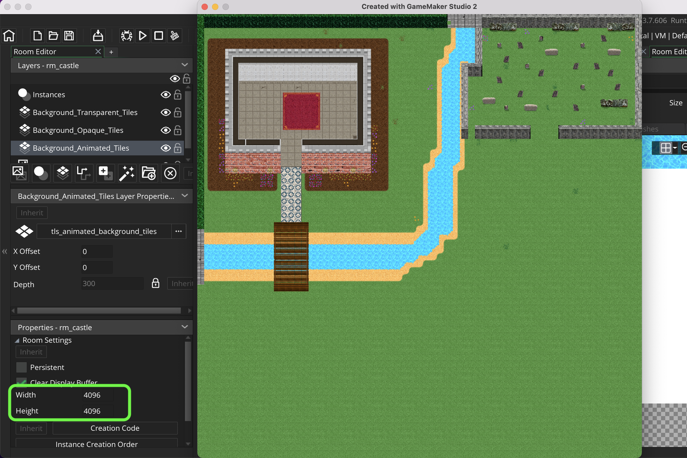
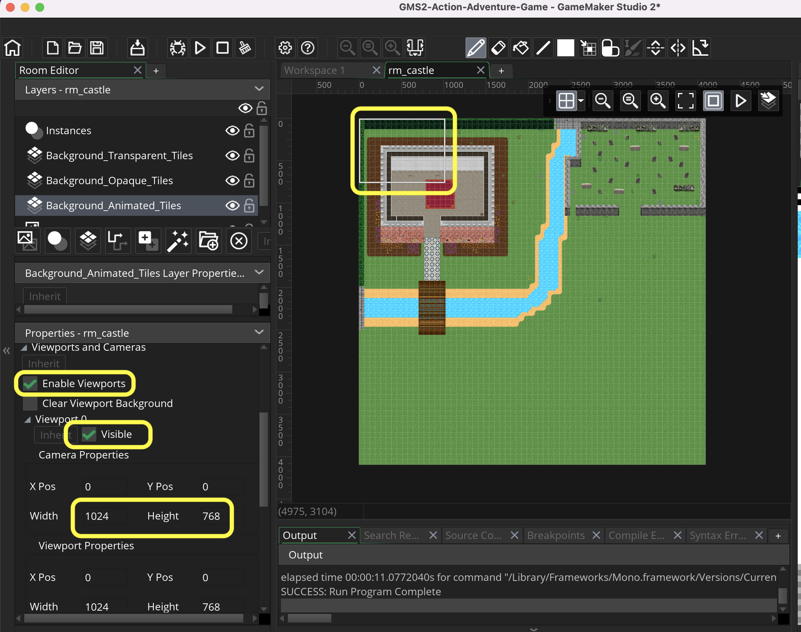
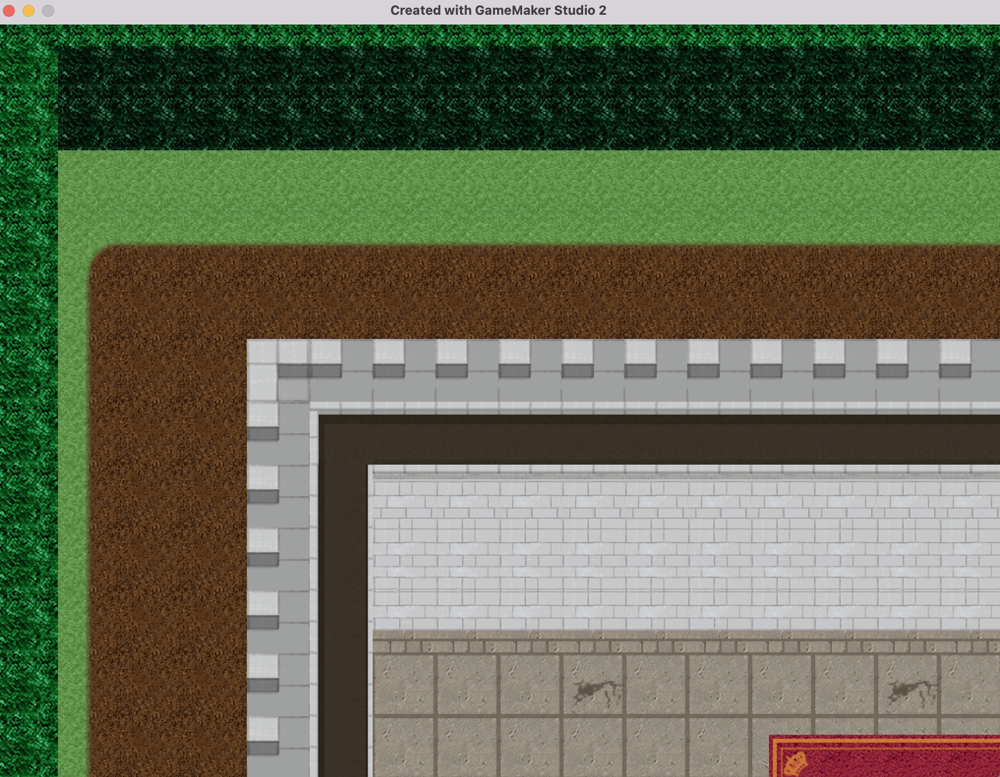

### Room Size

[previous](../setting-up/README.md#user-content-setting-up) • [home](../README.md#user-content-gms2-ue4-space-rocks) • [next](../player-anim/README.md#user-content-importing-player-animations)

Lets look at how we have a level that is larger than a single screen.  This way our player can walk around a larger level.

 

---

##### `Step 1.`\|`TDAAG`|:small_blue_diamond:

Go back to `rm_castle` and turn off  `Background_Transparent_Tiles`, `Background_Opaque_Tiles` and  `Background_Animated_Tiles`.  Turn them back on, we see we have animated water, solid opaque ground and building and a graveyard and bridge made mostly with transparent tiles.  Remember than layers on top of each other affets the render order. So the transparent are on top of the opaque which is on top of the animated tiles. Only half the level is completed.  You will complete the rest later.

https://user-images.githubusercontent.com/5504953/152532272-599f88cb-17b7-4b28-909f-216bbfe0a42d.mp4

##### `Step 2.`\|`TDAAG`|:small_blue_diamond: :small_blue_diamond: 

Now *press* the <kbd>Play</kbd> button in the top menu bar to launch the game. Notice that the room size is larger than a screen and represents the entire level and is 4096 by 4096. See that the entire level is scaled to fit on the screen and is a square ratio.  The game engine scaled it down so I can see it on my screen.

##### `Step 3.`\|`TDAAG`|:small_blue_diamond: :small_blue_diamond: :small_blue_diamond:

Now the problem is that our room is 4096 x 4096. We want it to be the standard default 1024 by 768. How do we create a camera in the level that follows our character so we can navigate this level? Double click your `rm_castle` and look at the bottom left for Viewports and Cameras. Select `Enable Viewports`.

Click on the arrow to open the menu. Click the tab `Viewports and Cameras` in the `Room | Properties` section.   Click to open the triangle for `Viewport 0`. Click on the radio button for `Enable Viewports` and `Clear Viewport Background` (which clears untiled areas with the background color).  In the  `Viewport 0` click on the `Visible` radio button. Then keep the Camera and Vieport properties at their default settings which is 1024 x 768.

A white box appears in the level to show where the viewport will start at.

##### `Step 4.`\|`TDAAG`|:small_blue_diamond: :small_blue_diamond: :small_blue_diamond: :small_blue_diamond:

Now *press* the <kbd>Play</kbd> button in the top menu bar to launch the game.

Now it plays the top left corner of the level and is only playing a portion of the level.  This is exactly what we wanted.  This is the same part of the level that the whitebox showed in the eidtor.  We will have the camera follow the player on the next page so they can explore the entire level.

##### `Step 5.`\|`TDAAG`| :small_orange_diamond:

Select the **File | Save Project** then press **File | Quit** to make sure everything in the game is saved. If you are using **GitHub** open up **GitHub Desktop** and add a title and longer description (if necessary) and press the <kbd>Commit to main</kbd> button. Finish by pressing **Push origin** to update the server with the latest changes.

___

<!--  -->

| [previous](../setting-up/README.md#user-content-setting-up)| [home](../README.md#user-content-gms2-ue4-space-rocks) | [next](../player-anim/README.md#user-content-importing-player-animations)|
|---|---|---|
