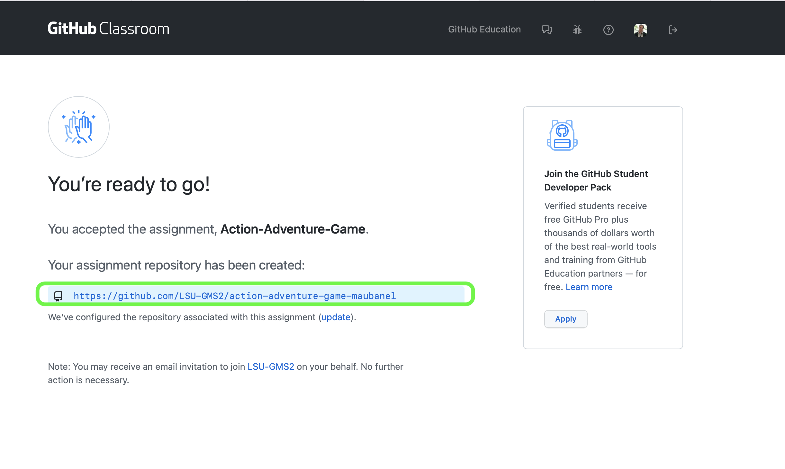
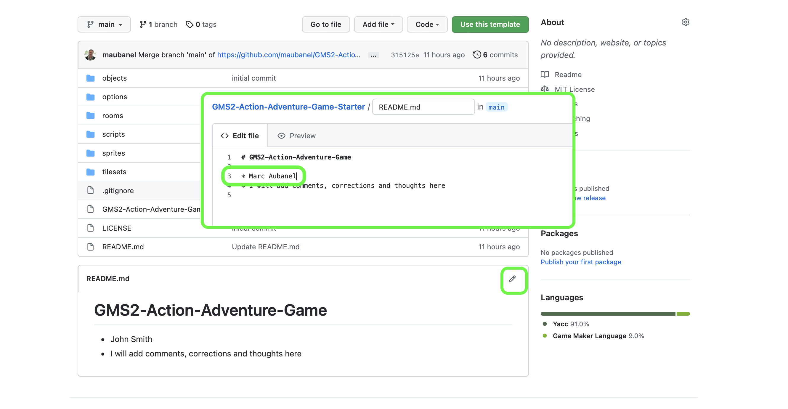
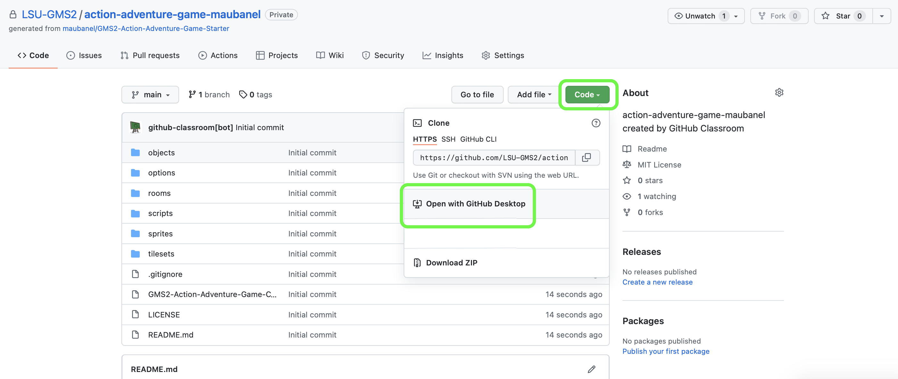
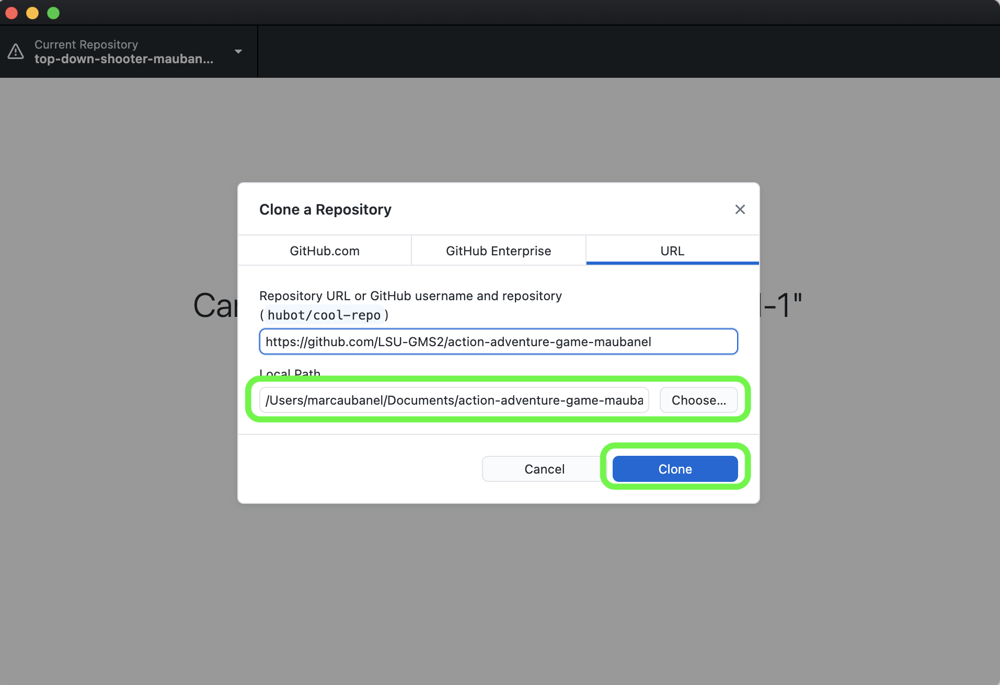
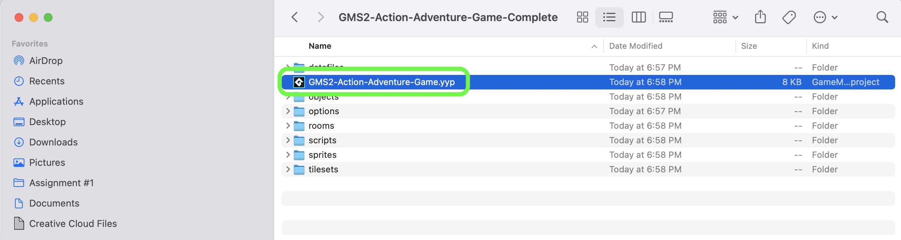

### Setting Up

[home](../README.md#user-content-gms2-ue4-space-rocks) • [next](../room-size/README.md#user-content-room-size)

 

---

##### `Step 1.`\|`TDAAG`|:small_blue_diamond:

You will have a new folder called **GMS2-Action-Adventure-Game**.  If you open it you will find that I have a project that is ready to go with some artwork and scripts to help get you started faster.

##### `Step 2.`\|`TDAAG`|:small_blue_diamond: :small_blue_diamond: 

You have a **README.txt** file that you can add your name to.  At the end you can add comments about the walk through.

##### `Step 3.`\|`TDAAG`|:small_blue_diamond: :small_blue_diamond: :small_blue_diamond:

A link for you repository will pop up.  Click on the link.

##### `Step 4.`\|`TDAAG`|:small_blue_diamond: :small_blue_diamond: :small_blue_diamond: :small_blue_diamond:

Press the **Pencil** button on the top right of the **README.md** file and change the name to your name!  Press the <kbd>Commit</kbd> button. Update the **LICENCSE** file if you want to chnage the open source nature of the project.

##### `Step 5.`\|`TDAAG`| :small_orange_diamond:

Select the <kbd>Code</kbd> button and select <kbd>Open With GitHub Desktop</kbd>.

##### `Step 6.`\|`TDAAG`| :small_orange_diamond: :small_blue_diamond:

**GitHub Desktop** opens up with the folder url ready to clone.  Make sure on **PC** it is NOT a **OneDrive** folder. Select a folder to install the software to and press the <kbd>Clone</kbd> button.

##### `Step 7.`\|`TDAAG`| :small_orange_diamond: :small_blue_diamond: :small_blue_diamond:

Navigate to the folder you just cloned and double click the `.yyp` project file.

##### `Step 8.`\|`TDAAG`| :small_orange_diamond: :small_blue_diamond: :small_blue_diamond: :small_blue_diamond:

The game project opens up and you will see the **GameMaker** IDE.

##### `Step 9.`\|`TDAAG`| :small_orange_diamond: :small_blue_diamond: :small_blue_diamond: :small_blue_diamond: :small_blue_diamond:

Now *press* the <kbd>Play</kbd> button in the top menu bar to launch the game. A level appears, we are now ready to start.

___

<!--  -->

| [home](../README.md#user-content-gms2-ue4-space-rocks) | [next](../room-size/README.md#user-content-room-size)|
|---|---|
