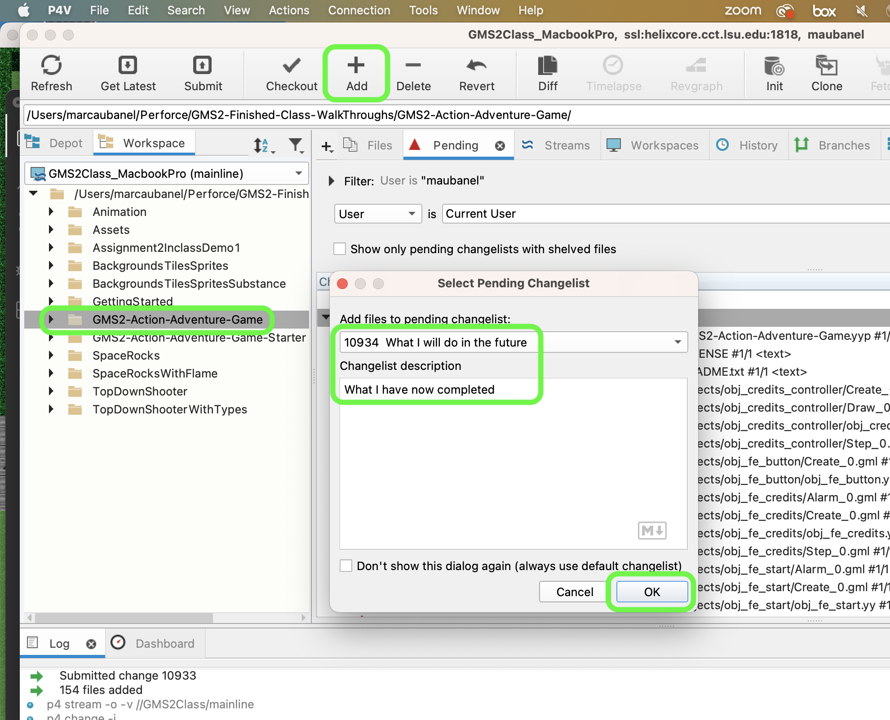

### Setting Up

[home](../README.md#user-content-gms2-ue4-space-rocks) • [next](../room-size/README.md#user-content-room-size)

 

---

##### `Step 1.`\|`TDAAG`|:small_blue_diamond:

You will have a new folder called **GMS2-Action-Adventure-Game**.  If you open it you will find that I have a project that is ready to go with some artwork and scripts to help get you started faster.

##### `Step 2.`\|`TDAAG`|:small_blue_diamond: :small_blue_diamond: 

You have a **README.txt** file that you can add your name to.  As you are completing the walk through, you can add comments about the walk through.

##### `Step 3.`\|`TDAAG`|:small_blue_diamond: :small_blue_diamond: :small_blue_diamond:

`Double click` the **GMS2-Action-Adventure-Game.yyp** up and you will see the **GameMaker** IDE.

##### `Step 4.`\|`TDAAG`|:small_blue_diamond: :small_blue_diamond: :small_blue_diamond: :small_blue_diamond:

Now *press* the <kbd>Play</kbd> button in the top menu bar to launch the game. A level appears, we are now ready to start.

##### `Step 5.`\|`TDAAG`| :small_orange_diamond:

We have provided sprites, objects, scripts and tilesets that we covered in previous walk throughs that will make completing this one go faster.

##### `Step 6.`\|`TDAAG`| :small_orange_diamond: :small_blue_diamond:

Open up **P4V**.  Select the top folder and press the **Add** button.  We want to add all the new files we created during this last session.  Add these files to the last change list you used at the begining of the session. Make sure the message accurately represents what you have done. Press the <kbd>OK</kbd> button.

##### `Step 7.`\|`TDAAG`| :small_orange_diamond: :small_blue_diamond: :small_blue_diamond:

Now you can submit the changelist by pressing both <kbd>Submit</kbd> buttons.

___

<!--  -->

| [home](../README.md#user-content-gms2-ue4-space-rocks) | [next](../room-size/README.md#user-content-room-size)|
|---|---|
